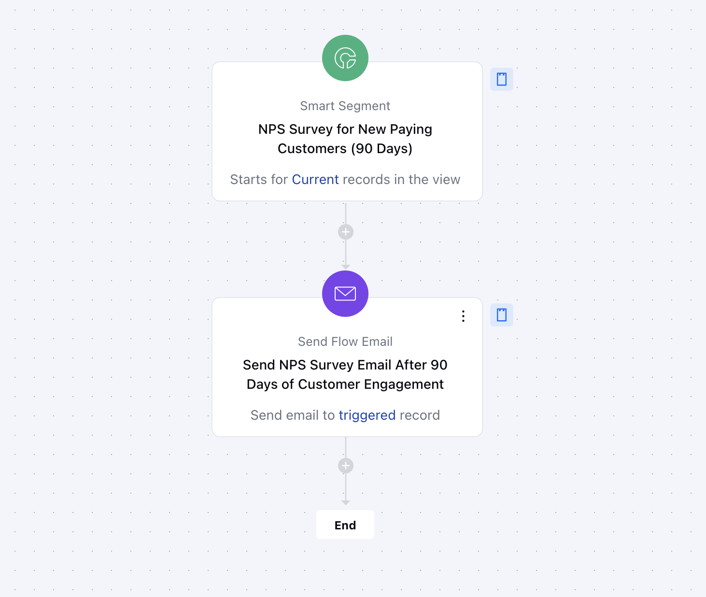

The**Automated NPS Survey for Customers (90 Days)**flow helps you gather valuable customer feedback by sending a personalized Net Promoter Score (NPS) survey to customers 90 days after they sign up or make their first purchase. This automated feedback loop allows you to measure customer satisfaction, identify potential issues, and take proactive steps to improve your products or services.

####**Topics Covered:**[Business Type](https://support.salesmate.io/hc/en-us/articles/42405743410585-NPS-Survey-for-Customers-90-Days#h_01JHYJ5KX7PRZHNJDHKSYQ2PNS)[Use Case](https://support.salesmate.io/hc/en-us/articles/42405743410585-NPS-Survey-for-Customers-90-Days#h_01JHYTHS792TQKHAW6CVYMQRMZ)[Key Features of the Flow](https://support.salesmate.io/hc/en-us/articles/42405743410585-NPS-Survey-for-Customers-90-Days#h_01JHYTM9123YNTJZKMS4NEHWFH)[Breakup of Items Used in the Flow](https://support.salesmate.io/hc/en-us/articles/42405743410585-NPS-Survey-for-Customers-90-Days#h_01JHYTN6ZKS5GB8V1X3R0S7CB3)[Steps Used in Creating the Flow](https://support.salesmate.io/hc/en-us/articles/42405743410585-NPS-Survey-for-Customers-90-Days#h_01JHYTPBGNZDR3QSKBB55HJ2TM)[Benefits](https://support.salesmate.io/hc/en-us/articles/42405743410585-NPS-Survey-for-Customers-90-Days#h_01JHYTS6TWN6FD19CTX4ZP7WCW)

####**Business Type**Perfect for SaaS, E-Commerce, and B2B businesses that want to monitor customer satisfaction and improve retention by gathering timely feedback.

####**Use Case**This template helps teams automate the collection of NPS feedback from customers at the 90-day mark after they’ve signed up or made their first purchase. By doing so, it provides actionable insights into customer sentiment, enabling teams to improve products and foster loyalty.

####**Key Features of the Flow****Automated NPS Survey:**Sends an NPS survey 90 days after customer onboarding or purchase to measure satisfaction.**Feedback Collection:**Helps you understand customer sentiment, identifying promoters, passives, and detractors.**Timing of Survey:**Sent exactly 90 days after the customer engages with your service or product, giving them time to evaluate it.**Personalized Engagement:**The survey email is tailored to the customer, ensuring a personal and timely request for feedback.

####**Breakup of Items Used in the Flow****Trigger****Activity Completed – Customer Onboarded or Purchased:**The flow is initiated 90 days after a customer signs up or makes their first purchase, ensuring the feedback is gathered at the right moment in their journey.

####**Actions****Send Flow Email (1):**The flow sends the NPS survey email to the customer. This action encourages them to fill out the survey, helping you collect valuable insights on their experience.

####**How to Create "NPS Survey for Customers" Flow**####**Step 1: Customer Journey Trigger****Action:**The flow is triggered 90 days after a customer’s onboarding or first purchase. This marks the optimal time to ask for feedback based on the customer’s experience with your product or service.

####**Step 2: Send NPS Survey Email****Action:**The flow sends a personalized NPS survey email, asking customers to rate their likelihood of recommending your product/service on a scale from 0 to 10.**Purpose:**The email encourages participation and provides an easy way for customers to provide valuable feedback.

####**Benefits****Timely and Actionable Feedback:**Collects customer satisfaction data 90 days after onboarding or purchase, giving businesses insights at the right moment to drive improvements.**Improved Retention and Loyalty:**Identifies promoters for advocacy, passives for further engagement, and detractors to address concerns, ultimately boosting customer retention.**Enhanced Efficiency:**Automates the feedback collection process, saving time and ensuring consistent follow-ups, allowing teams to focus on building relationships and improving services.
