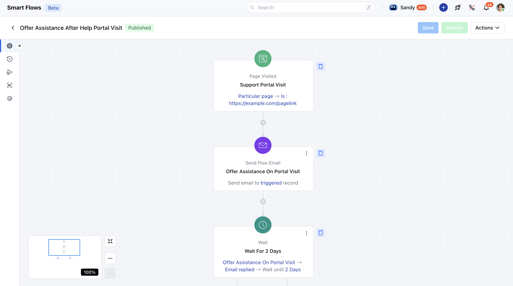
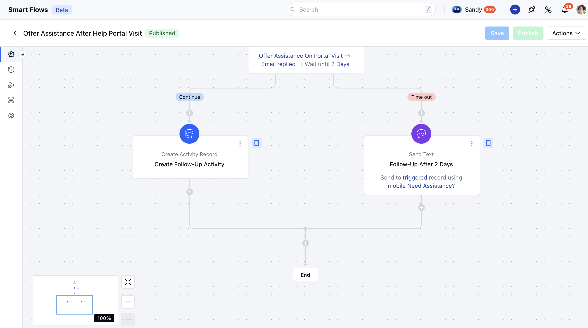

This **Smart Flow** enhances your customer experience by automatically sending follow-up emails or texts after customers visit your help portal, ensuring their issues are addressed and their questions are resolved.

### **Topics covered:**

- [Business Type](#business-type)
- [Template Type](#template-type)
- [Use Case](#use-case)
- [Key Features of the Flow](#key-features-of-the-flowtake-action-on-help-portal-visit-quickly-initiate-follow-up-actions-as-soon-as-a-customer-visits-your-help-portal)
- [Steps used to Create Flow](#steps-used-to-create-flow-page-visited-triggerpage-visitedhttpssupportsalesmateiohcen-usarticles37779938430745-page-visited-description-when-a-contact-visits-the-support-portal-tracking-their-visit-via-the-specified-portal-link-and-initiating-follow-up-actions-as-needed)
- [Breakup of Items used in the Flow](#steps-used-to-create-flow-page-visited-triggerpage-visitedhttpssupportsalesmateiohcen-usarticles37779938430745-page-visited-description-when-a-contact-visits-the-support-portal-tracking-their-visit-via-the-specified-portal-link-and-initiating-follow-up-actions-as-needed)
- [Benefits](#benefits)

### Business Type:

This flow is ideal for industries like SaaS, E-Commerce, and Customer Support/Success, aiming to enhance customer satisfaction by automating follow-ups when customers visit their help portal.

### Template Type:

This flow is best suited when you are trying to improve your customer's experience by streamlining the process of following up with them after their visit to help/support portal to ensure their queries are resolved and address in timely manner.

### Use Case:

This flow helps you proactively address customer queries by sending a follow-up email after they visit your help portal. Based on their interaction with the email, it triggers further actions like creating an activity or sending a text for additional follow-up.

### Key Features of the Flow:**Take Action on Help Portal Visit**: Quickly initiate follow-up actions as soon as a customer visits your help portal.

- **Automated Follow up:** Follow up with the customer via email to confirm that their issue, which led them to visit the support portal, has been resolved.

- **Acting on Time:** Take action based on the customer's interaction with your follow-up email to ensure their query has been resolved **.

- **- **Enhance Customer Experience:** The overall process of how this flow is designed can improve customer experience, build trust on your services.

- **Increase Efficiency of Support Agents:** Automating follow-ups ensures your agents stay aligned with the right tasks. It also creates and assigns activities automatically, helping agents promptly follow up on client queries.

### Steps Used to Create Flow **Page Visited (Trigger)**[Page Visited](#key-features-of-the-flowtake-action-on-help-portal-visit-quickly-initiate-follow-up-actions-as-soon-as-a-customer-visits-your-help-portal):- **Description:** When a contact visits the Support Portal, tracking their visit via the specified portal link and initiating follow-up actions as needed.

- **Practical Use Case:** In this particular flow, the page visited trigger is set to be configured on help portal visit to ensure whenever a customer visits the help portal, their query is resolved.

- **Send Flow Email (Action)**[Send Flow Email](https://support.salesmate.io/hc/en-us/articles/38138164432409-Send-Flow-Email):- **Description:** Send a help email to contacts who have visited the support portal, proactively offering assistance and ensuring their reason to visit support portal was solved.

- **Practical Use Case:** As the customer visits the support portal, sending a follow E-mail to them helps improve the customer experience. This step automates the process of sending the E-mail to ensure their issue is resolved. If not, the flow can take further action as set.

- **Wait (Condition)**[Wait](#key-features-of-the-flowtake-action-on-help-portal-visit-quickly-initiate-follow-up-actions-as-soon-as-a-customer-visits-your-help-portal):- **Description:** This condition is used to provide an interval in the flow before taking the next set of action.

- **Practical Use Case:** In this particular flow we have customized the flow to wait for 2 days to check if the client replies to the email before splitting the flow into separate paths. The wait can be customized as per your use case and process.

- *Create record (Action):**[Create Record](https://support.salesmate.io/hc/en-us/articles/38098733305753-Create-Record):- **Description:** Create a follow-up activity for the user to check in with the client regarding their issue, ensuring proactive communication and timely resolution.

- **Practical Use Case:** In order to enhance customer experience, once the wait period is over and if the client replies their query isn't solved, this action further creates a follow up activity for your support agents to get in touch with the client and resolve their query.

- **Send Text (Action)**[Send Text](https://support.salesmate.io/hc/en-us/articles/38138168474905-Send-Text):- **Description:** Send a follow-up text to the client if no reply is received within two days, ensuring continued engagement and prompt resolution of their issue.

- **Practical Use Case:** In case if the client does not reply to the E-mail, this step is used to send a follow up text to the client to ensure their query is resolved. This also creates multiple touch point with client ensuring that you are reaching them out via all sort of communication method hence enhancing their experience.

- **End:** The flow concludes once the appropriate follow-up action has been completed.

###

### Breakup of the items used in the Flow** Trigger **Page Visited :** This trigger can be used and customized to trigger the flow when a user visits a specific page. In this case, it is used when a customer visits the help portal.

- **Condition:**Wait :**The wait time is used in the flow to provide an interval in the flow before taking the next set of action. It also checks if the client replies to the E-mail and take further action accordingly.

- **Actions:**-**Send Flow Email:** Sending an E-mail to the client after their visit to help portal to confirm if their query is solved

- **Create Record:** This action can be used to create record across modules. In this particular case, it creates a follow up activity for the support agent to follow up with the client.

- **Send Text:** This action is used to send text to the client. In this case, it is used to send a follow up text to the client ensuring their query is solved.

### Benefits

This flow will ensure quick follow-ups when a customer visits the help portal, confirming issue resolution via email. By streamlining tasks, it enhances customer experience and trust while boosting support agent efficiency through automated task assignment.
