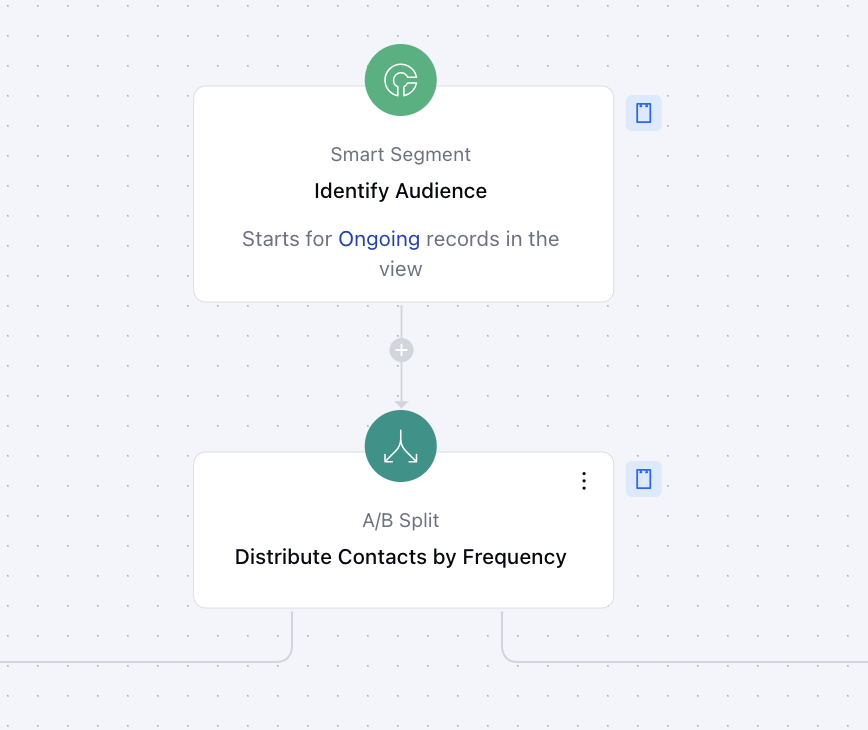
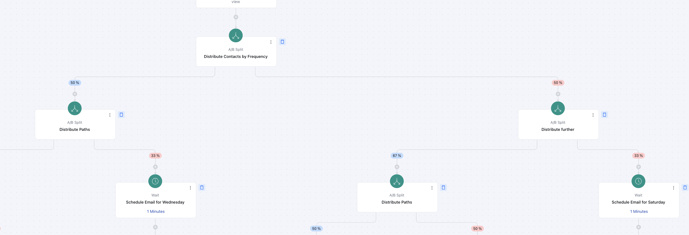
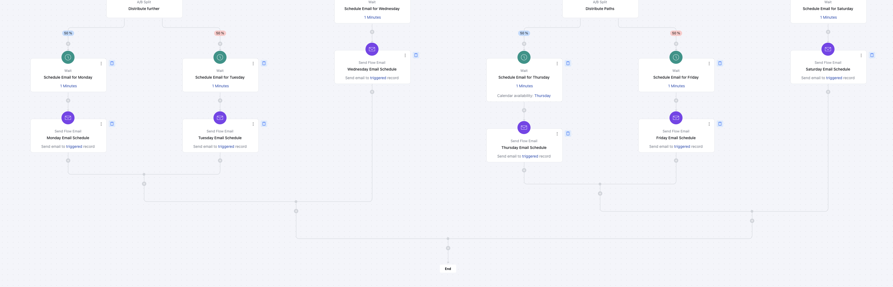

This Smart Flow is designed to help you organize leads into groups and assign them to users based on their availability. It simplifies the process of scheduling emails on different days, making it easier to manage clients efficiently.

### Topics Covered

[Business Type](https://support.salesmate.io/hc/en-us/articles/42343159769369-Optimize-Engagement-Discover-Your-Best-Day-to-Connect#h_01JHTMDMX0YGC9EE89QJ2PHTBD)[Template Type](https://support.salesmate.io/hc/en-us/articles/42343159769369-Optimize-Engagement-Discover-Your-Best-Day-to-Connect#h_01JHTMDCQ19V4TJZWPAG6ZA507)[Use Case](https://support.salesmate.io/hc/en-us/articles/42343159769369-Optimize-Engagement-Discover-Your-Best-Day-to-Connect#h_01JHTMD6FSPEGDE945GBY75ZK7)[Key Features of the Flow](https://support.salesmate.io/hc/en-us/articles/42343159769369-Optimize-Engagement-Discover-Your-Best-Day-to-Connect#h_01JHTMD02EAD1FYG7QDRY58QGA)[Steps Used in Creating the Flow](https://support.salesmate.io/hc/en-us/articles/42343159769369-Optimize-Engagement-Discover-Your-Best-Day-to-Connect#h_01JHTMBF2ZSSVBBD8967QZ57SY)[Breakup of Items Used in the Flow](https://support.salesmate.io/hc/en-us/articles/42343159769369-Optimize-Engagement-Discover-Your-Best-Day-to-Connect#h_01JHTM998AXT356M4MY5TR3CXX)[Benefits of the Flow](https://support.salesmate.io/hc/en-us/articles/42343159769369-Optimize-Engagement-Discover-Your-Best-Day-to-Connect#h_01JHTMC4X51MZ62D7V4VAQTYDZ)

### Business Type

This flow is ideal for businesses in the tourism sector, such as travel agents, event planners, and tour operators. It allows them to connect with customers on their preferred days, offering a more convenient and practical scheduling experience.

### Template Type

Designed for customer success and sales teams, this flow makes it easier to send emails by testing different days based on client availability. By using the Smart Segment trigger and A/B Split actions, you can figure out the best day to connect with your contacts and follow up with them effectively.

### Use Case

This flow helps businesses test which day works best for connecting with clients. Using a Smart Segment trigger and A/B split interactions, it ensures that emails are sent out on different days of the week, from Monday to Saturday. This helps businesses identify the most suitable days for reaching out to their clients, allowing them to plan future communications accordingly.

### Key Features of the Flow**Smart Segment:**Only contacts with the “newsletter” tag are added to the flow, ensuring that the right people are contacted.**A/B Split Testing:**The flow splits contacts into smaller groups to test different timing strategies and identify the best days to send emails.**Automated Scheduling:**Emails are sent automatically on various days of the week to see which day gets the best responses.**Time-Efficient Engagement:**By automating the email-sending process, the flow reduces manual efforts and ensures timely communication with clients.

### Steps Used in Creating the Flow**Trigger: [Smart Segment](https://support.salesmate.io/hc/en-us/articles/37772408384665)****Description:**The smart segment trigger lets you run a flow for contacts in a specific view, whether they’re current, upcoming, or ongoing, based on your needs.**Practical Use Case:**We’ve set up the smart segment so that it will trigger for contacts who currently have the newsletter tag or will have it added in the future for ongoing views.

**Distribute Contacts Using [A/B Split](https://support.salesmate.io/hc/en-us/articles/38138391340185)****Action:**As soon as the flow is triggered, we will split the contacts equally—50/50. Then, we’ll apply another A/B split into both groups, dividing them 67% and 33%, to ensure the actions are distributed evenly among the contacts.**Practical Use Case:**Using this A/B split method helps us divide the contacts fairly, so emails can be sent on different days of the week, from Monday to Saturday. This allows us to test which day works best for connecting with clients and planning future communications.

**Set a Minor Buffer Using the [Wait](https://support.salesmate.io/hc/en-us/articles/38138356545433) Action****Practical Use Case:**We’ll use the Wait action with all the exit nodes from the A/B Split, setting a 1-minute buffer. This ensures that the smart flow runs smoothly, giving enough time for actions to take place after the buffer period.**Schedule Emails for Every Day of the Week****Action:**We will schedule the emails to be sent out every day from Monday to Saturday using the "Send Flow Email" action. By tracking the response and engagement, we’ll determine which day is best for connecting with the client.

### Breakdown of Items Used in the Flow**Trigger****Smart Segment:**The flow starts when contacts with the “newsletter” tag are added to a specific list. This ensures that only relevant contacts receive the emails.**Entry-Level Condition:**The flow checks for the “newsletter” tag to make sure it’s targeting the right contacts for email testing.**A/B Split Interactions**The flow uses an A/B Split action to divide contacts into smaller groups and test different days of the week for sending emails. This allows businesses to analyze which days receive the best engagement and refine future communication plans accordingly. By testing multiple groups with varying schedules, the flow ensures comprehensive insights into client preferences.**Wait and Send Flow Email Actions**The flow includes Wait Actions and Send Flow Email actions at various stages to manage timing and ensure smooth email delivery:**Wait Actions:**A 1-minute pause is applied after each A/B Split. This helps manage the timing of emails and allows contacts enough time to engage.**Send Flow Email Actions:**Emails are sent after each A/B Split, testing different days of the week to identify which day gets the best response.

### End**Exit Flow**: Ends the flow after the email is sent, completing the process.

### Benefits of the Flow

This flow helps businesses understand the best days to connect with clients by testing different email schedules. It saves time and effort by automating the process while providing valuable insights on client preferences. The A/B Split testing identifies which days get the best responses, helping businesses plan future communications more effectively. The Wait Actions and automated emails ensure everything runs smoothly, making it easier to stay organized and connect with clients on the most effective days.
