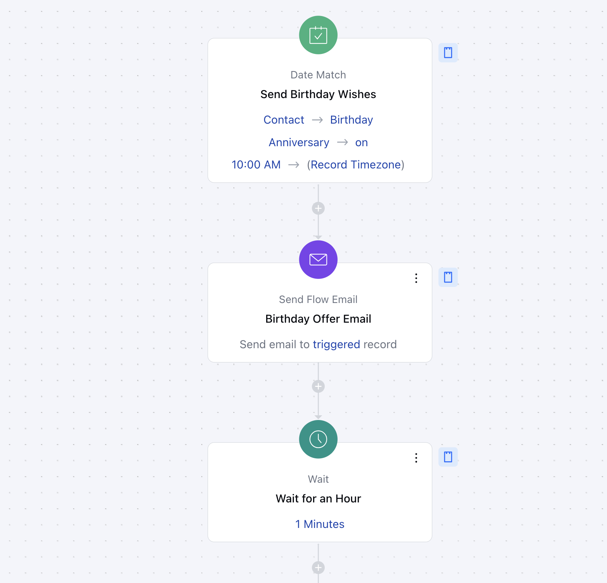
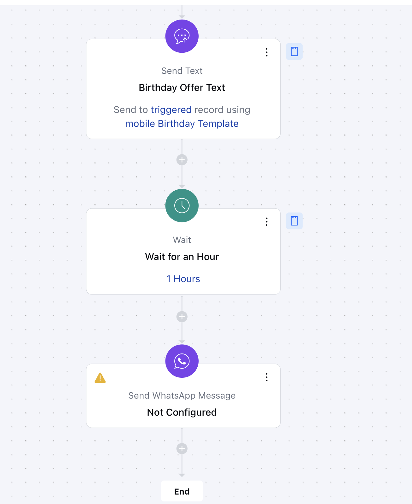

This flow initiates the process by sending an email, followed by a text message, and finally, a WhatsApp message. Each message includes a coupon, special offer, or customized template, ensuring your customers feel valued and celebrated on their special day.

####**Topics Covered:**[Business Type](https://support.salesmate.io/hc/en-us/articles/42441765112729-Personalized-Birthday-Wishes#h_01JHTRXVVDTKTZZZSNKCSYWF2R)[Template Type](https://support.salesmate.io/hc/en-us/articles/42441765112729-Personalized-Birthday-Wishes#h_01JHTS5GHZBVRF4TTSQ1D80PF1)[Use Case](https://support.salesmate.io/hc/en-us/articles/42441765112729-Personalized-Birthday-Wishes#h_01JHTSHY9H2NAV6D7ZBBP21ZT3)[Key Features of the Flow](https://support.salesmate.io/hc/en-us/articles/42441765112729-Personalized-Birthday-Wishes#h_01JHTSZRB0Z5GNZY0SSAPN18RC)[Steps to create the flow](https://support.salesmate.io/hc/en-us/articles/42441765112729-Personalized-Birthday-Wishes#h_01JJ1TKK6EQJY8XZ3DBME6FTXS)[Benefits](https://support.salesmate.io/hc/en-us/articles/42441765112729-Personalized-Birthday-Wishes#h_01JHTSZRB18HZJN49EF708CSHF)

####**Business Type:**This flow is perfect for Saas, B2B industries as it offers a strategic way to personalize customer interactions, strengthening brand loyalty and creating memorable experiences.

####**Template Type:**This flow is best suited for Marketing, Sales, Startup teams for enhancing customer engagement and building lasting relationships, which are critical for retention and growth.

####**Use Case:**A CRM SaaS platform uses the Birthday Series flow to engage customers on their special day. The flow sends a personalized email with an offer, follows up with an SMS for visibility, and ends with an interactive WhatsApp message. This approach boosts loyalty, increases offer redemption, and strengthens customer relationships through multi-channel engagement.

####**Key Features of the Flow:**Multi-Channel Communication: Engages the customer through email, text message, and WhatsApp, ensuring the message reaches the customer effectively.Personalized Birthday Greetings: Sends a heartfelt message to customers, making the experience more personal and meaningful.Coupon or Offer Integration: The messages can include special offers or discounts, encouraging repeat purchases and boosting customer retention.

####**Steps to create the flow:**[Click here](https://support.salesmate.io/hc/en-us/articles/36752706603929-How-to-Create-New-Smart-Flow) to learn about how to create a new Smart Flow or access the Flow Templates.**Trigger: [Date Match](https://support.salesmate.io/hc/en-us/articles/37775415806105-Date-Match#h_01J7X9REZFP3SYAQ0N1PQG15MX)**Description: This flow is automatically triggered when a contact's birthday occurs.Practical Use-Case: Trigger the flow when the contact's birthday occurs once a year. You will need to create a [custom field](https://support.salesmate.io/hc/en-us/articles/360041831032-How-to-Create-Custom-fields) of type Date and Time and select the Date of Execution, Time of Execution and Time Zone of execution.**Send a Birthday Email: [Send Flow Email](https://support.salesmate.io/hc/en-us/articles/38138164432409-Send-Flow-Email)**Description: This step sends a personalized birthday email with warm wishes and special offers to make the contact's day extra special.Practical Use-Case: This step sends a personalized birthday email with warm wishes and special offers to make the contact feel valued, strengthen the relationship, and encourage engagement or repeat purchases.**Wait for 1 hour: [Wait](https://support.salesmate.io/hc/en-us/articles/38138356545433-Wait)**Description: This step will pause briefly before sending the text message to give the client time to notice the birthday wish sent earlier via email.Practical Use-Case: The Wait gives the recipient time to read and engage with the email before receiving the next message, making the communication feel natural and non-intrusive. Increases the likelihood of meaningful interaction and reduces the risk of overwhelming the contact.

**Send Text: [Send Text](https://support.salesmate.io/hc/en-us/articles/38138168474905-Send-Text)**Description: This step sends a personalized birthday SMS to the contact, offering exclusive coupons or special offers to celebrate their special day.Practical Use-Case: This step sends a personalized birthday text with warm wishes and special offers to make the contact feel valued, strengthen the relationship, and encourage engagement or repeat purchases.**Wait for 1 hour: [Wait](https://support.salesmate.io/hc/en-us/articles/38138356545433-Wait)**Description: This step will pause briefly before sending the text message to give the client time to notice the birthday wish sent earlier via email.Practical Use-Case: The Wait gives the recipient time to read and engage with the email before receiving the next message, making the communication feel natural and non-intrusive. Increases the likelihood of meaningful interaction and reduces the risk of overwhelming the contact.**Send Whatsapp Message: [Send Whatsapp Message](https://support.salesmate.io/hc/en-us/articles/38138309260057-Send-WhatsApp-Message)**Description: This step sends a personalized birthday whatsapp message with warm wishes and special offers to make the contact's day extra special.Practical Usage: Using this action provides a final touchpoint to remind the contact of the special offer and boost conversion, all while using a preferred communication channel. WhatsApp is a widely used app, and messages here are often seen faster and can have higher response rates.To configure Whatsapp: [Learn More](https://support.salesmate.io/hc/en-us/articles/25786757545497-WhatsApp-by-Twilio-Installation)

####**Benefits:**Strengthen Customer Relationships: Personalized greetings make customers feel valued, fostering loyalty.Increase Engagement and Retention: Multi-channel messaging ensures the customer notices the offer.Drive Repeat Sales: Offers and discounts included in the messages can encourage customers to make a purchase.Automation Efficiency: The entire process runs automatically, saving time while ensuring consistency.
