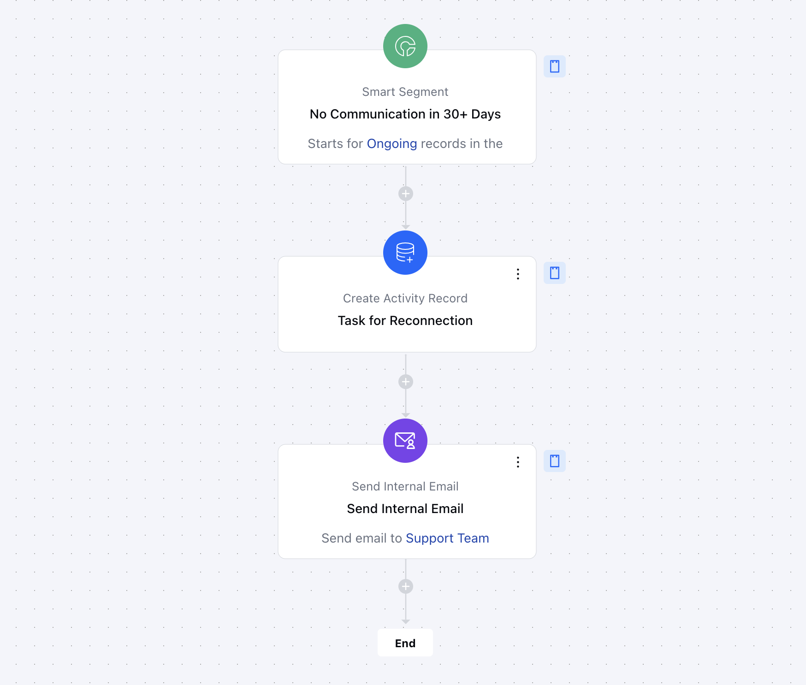

This flow helps sales teams automatically revive deals that have been inactive for over 30 days. By detecting dormant deals, notifying team members, and creating follow-up tasks, keeping your pipeline active and focused on closing.

###  **Topics covered:**

- [Business Type](https://support.salesmate.io/hc/en-us/articles/42361392934297-Re-connect-with-inactive-Deals#h_01JHPGEHR9WVB0RSTM7GWSWH1P "https://support.salesmate.io/hc/en-us/articles/42342268300953/live_preview/01jhpy55rwmkchvjbx6h6rvgtx#h_01jhpt8jzbzczdere43nv5vqbr")
- [Template Type](https://support.salesmate.io/hc/en-us/articles/42361392934297-Re-connect-with-inactive-Deals#h_01JHPGEXSN3ZMKEX4SYFD6JJNB)
- [Use Case](https://support.salesmate.io/hc/en-us/articles/42361392934297-Re-connect-with-inactive-Deals#h_01JHPGF96RJD3PA8V9013Z4M9R "https://support.salesmate.io/hc/en-us/articles/42342268300953/live_preview/01jhpy55rwmkchvjbx6h6rvgtx#h_01jhptz1a3wyg6g0gz6bsg4vpg")
- [Key Features of the Flow](https://support.salesmate.io/hc/en-us/articles/42361392934297-Re-connect-with-inactive-Deals#h_01JHPGHNKAS7B1CK7X26XKJQQE "https://support.salesmate.io/hc/en-us/articles/42342268300953/live_preview/01jhpy55rwmkchvjbx6h6rvgtx#h_01jhma0mxs75ybgjkckhqsrtxg")
- [Breakup of Items Used in the Flow](https://support.salesmate.io/hc/en-us/articles/42361392934297-Re-connect-with-inactive-Deals#h_01JHMKGDFGFKJHQ0SD9GV06CCQ "https://support.salesmate.io/hc/en-us/articles/42342268300953/live_preview/01jhpy55rwmkchvjbx6h6rvgtx#h_01jhptyajq4vwnbs396b6akr2q")
- [Steps used in Creating the flow](https://support.salesmate.io/hc/en-us/articles/42361392934297-Re-connect-with-inactive-Deals#h_01JKK12HTKB83X3TCYA1EYE595)
- [Benefits](https://support.salesmate.io/hc/en-us/articles/42361392934297-Re-connect-with-inactive-Deals#h_01JHPGNXAVPCV6SKQS5M5M6DZW "https://support.salesmate.io/hc/en-us/articles/42342268300953/live_preview/01jhpy55rwmkchvjbx6h6rvgtx#h_01jhpxd9q5vwjbeq4va0thyy2t")

### **Business Type** Ideal for **SaaS**,**B2B**, and **Service Companies**, this flow is especially useful for industries with long sales cycles requiring consistent follow-ups to prevent deals from going cold.

### **Template Type** Designed for **Campaigns** and **Follow-Up Automation**, this flow automates repetitive follow-up tasks and keeps your sales pipeline active and efficient.

### **Use Case** Perfect for **Deal Re-Engagement** and **Deal flow management**, this template helps sales teams re-engage with prospects, improve deal progression, and maintain consistent communication with inactive deals.

### ** Key Features of the Flow **Automatic Detection of Inactive Deals**: Scans for deals with no activity for over 30 days, flagging them for re-engagement.

- **Automated Re-Engagement**: Sends personalized emails to prospects, reigniting interest in dormant deals.

- ** Follow-Up Task Creation **: Assigns tasks to deal owners, ensuring timely follow-up actions.

### ** Breakup of items used in the flow **Trigger **Smart Segment **: It identifies deals with no activity for 30+ days.

- ** Actions **Create Activity Record**: Generates a follow-up task for the deal owner, ensuring accountability and proactive engagement.

- **Send Internal Email**: Notifies the deal owner about the inactive deal, ensuring they are informed and can act promptly.

- ** End** The flow ends after the follow-up actions are completed, ensuring the deal is addressed appropriately.

### **Steps used in creating the flow** You can **[click here](https://support.salesmate.io/hc/en-us/articles/42361392934297-Re-connect-with-inactive-Deals#)** to learn how to create a new Smart Flow or access the Flow Templates.

- **Trigger**:**[Smart Segment](https://support.salesmate.io/hc/en-us/articles/37772408384665-Smart-Segment)**- **Description:** This trigger activates when a deal’s last communication date exceeds 30 days, signaling inactivity.

- **Use Case:** It ensures that follow-up actions are automatically initiated, preventing the deal from stalling and helping to re-engage the prospect before it goes cold.

- **Action**:

[**Create Activity Record**](https://support.salesmate.io/hc/en-us/articles/38098733305753-Create-Record)
:- **Description:** Creates a follow-up task for the assigned deal owner to take action and reconnect with the prospect.

- **Use Case:** Keeps the sales team on track by reminding them to follow up with prospects, ensuring timely engagement and progress on the deal.[
- **Send Flow Email:** ](https://support.salesmate.io/hc/en-us/articles/38138164432409-Send-Flow-Email)
- **Description:** Sends an internal email notification to the assigned record owner and relevant team members about the inactive deal, providing key details.

- **Use Case:** Ensures the team is informed about inactive deals, prompting them to take swift action to revive the deal and prevent it from being forgotten.

### **Benefits** This flow automates routine tasks, reduces manual tracking, and ensures consistent prospect engagement. Key benefits include:**Proactive Deal Management**: Prevents deals from slipping through the cracks.

- **Improved Conversion Rates**: Encourages timely follow-ups, increasing the chances of closing deals.

- **Automation Efficiency**: Saves time by reducing manual effort, allowing sales teams to focus on high-priority tasks.
