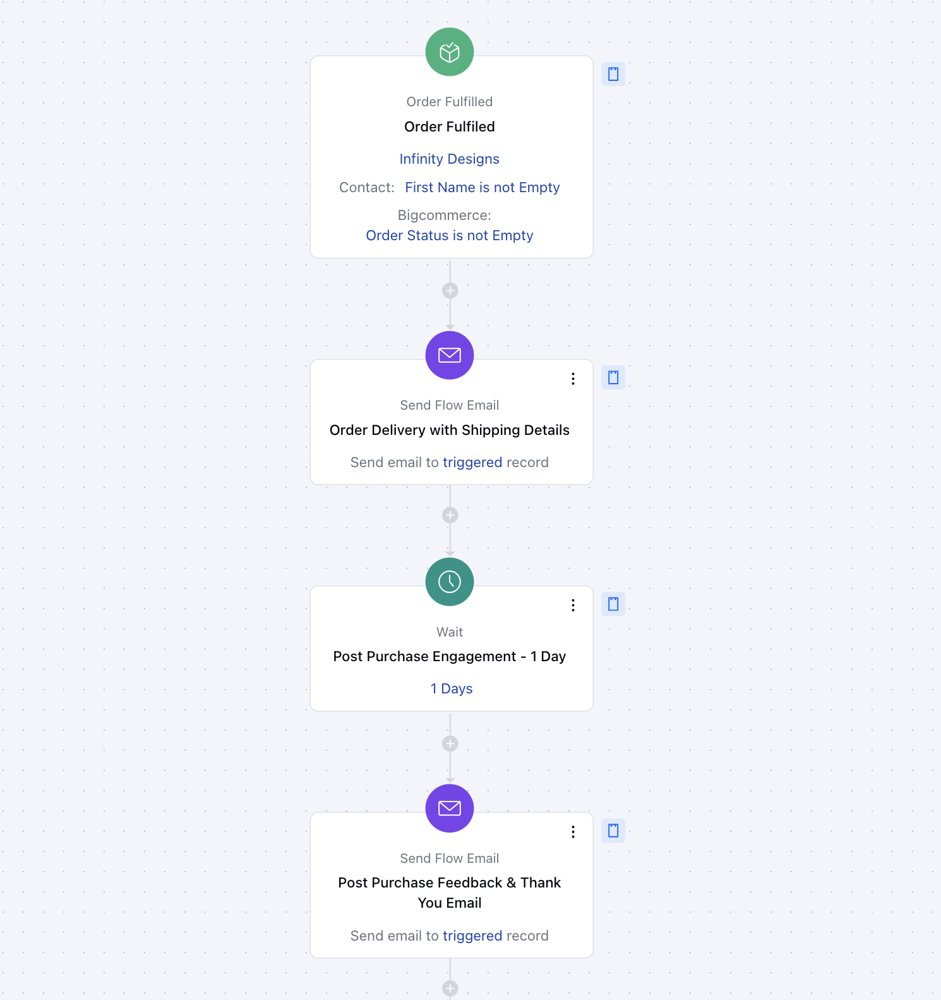

This flow automates timely and personalized customer communication after an order is shipped, ensuring customers stay informed and engaged while businesses gather valuable feedback to enhance their services.

####**Topic Covered:**[Business Type](https://support.salesmate.io/hc/en-us/articles/42405775461785-Send-an-Email-after-First-Purchase#h_01JHZKVPKJSQNNNM12WR3TSWPT)[Use Case](https://support.salesmate.io/hc/en-us/articles/42405775461785-Send-an-Email-after-First-Purchase#h_01JHZKW83NVDMKE5D89BPG05PA)[Key Features of the Flow](https://support.salesmate.io/hc/en-us/articles/42405775461785-Send-an-Email-after-First-Purchase#h_01JHZKZ2NAHYYQW841MY5RA506)[Breakup of Items Used in the Flow](https://support.salesmate.io/hc/en-us/articles/42405775461785-Send-an-Email-after-First-Purchase#h_01JHZM1PJQRXT0DK7AZT2TFRRA)[How to Create the Shipping Confirmation & Feedback Request Flow](https://support.salesmate.io/hc/en-us/articles/42405775461785-Send-an-Email-after-First-Purchase#h_01JHZM6DHGBYKMTSF90DE78WN0)[Benefits](https://support.salesmate.io/hc/en-us/articles/42405775461785-Send-an-Email-after-First-Purchase#h_01JHZMNB2EKX39VH1ARKZ41MZQ)

####**Business Type**Ideal for E-commerce businesses looking to enhance customer communication, reduce post-purchase anxiety, and improve customer retention through proactive updates and valuable feedback collection.

####**Use Case**This flow is designed for businesses that want to improve customer experience by keeping them informed post-purchase and using their feedback to continuously optimize their offerings.

####**Key Features of the Flow****Automated Shipping Confirmation**The flow sends an automated, personalized email to customers with detailed shipping information, including tracking details and estimated delivery times.**Feedback Request Email**After the estimated delivery date, the flow triggers a follow-up email, requesting customer feedback on the product and service received, along with a CTA to leave a review or fill out a survey.**Customer Engagement & Trust Building**By keeping customers informed and asking for feedback, this flow fosters trust and builds stronger customer relationships, contributing to higher satisfaction and loyalty.**Email Automation**Automates the sending of two essential emails—Shipping Confirmation and Feedback Request—saving time and improving communication consistency.

####**Breakup of Items Used in the Flow**####**Trigger****Order Shipped**: The flow is triggered when an order reaches the "Shipped" stage in the system, ensuring timely communication with the customer about their order’s shipping status.

####**Condition****Wait for Delivery**: After sending the Shipping Confirmation Email, the flow waits for a set period, typically after the expected delivery date, to ensure the customer has received their order before following up.

####**Actions****Send Flow Email (1)**:**Shipping Confirmation Email**: Includes tracking information and estimated delivery times.**Wait (1)**:
The flow waits for the customer to receive the order, ensuring adequate time has passed before requesting feedback.**Send Flow Email (2)**:**Feedback Request Email**: Invites the customer to share feedback on their purchase and experience, often linking to a review or survey.**Exit**:
The flow ends once the customer’s feedback is collected or if no further actions are required (e.g., the customer has unsubscribed or opted out of communications).

####**How to Create the Shipping Confirmation & Feedback Request Flow**####**Step 1: Order Shipped (Trigger)**This flow is activated once the order status is updated to "Shipped," ensuring timely delivery of key shipping information. The first email is sent immediately after the order has shipped.

####**Step 2: Wait for Delivery (Condition)**Introduce a wait period, usually until after the estimated delivery date, to allow customers time to receive their order. This step ensures you don’t follow up prematurely.

####**Step 3: Send Feedback Request Email (Action)**Once the customer is likely to have received their order, a follow-up email is sent asking for feedback on their experience. This could include a survey or a request for a product review.

####**Step 4: Exit the Flow (Action)**The flow concludes once the feedback is collected or the customer’s order is closed, marking the completion of the engagement cycle. This ensures a seamless, non-repetitive process.

####**Benefits****Improved Customer Satisfaction**Automated shipping updates and follow-up feedback requests keep customers informed and engaged, reducing anxiety and fostering a positive post-purchase experience.**Time and Effort Savings**The flow automates communication, saving time for both the customer and business by eliminating manual follow-ups and ensuring timely, consistent updates.**Actionable Insights for Improvement**Feedback collected from customers provides valuable insights that help refine product offerings, enhance customer service, and optimize the overall shopping experience.
