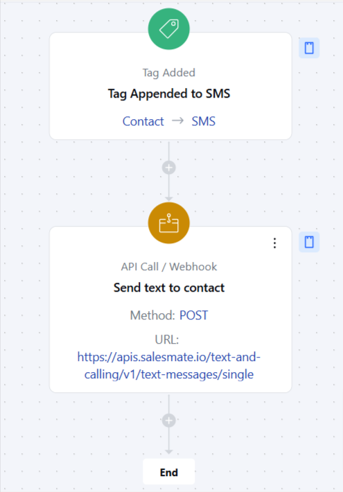

Utilize the Webhook to send messages directly to contacts, ensuring seamless and efficient communication. This flow automates text messaging via webhooks, enabling timely, personalized outreach for notifications, follow-ups, or updates. Ideal for sales, marketing, and customer service, it streamlines communication and boosts engagement through SMS.

###  **Topics covered:**

- [Business Type](#business-type)
- [Template Type](#template-type)
- [Use Case](#use-case)
- [Key Features of the Flow](#key-features-of-the-flow-automated-sms-sending-sends-text-messages-to-contacts-using-webhooks)
- [Breakup of Items Used in the Flow](#breakup-of-items-used-in-the-flow-trigger-tag-added-send-sms-starts-the-flow-when-an-event-eg-form-submission-status-change-tag-added-requires-an-sms-notification)
- [Benefits](#benefits)

###  Business Type

Perfect for SaaS, B2B, Sales, Services, and Marketing teams looking to enhance communication and customer engagement.

###  Template Type

Ideal for businesses and teams focused on improving customer communication and delivering timely updates. This template is suitable for automating SMS notifications, follow-ups, and reminders to improve customer experience and operational efficiency.

###  Use Case

By sending timely, personalized SMS messages, businesses can keep customers informed, improve follow-ups, and boost overall engagement. It’s especially useful for sending reminders, alerts, or status updates to ensure customers stay connected.

###  Key Features of the Flow **Automated SMS Sending**: Sends text messages to contacts using Webhooks.

- **Personalized Outreach**: Allows customization of messages to match the specific needs of recipients.

###  Breakup of Items Used in the Flow ** Trigger **Tag Added: Send SMS**: Starts the flow when an event (e.g., form submission, status change, tag added) requires an SMS notification.

- **Actions **Send SMS **: Uses webhooks to send text messages.

- ** End** The flow ends after the SMS is sent and the details are logged.

###  Benefits

This flow simplifies and automates SMS communication, enabling teams to focus on high-priority tasks. By leveraging third-party texting services, businesses can deliver timely and personalized messages to their customers, boosting engagement and improving the overall customer experience. Automated notifications and follow-ups reduce manual effort, ensuring a more efficient and consistent communication process.
