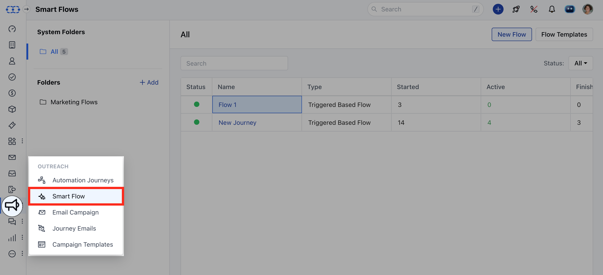
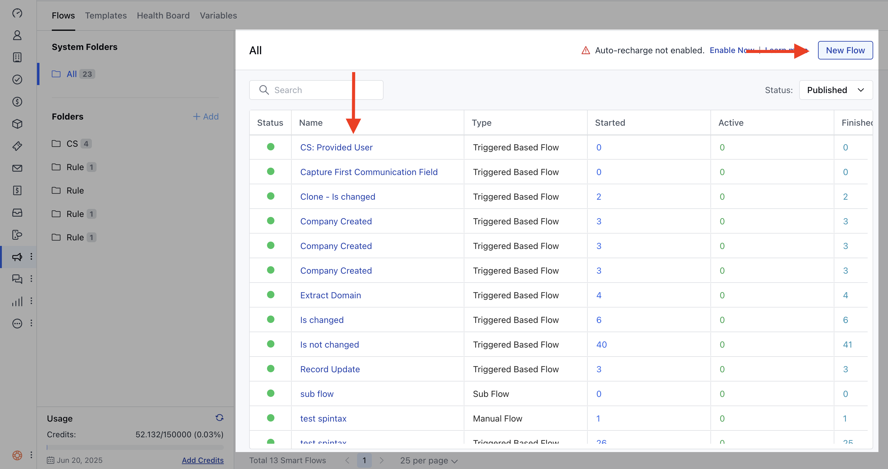
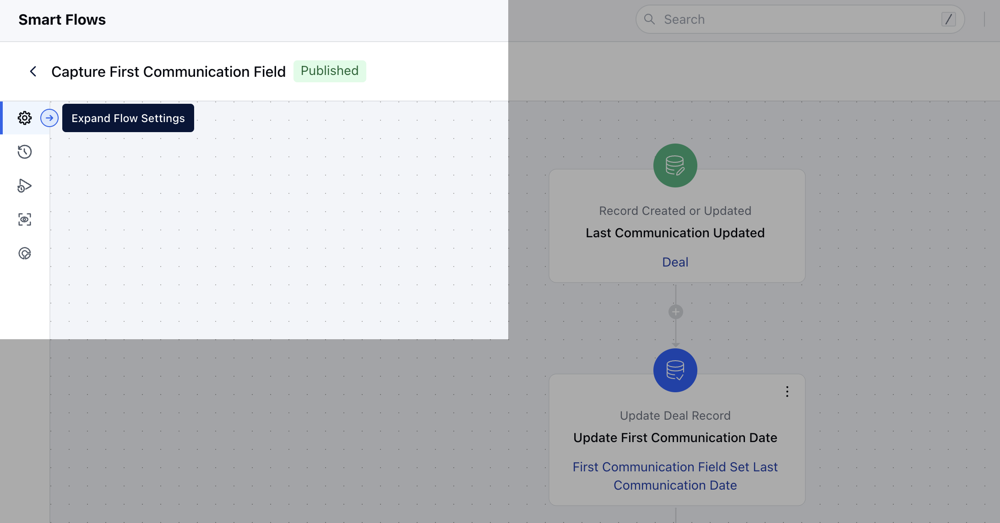
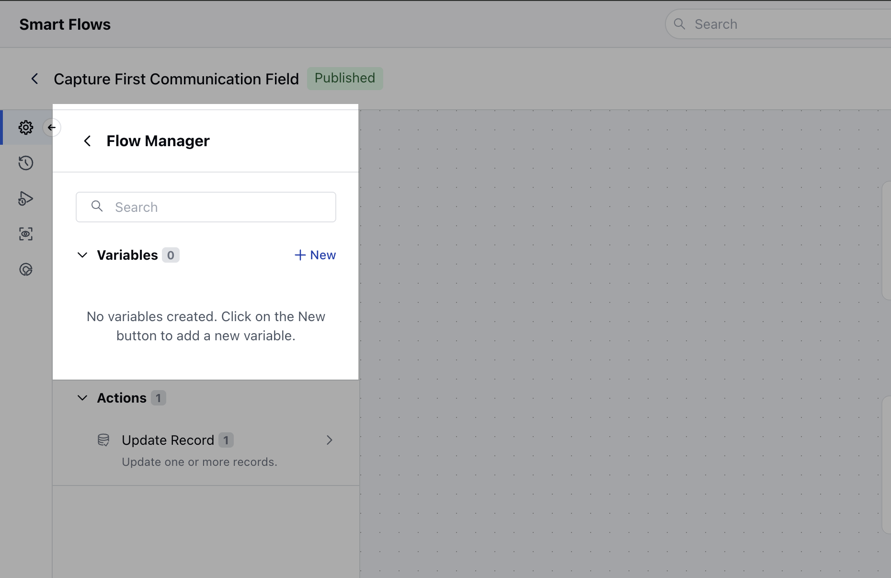
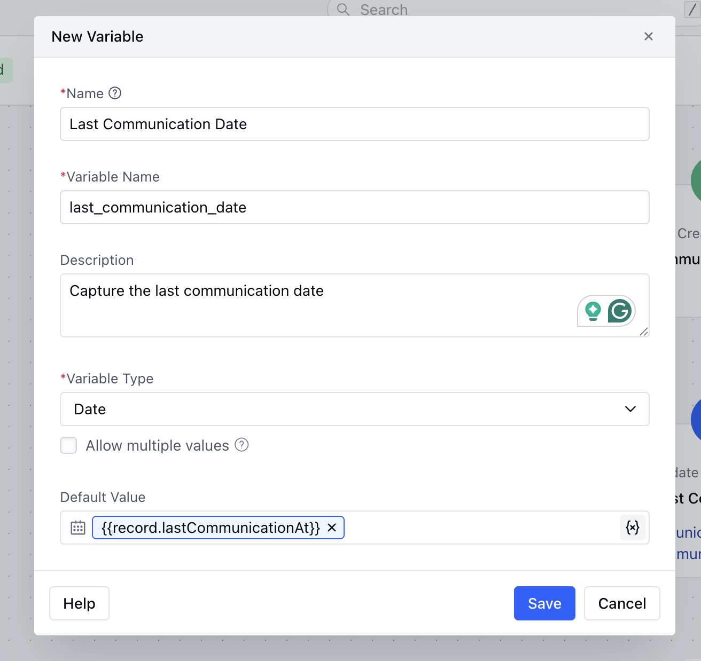

With Smart Flows, you can create custom variables that allow you to personalize and customize your Smart Flows.

### How to Create Smart Flow Variables

To Create Smart Flow Variables,

Access **Smart Flows** feature from left menu bar.

Choose an existing Flow to add variables, or you can create variables as you set up a new Flow.

Expand the Flow Settings

Go to the Flow Manager and click the +New button under the Variables section.

Here, provide the following details:

- **Name:** Enter a suitable name for the variable.

- **Variable Name:** This field will auto-populate based on the name you enter.

- **Description:** Provide a clear and helpful description for the variable.

- **Variable Type:** Choose the type of variable you are creating. If you have chosen the Variable Type Record, you will need to select the module type to create and capture the values
 If you are creating any variable other than Record type then the system will ask you to provide default value for that variable.

- **Allow Multiple Values:** Decide whether this variable should store a single value or multiple values of the selected object. If you choose multiple values, the object will become an array of records, and each value will need to be accessed by its index.If you creating a Sub Flow or a Manual Flow will get an option to choose if the Variable is **Available for Input.

- **- **Sub Flow:** Select whether to capture data from the parent flow when this sub-flow is triggered.

- **Manual Flow:** Select whether to capture input data from the user when they initiate the flow.

- **Note:** You cannot create a variable that matches the name of any other variable within the flow or any output variable name that is already used in any action step.Allow Multiple Values option will not be provided while creating a 'select' and 'multi select' type variable.Once the Variable is created you would not be able to change the Type or change if it is available for multiple values or not.
