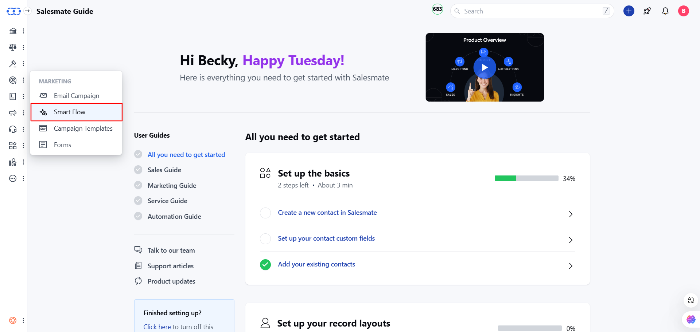
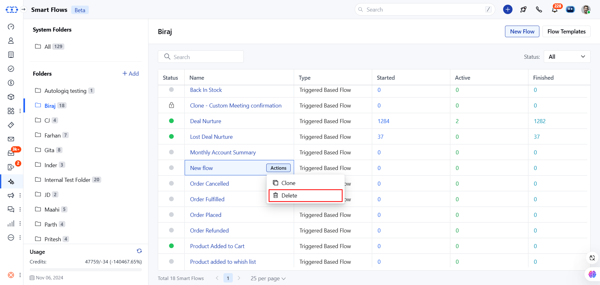
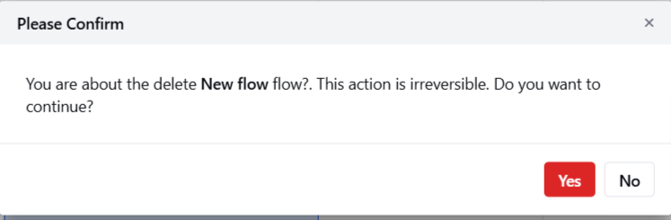
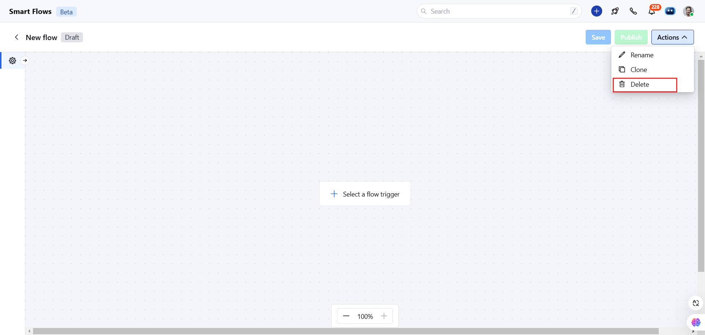

To delete a journey, please follow these steps:

Navigate to the **Outreach Icon** from the left menu barClick on the **Smart Flow**

Find your Flow.Click on the **Actions** button.Select the **Delete** option.

Confirm your action to delete the Smart Flow.

Or

**Note:**On delete, all enrolled contacts to that Smart Flow get unenrolled. Delete operations are irreversible; once done, you can't recover your Smart Flow. If you want to stop any flow temporarily, then use the Pause or Lock flow options.
