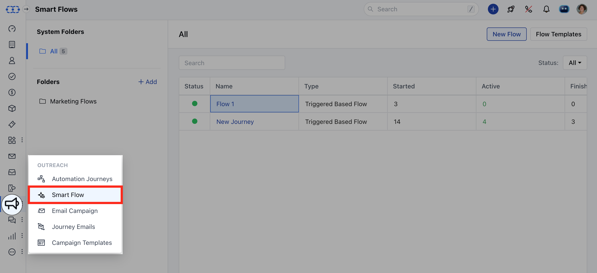

Once the Smart Flow is published and live, you have the flexibility to pause or resume the flow as needed. This means you can temporarily stop the flow from running if necessary and then restart it when required.

### **Topics covered:**

- [How to Pause the Smart Flow](#how-to-pause-the-smart-flow)

- [How to Resume the Smart Flow](#how-to-resume-the-smart-flow)

### How to Pause the Smart Flow

To Pause the Smart Flow,

Access **Smart Flows** feature from left menu bar.

Select the desired flow, and you'll be redirected to its details pageClick on Actions in the top right corner and choose Pause.On confirmation, it will accept new records but mark them as queued, while the current records will remain frozen in their existing state.

- **Note:**Currently, there is no limit on the number of records that can be queued. However, the flow can only remain paused for up to 14 days, after which it will automatically resume.

### How to Resume the Smart Flow

To Resume the Smart Flow,

Access **Smart Flows** feature from left menu bar.

Select the desired flow, and you'll be redirected to its details pageClick on Actions in the top right corner and choose Resume.Upon confirmation, the flow will either begin processing the records that were queued during the pause (if you opted to queue them), or it will start enrolling new records into the flow.
