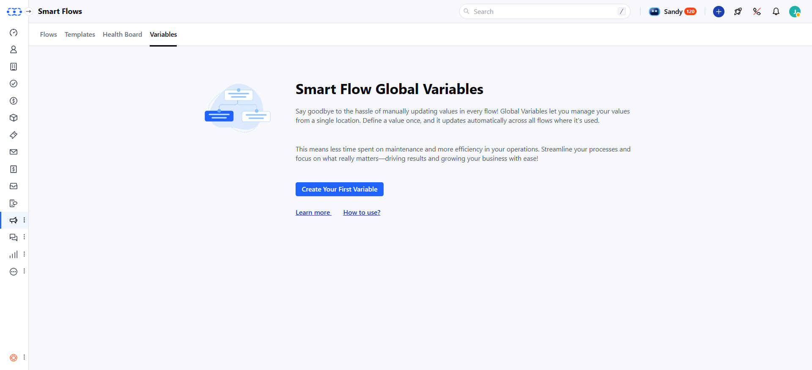
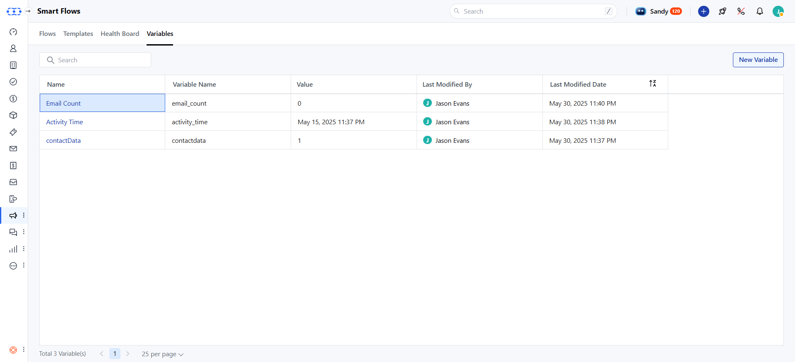
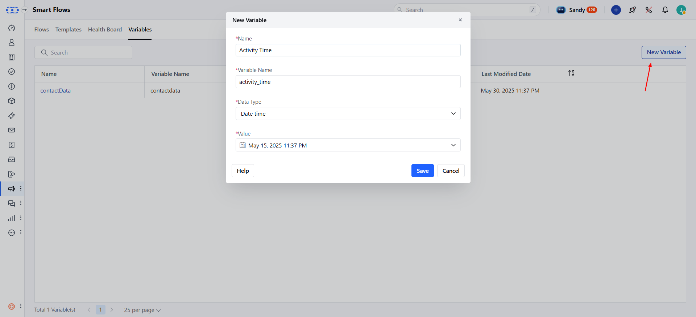
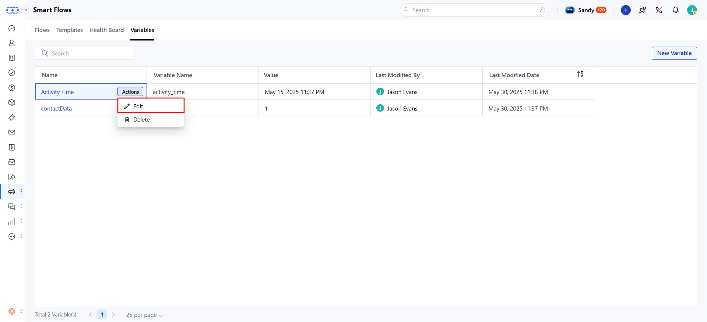
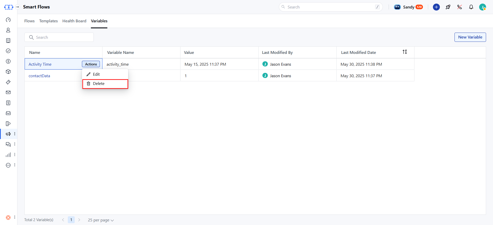

SmartFlow Global Variables help you store and reuse values across multiple flows. They make automation more flexible and easier to manage. This guide explains how to create, edit, and delete these variables within your SmartFlows.

- **Note:** You'll need permission to manage Smart Flows to create, edit, or delete Global Variables.Topics Covered:

- [Steps to Manage Global Variables](#steps-to-manage-global-variables)
- [View Global Variables List](#view-global-variables-list)
- [Create a Global Variable](#create-a-global-variable)
- [Edit a Global Variable](#edit-a-global-variable)
- [Delete a Global Variable](#delete-a-global-variable)
- [Use Global Variables in Flows](#use-global-variables-in-flows)

### Steps to Manage Global Variables

In the left **sidebar**, go to **Smart Flows.

- **Switch to the **Variables** tab.

If no variables exist, you'll see a page with a **Create Your First Variable** button. Click it to open the create variable popup.

### View Global Variables List

Each variable in the list displays the following details:**Name**: Display name of the variable.

- **Variable Name**: Unique internal name used in flows.

- **Value**: The stored value.

- **Last Modified Date**: When the variable was last updated.

- **Last Modified By**: Who last updated it.

### Create a Global Variable

Here's how to create a new Global Variable:

Click the **New** button

Fill in these details to create a global variable:**Name**: Enter a display name (max 255 characters, no special characters).

- **Variable Name**: It is auto-generated from the display name, and is unique.

- **Data Type**: You have the option to choose from Text , Number, Date, Date Time, Boolean, Select, or Multi-select.

- **Value**: Enter the value for the variable (max 1000 characters).

- **Mark Sensitive**: Enable to hide sensitive values (e.g., passwords). You'll need to enter your login password to view or edit the value.Once done, you can click **Save** to create the variable.

### Edit a Global Variable

Here's how to edit an existing Global Variable:

Hover over the variable name and select **Edit**, to edit the variable.

You can update the following fields:**Name**: Change the display name.

- **Value**: Update the value of the existing variable.

- **Mark Sensitive**: Enable or disable to hide sensitive values (requires password confirmation to view/edit).Other fields (e.g., Variable Name, Data Type)**cannot** be changed after creation.Once done, please click **Update** to save changes.

### Delete a Global Variable

Here's how to delete a Global Variable:

Hover over the variable name and select **Delete** from the action menu.

A confirmation pop-up appears:
If the variable isn't used: "Are you sure you want to delete this variable?"If the variable is used in flows, "You must remove all references to the variable before deleting it."Remove all references from flows before deleting.After deletion, you'll see a "Deleted successfully" message pop-up on your screen.

### Use Global Variables in Flows

Here's how to use Global Variables in your Smart Flows:**Accessing Variables**:
Find the **Global Variables** section marked with **$variables** in the flow editor.Click **$variables** to see a list of all Global Variables. The display name is shown with the internal name below it.Click a variable to insert it into your flow.

- **Assigning Values**:
Assign the value of a Global Variable to a local variable in the flow (e.g., use a Global Variable "Key" as the default value for a local variable).

- **Updating Variables**:
Changes to a Global Variable's value automatically update in all flows where it's used.

Use Global Variables to streamline your automation, reduce redundancy, and simplify updates across your Salesmate workspace.
