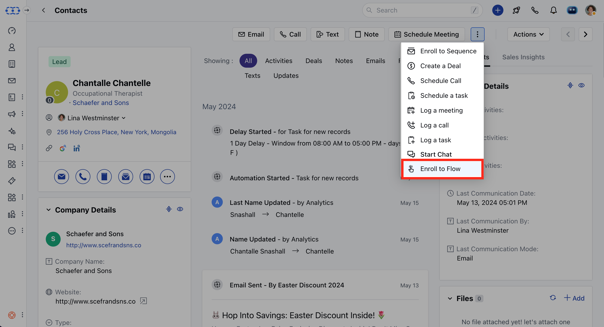

Manual Flow initiates when a user manually publishes and enrolls a record. If you have any active Manual Flows linked, you can enroll records from both the record detail and listing pages.

### **Topics covered:**

- [How to Create Manual Flow](#how-to-create-manual-flow)

- [How to Enroll Records to Manual Flow](#how-to-enroll-records-to-manual-flow)

### How to Create Manual Flow

To create the Manual flow,

Navigate to **Smart Flows** from left side outreachClick on ** New Flow ***

- *Select the flow type as** Manual Flow ***

- *For** Manual Flow **, you'll need to choose the record module

Proceed with selecting Actions and Conditions to complete the flowOnce the Flow is created you can go ahead and **Save and Publish** the Flow.

- **Note:**While creating a manual flow, there is no option to create the trigger. You have to select the module and then start with actions and conditions.

### How to Enroll Records to Manual Flow

There are two ways to enroll the records,

- [From the Detail View](#from-the-detail-view)
- [From the List View](#from-the-list-view)

### From the Detail View

Navigate to the required **Module** from the left menu barOpen the **Detail view** of the specific record you wish to enroll.Click on the **Three dots** in the top right cornerSelect the **Enroll to Flow** option.

A popup will appear, showing the available manual flows for enrollment.

Select the desired manual flows from the list.Click the **Enroll** button to finalize your selection.

A success message will be displayed:**Record(s) added to enrollment queue.

### From the List View

Navigate to the Listing screen of the required Module.Select the records you want to enroll in by checking the corresponding boxes.Click on the **Enroll to Flow** option in the bulk actions toolbar.

A popup will appear, displaying the available manual flows for enrollment.

Select the desired manual flows from the list.Click the Enroll button to confirm your selection.

A success message will appear:**Record(s) added to enrollment queue.

- **A manual flow can have the following enrollment conditions:**Only once:**A record can only enter this flow once **More than once, but single active instance:**A record can enroll in this flow whenever the conditions are met, provided that they are not running through the same flow.

- **More than once, whenever the conditions are met:**A record can enter this flow each time the trigger conditions are met.

