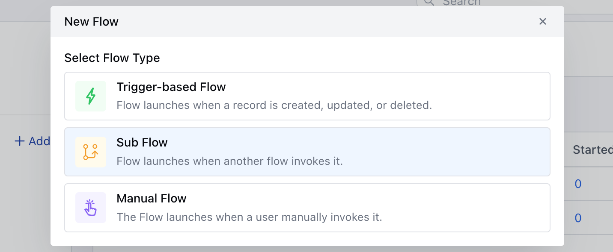
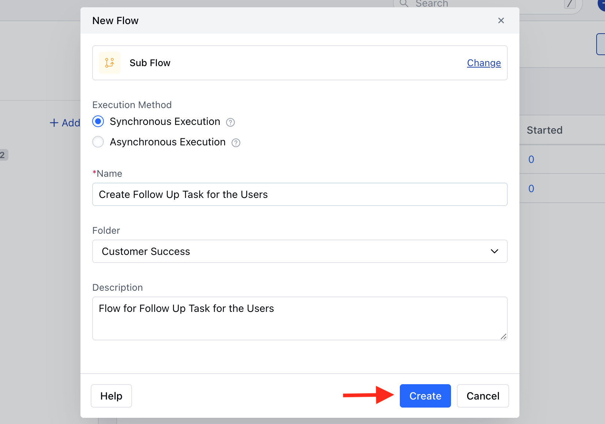
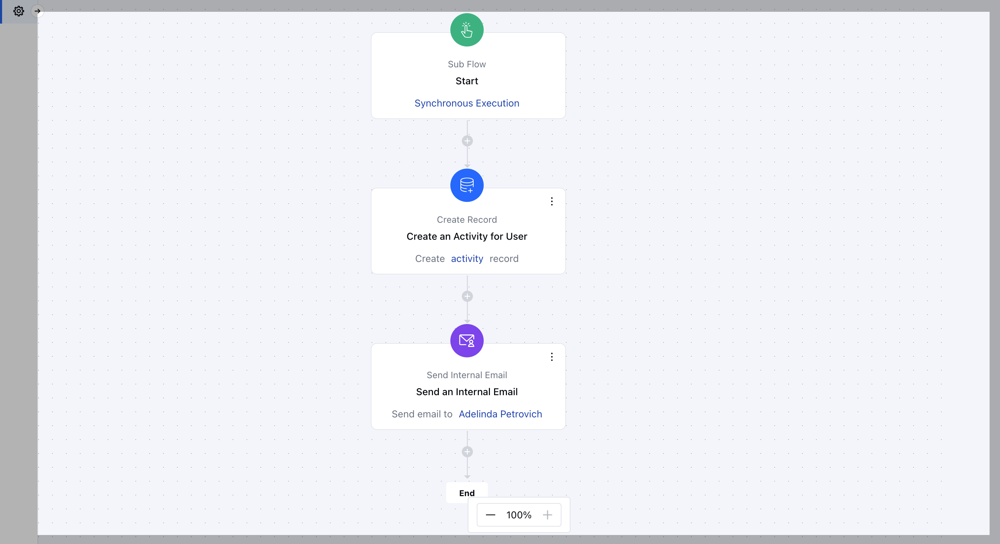

Subflows are a powerful feature within Smart Flow, allowing you to create flexible, reusable workflows. With subflows, you can connect and trigger smaller, modular flows within larger automation sequences, making your processes more efficient and less repetitive.

### **Topics covered:**

- [How to Create a Sub Flow](#how-to-create-a-sub-flow)

- [Practical Example](#practical-example)

### How to Create a Sub Flow

To Create a Subflow:

Navigate to **Smart Flows** from left sidebarClick on **New Flow**

Select the flow type as **Sub Flow**

Select the Execution Method,- **In synchronous execution:** The subflow runs immediately without any delays or wait steps, so it’s perfect if you need real-time results from the subflow to use in the main flow.

- **In asynchronous execution:** The subflow can include wait steps like pausing to wait for a response. However, you won’t be able to use output variables from the subflow in the main flow.Add the following details,
- **Name:** Assign a suitable title for the flow.

- **Folder:** Choose an appropriate folder for the flow.

- **Description:** Provide a brief explanation of the flow's purpose.Once done click on **Create**.

Proceed with selecting **Actions and Conditions** to complete the flowOnce the Flow is created, you can go ahead and **Save and Publish** the Flow.

### Practical Example

This subflow automatically creates a follow-up task and sends an internal follow-up email to the user, eliminating the need to manually add these steps in other Smart Flows. By incorporating this subflow, you save time and reduce repetitive work across workflows.

