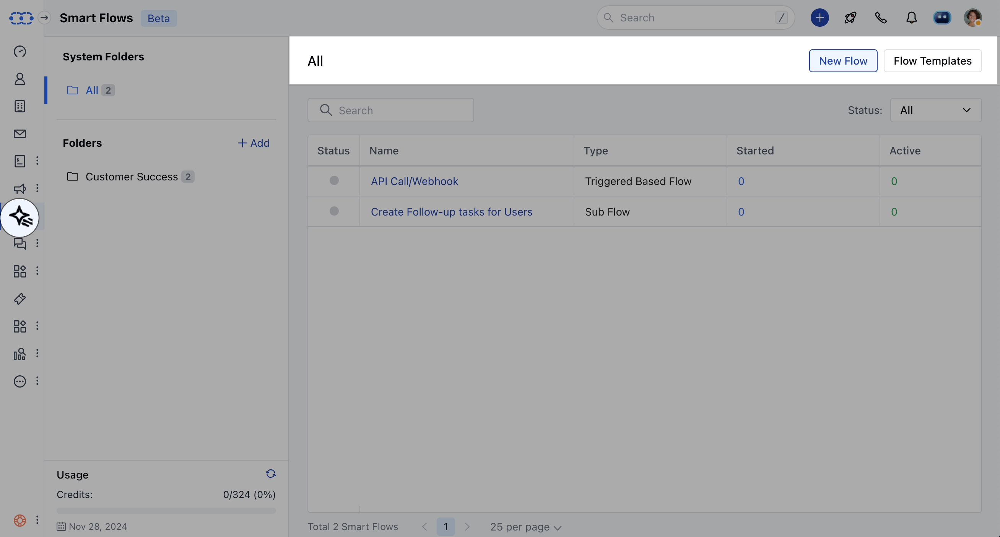
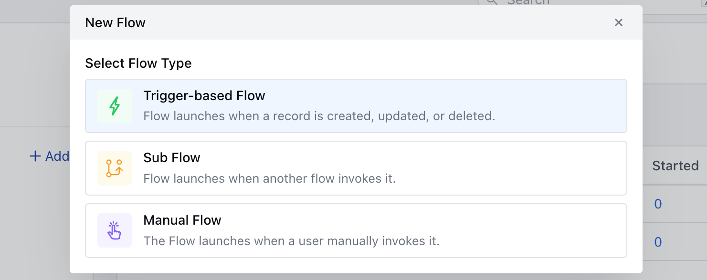
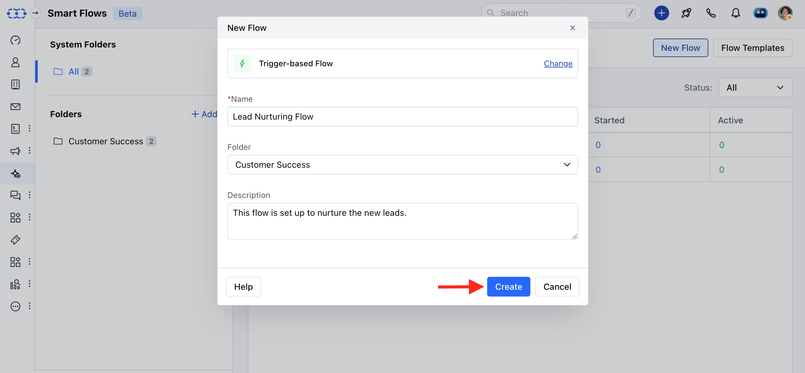
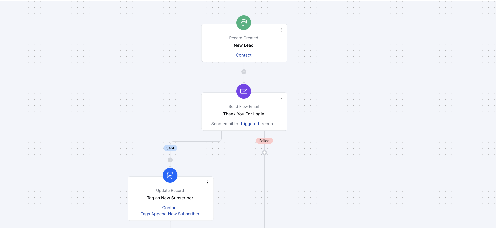

With the trigger-based smart flow, you can automate your marketing and sales processes by incorporating various triggers and actions.You can set your trigger criteria to automatically enroll records like contacts, companies, deals, and activities into the flow. This allows you to take actions on primary or associated records (e.g., updating the contact linked to a deal) that are part of the flow.

###  **Topics covered:**

- [How to Create a Trigger based Smart Flow](https://support.salesmate.io/hc/en-us/articles/37578402656281-Working-with-Trigger-Based-Smart-Flows#h_01JCFSQTZPS4XNFBB5WWTATDQ8)
- [Practical Example](https://support.salesmate.io/hc/en-us/articles/37578402656281-Working-with-Trigger-Based-Smart-Flows#h_01JCFSSNXE1GE3W0T1G3448NCY)##**To create the Trigger Based Smart Flows,**Navigate to **Smart Flows** from left sidebarClick on **New Flow**

Select the flow type as **Trigger-based Flow.

Add the following details,- **Name:** Give it an appropriate name.

- **Folder:** Select the Folder

- **Description:** Give a brief description of Flow been created.

Select the required TriggerProceed with selecting Actions and Conditions to complete the flowOnce the Flow is created, you can go ahead and **Save and Publish** the Flow.

### **Practical Example** When a new subscriber signs up on your website, an automated welcome email is sent to thank them and introduce your services. A tag, such as "New Subscriber," is added to their profile for future segmentation. Additionally, a follow-up email with helpful resources or a special offer is scheduled to be sent a week later. This kind of flow helps engage new subscribers and increases the likelihood of conversion.

