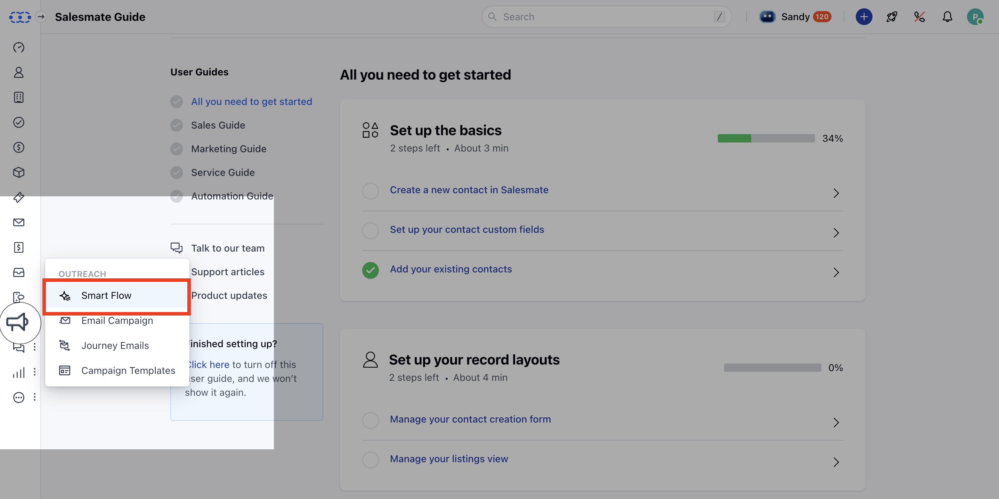
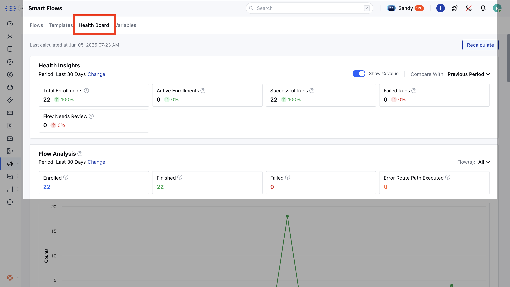
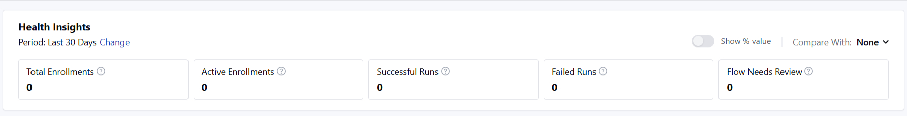
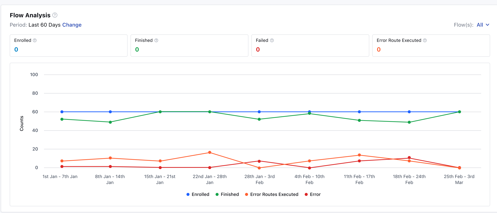
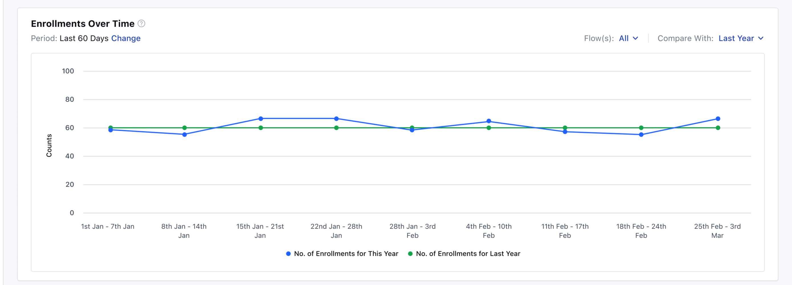
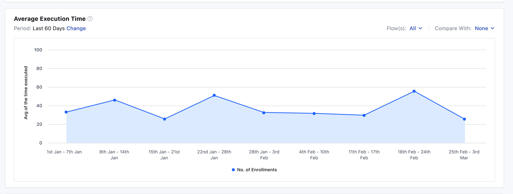
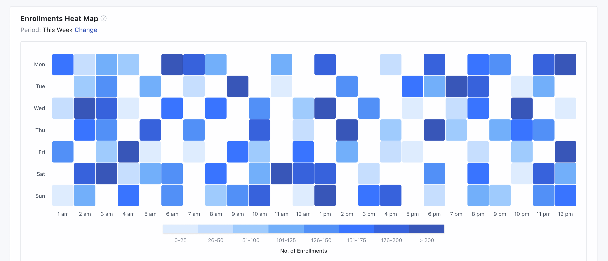
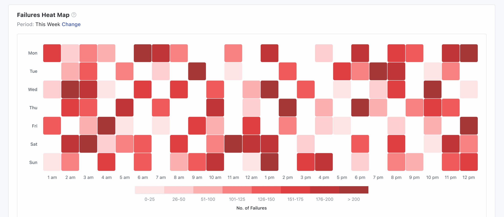
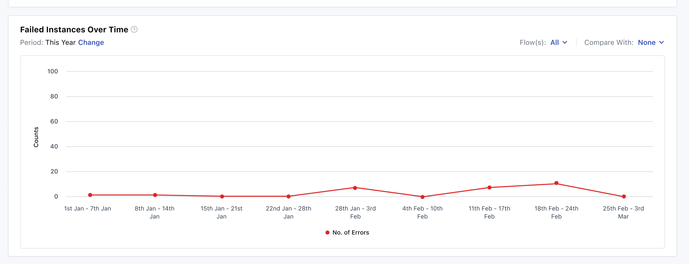
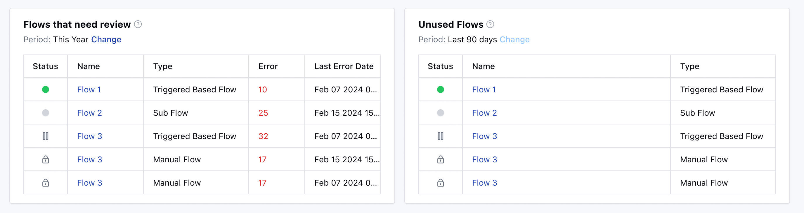

Now in Salesmate, you can analyze your **Smart Flow performance** to assess functionality and identify underperforming or unused flows. Review enrollment data to make informed decisions and optimize workflows.Here is how you can get to the Smart Flows Health board:

Navigate to **Smart Flows** from the left sidebar

Click on the **Health Board** tab.The default period is **Last 30 days.

- ** Data is calculated in real-time; you can use the **Recalculate** button to refresh metrics.

### There are a number of Reports Available:

- [Health Insights](#health-insights)
- [Flow Analysis](#flow-analysis)
- [Enrollments Over Time](#enrollments-over-time)
- [Average Execution Time](#average-execution-time)
- [Heat Map: Weekly Time-Based Enrollments](#heat-map-weekly-time-based-enrollments)
- [Heat Map: Weekly Time-Based Failures](#heat-map-weekly-time-based-failures)
- [Failed Instances Over Time](#failed-instances-over-time)
- [Flows That Need Review](#flows-that-need-review)
- [Unused Flows](#unused-flows)

### Health Insights

This report displays data for the last 30 days by default, which you can change to a different date and enable comparison with the previous period or year. You can have the comparison show percentage change; by default, it compares with the previous period. Frequency is fixed to dailyThis report will give you the following metrics:**Total Enrollments**– Count of enrollments in the selected period to assess scale and aid capacity planning.

- **Active Enrollments**– Currently running instances that help identify delays due to the flow queue.

- **Successful Runs**– Number of flows completed successfully, indicating system health when compared to total enrollments.

- **Failed Runs**– Instances that failed due to errors, revealing issues in steps or integrations.

- **Flows Needing Review**– Flows that encountered errors and may require reconfiguration.

- **Percentage View**– Option available when comparison is enabled; turned on by default.

### Flow Analysis

This section displays a multi-line chart showing daily trends in flow activity over the selected time period. It visualizes how flows were enrolled, completed, failed, or routed through the error path. This helps monitor performance patterns and spot irregularities.

Metrics: Enrolled, Finished, Failed, Error Route Path ExecutedThe Chart Type is Multi-Line ChartX-axis contains Date RangeY-axis contains Count of Records

### Enrollments Over Time

This report displays the number of enrollments over time. You can enable comparison with the previous timeframe.

The Chart Type is Line ChartX-axis contains Date RangeY-axis contains Count of Records

### Average Execution Time

This report shows how long flows typically take from initiation to completion, helping you identify performance bottlenecks or resource-heavy flows.

The Chart Type is Area ChartX-axis contains Date RangeY-axis contains Average Execution Time (in seconds)

### Heat Map: Weekly Time-Based Enrollments

This chart visualizes weekly distribution of enrollments by time of day to identify peak periods for better resource allocation and marketing.

Y-axis contains Days of the week (Monday to Sunday)X-axis contains Time of day (hourly intervals from 12 AM to 12 PM)Color Intensity is the Number of enrollments (darker shades for higher counts)

### Heat Map: Weekly Time-Based Failures

This chart visualizes weekly distribution of failures by time of day, helping identify patterns for troubleshooting and optimization.

Y-axis contains Days of the week (Monday to Sunday)X-axis contains Time of day (hourly intervals from 12 AM to 12 PM)Color Intensity is Number of failures (darker shades for higher counts)Frequency is Weekly, which cannot be altered/changed.Failures are summed for each day/hour combination across selected weeks

### Failed Instances Over Time

This report shows only the instances that stopped due to an error, excluding those routed through the error path. You can enable comparison with the previous timeframe.

The Chart Type is Line ChartX-axis contains Date RangeY-axis contains Count of Records

### Flows That Need Review

This grid report lists all flows that encountered errors. By default, data is shown for the last 30 days, and the date range cannot be changed.

You get these Columns for the data:
Status – Current status of the flowName – Name of the flowType – Type of the flowErrors – Number of errors in the flowLast Error – Date of last errorDefault sorting is by descending number of errors.

### Unused Flows

This report shows flows with no enrollments for at least 90 days. It is displayed in a grid format with a fixed date range.

The Default Period is Last 90 days which cannot be changedYou get these Columns for the data:
Status – Current status of the flowName – Name of the flowType – Type of the flow

