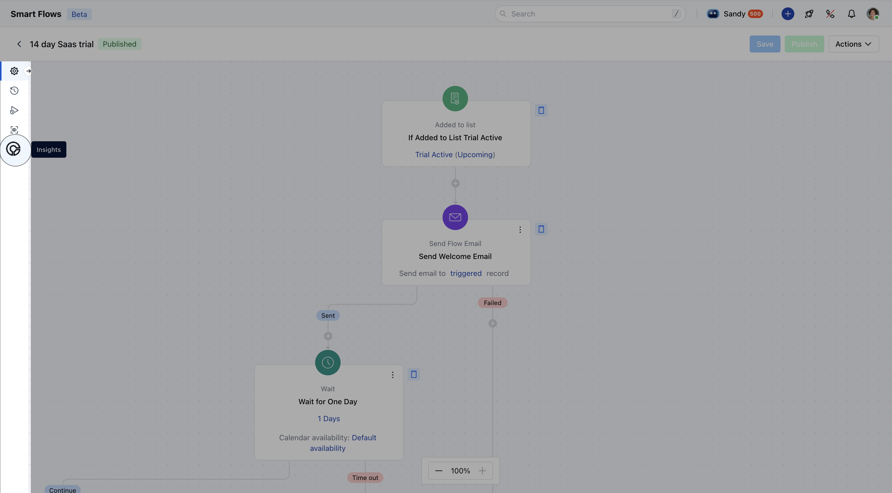
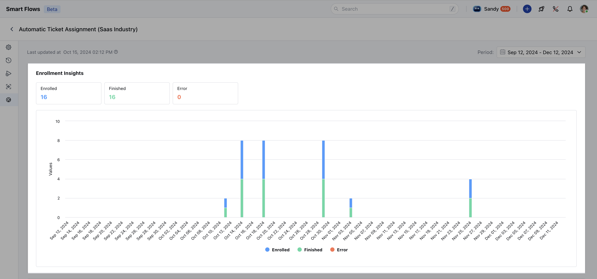
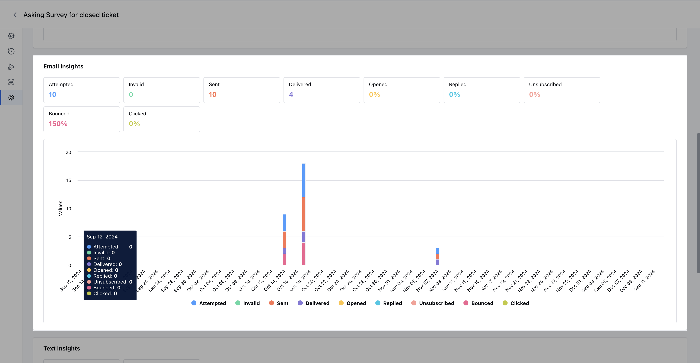
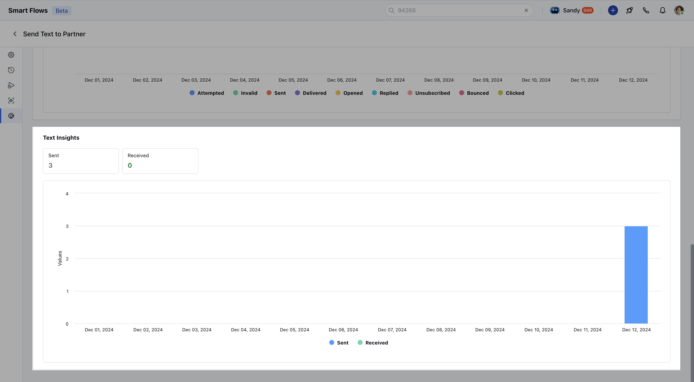

**Smart Flow Insights**in Salesmate help you monitor the performance of your automated workflows by providing detailed metrics. These insights allow you to track enrollments, email interactions, and text message outcomes to ensure your flows are running smoothly and effectively.To view Smart Flow Insights

Navigate to the**Smart Flows**section in SalesmateSelect the flow you want to analyze.In the selected flow, click on the**Insights**tab in the left-hand menu to view performance metrics.

###**Insights Overview**[Enrollment Insights](https://support.salesmate.io/hc/en-us/articles/40498300775449-Smart-Flow-Insights#h_01JE2PT5G0BQK833DM52QC5V0D)[Email Insights](https://support.salesmate.io/hc/en-us/articles/40498300775449-Smart-Flow-Insights#h_01JE2PVYC057YEP46BWXP7Y794)[Text Insights](https://support.salesmate.io/hc/en-us/articles/40498300775449-Smart-Flow-Insights#h_01JE2PXBBKAFRRNRNBMZX553YC)

####**Enrollment Insights**This section provides a summary of how records are progressing through the flow. Key metrics include:

**Enrolled:**The total number of contacts or deals enrolled in the flow.**Finished:**The number of contacts or deals that have completed the flow.**Error:**The number of contacts or deals that faced issues during the flow.

####**Email Insights**The**Email Insights**section provides a detailed breakdown of the performance of email actions included in your Smart Flow. These metrics help you understand how your email communication is performing at each step:

**Attempted:**This shows the total number of emails the system attempted to send. It includes both successful and failed attempts.**Invalid:**This metric highlights emails that could not be sent due to invalid addresses, ensuring you can update or correct inaccurate contact details.**Sent:**The count of emails that were successfully processed and sent out. This excludes invalid or failed attempts.**Delivered:**Out of the emails sent, this shows the number of emails that successfully reached the recipients’ inboxes. High delivery rates indicate effective email deliverability practices.**Opened:**Tracks the number of emails that recipients opened. This metric gives you an idea of how engaging your subject lines are.**Replied:**Shows the number of recipients who responded to your emails. It’s a key indicator of engagement and communication success.**Unsubscribed:**This reflects the number of recipients who opted out of further email communication, helping you measure email content relevance and frequency.**Bounced:**Identifies emails that failed to reach the recipient due to issues like a full inbox, non-existent address, or other delivery failures.**Clicked:**Tracks how many recipients clicked on the links in your emails, providing insights into the effectiveness of your call-to-action and content strategy.

####**Text Insights**The**Text Insights**section provides key metrics for monitoring the performance of SMS actions in your Smart Flow. These metrics help you evaluate how effectively your text communications are reaching and engaging recipients:

**Sent:**The total number of text messages successfully sent through the flow. This reflects the outreach efforts made via SMS.**Received:**The count of responses received from recipients, indicating how many engaged with your text messages

By reviewing these insights, you can identify strengths and areas for improvement in your email and text communication strategies, ensuring that your Smart Flow automation delivers optimal results.
