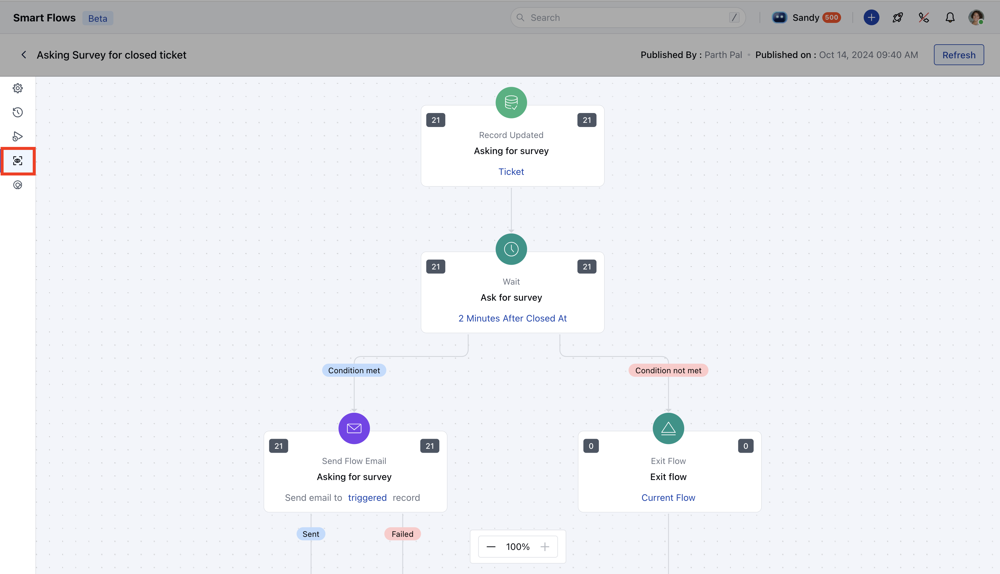
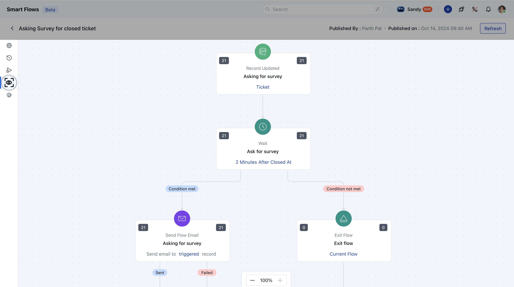

The **Smart Flow Live View** feature allows you to track your published flows in real-time. You can view how many records have entered or completed each step of the flow and analyze its performance.Follow these steps to see how many records have reached or completed the smart flow:

Go to **Outreach** from the left menu.Select **Smart Flow**. Locate and click on the name of the flow you want to track.Click on the **Live View** icon from the left-hand sidebar.

Once in the Live View, you will see all the nodes of your published flow. Please note that any nodes in **draft mode** will not be displayed here.

####- **Metrics in Live View:** For each node in the flow, you can monitor the following metrics:

- **Left Side Count:** Displays the number of records that have reached this node.

- **Right Side Count**: Shows the number of records that:
 Successfully executed the step.Finished the flow.Were not eligible for the next step.

- **Refresh Logs:**To reload the latest data for the flow, click on the **Refresh** button located in the top bar.

- **Zoom In/Out:**Use the zoom controls in the bottom-left corner to adjust your view of the flow canvas. The default zoom level is **100%**, but you can zoom in or out as needed.

- **Note:**In case of failure, the left side will have a greater value than the right side.Use the **Smart Flow Live View** to gain real-time insights into your automation flows, resolve issues promptly, and optimize their performance for better results.
