This article will help you to learn more about accessing your flow settings and how to use them.

- [How to access Smart Flow settings](#how-to-access-smart-flow-settings)
- [What Options are available under Smart Flow flow settings](#understanding-different-options-available-under-smart-flow-settings)

###  How to access Smart Flow settings

To access your Smart Flow Settings,

Click on a Smart Flow TitleHover the cursor towards the arrow visible besides the settings icon on left side menu bar under the flow title

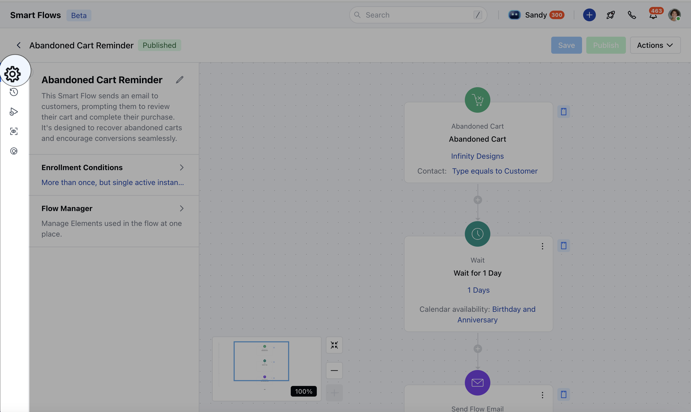

Click on the arrow which should expand your flow settings.This should open the page where you can view options available under Smart Flow settings

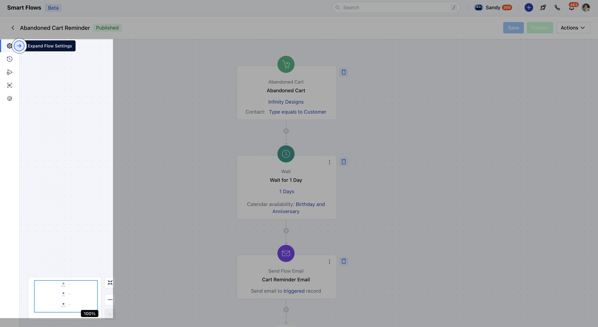

###  Understanding Different Options Available Under Smart Flow Settings

- [Editing your Flow's Title, Description and Changing the Folder](#editing-your-flows-title-description-and-changing-the-folder)
- [Enrollment Conditions](#enrollment-conditions)
- [Flow Manager](#flow-manager)
- [Credits Consumed](#credits-consumed)

###  Editing your Flow's Title, Description and Changing the folder:

Click on the pencil besides the flow's title

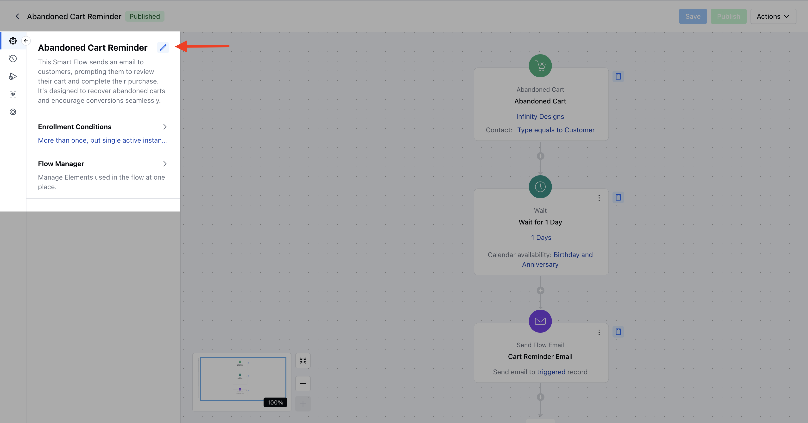

On the next page, you should be able to identify the type of your flow i.e. Trigger based, Sub Flow, Manual FlowView/Edit the Title of the flowView/Change the folder of the flowView/Edit it's descriptionHit "**Update**" to implement any changes you have made in Title, description or folders

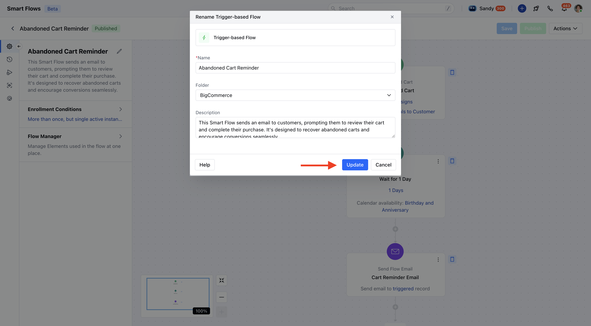

###  Enrollment Conditions:

Using this setting, you can configure your record's enrollment condition. The available options are:**Only Once**: This can be used if you do not want a record to be enrolled more than once in a flow

- **More than Once But Single Active Instance:** This should be used when you want a record to be enrolled if it is not active i.e. not at any stage of the specific flow.

- **More Than Once Whenever the Conditions are met:** This should be used if you want a record to be enrolled multiple times in a flow disregarding if it is already active i.e. Sending a meeting booking confirmation every time a customer books a meeting

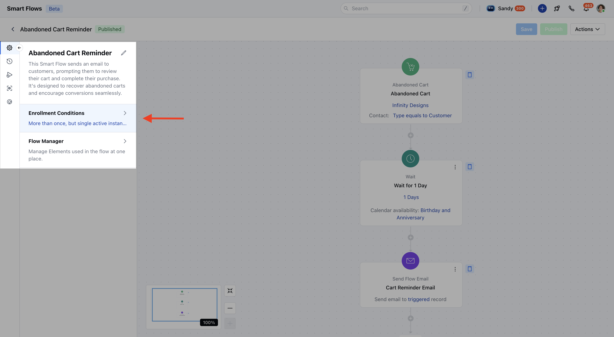

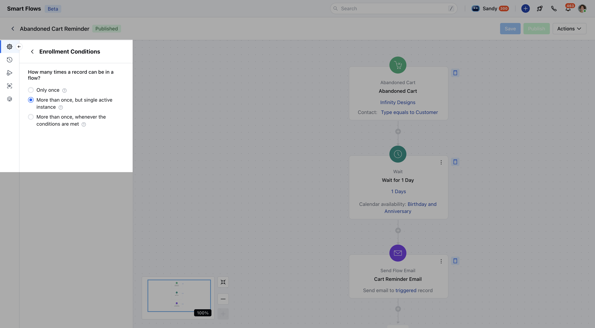

If you are making any changes to the existing enrollment condition, please make sure to hit **"Save"**"**Publish"**so that the new enrollment condition takes effect.

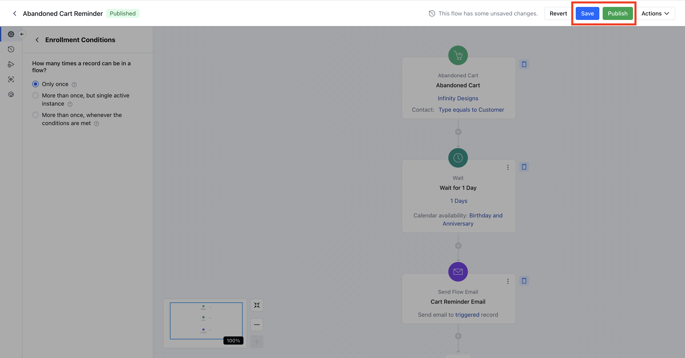

###  Flow Manager

Flow Manager should be used to understand and manage the elements used in a given flow. Elements are:

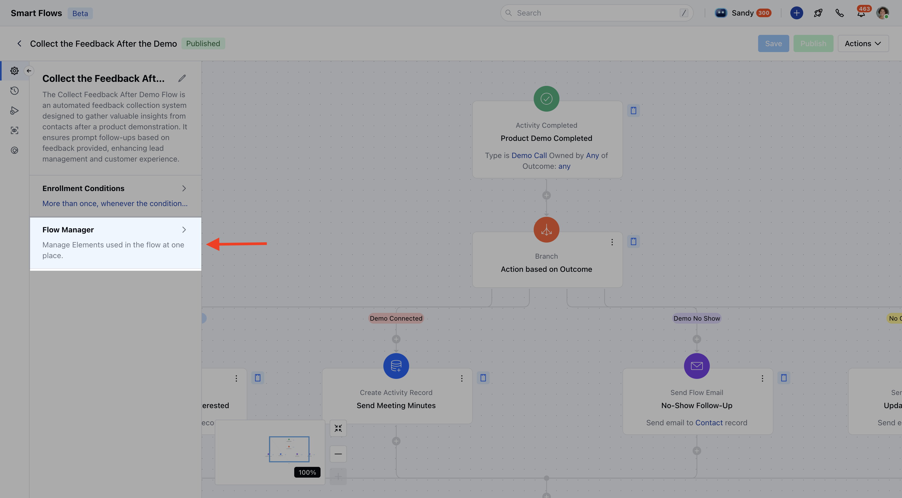

- *Variables**: This allows you to view/create new variable for a given flow

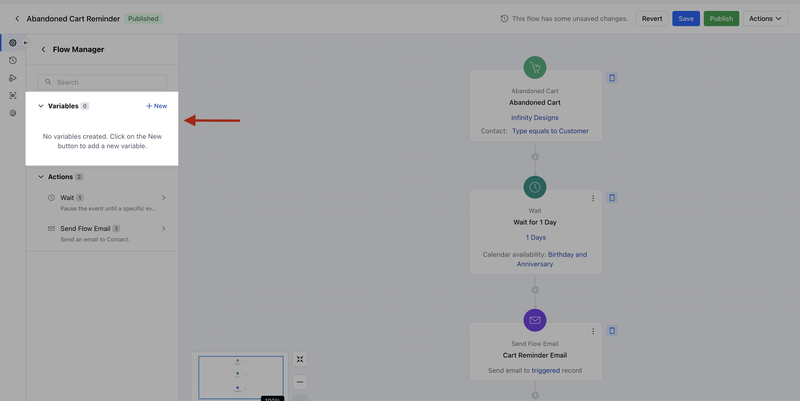

- **Actions:** This lets you view number of actions and what the are the actions used in a flow

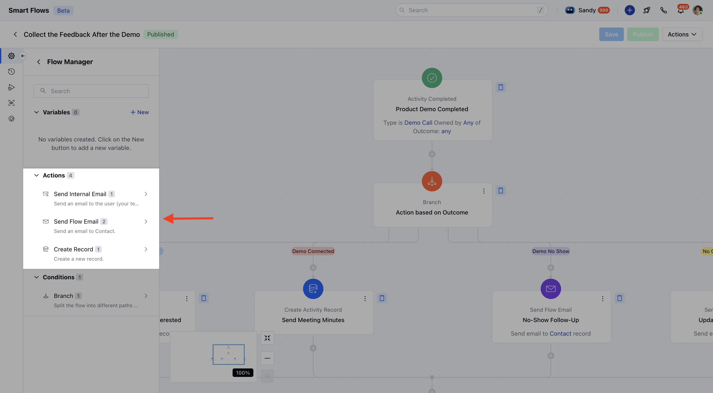

- **Conditions:** This lets you view the number of condition nodes and what the are the conditions used in the flow.

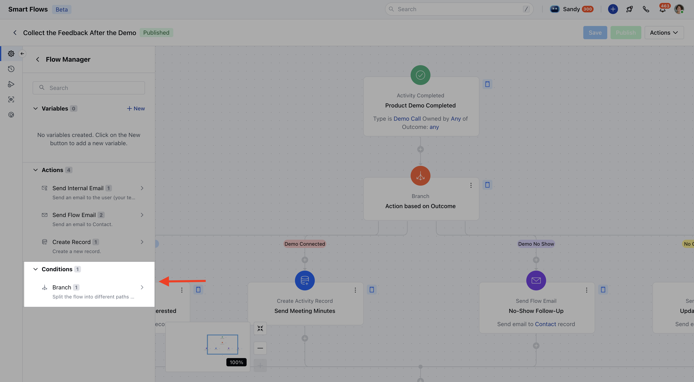

###  Credits Consumed

This section will show you the Lifetime value of the credits consumed by a given flow.

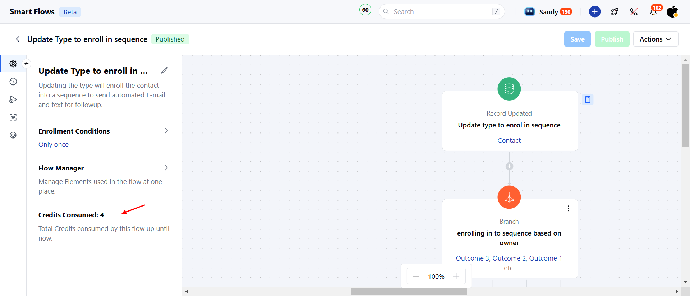
