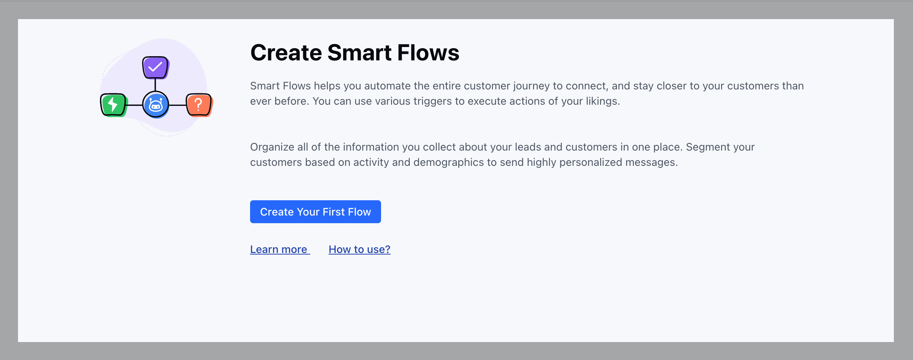

With Salesmate Automation’s no-code tools, you can easily create and manage automated processes without any coding. This means you can simplify your work, cut down on manual tasks, and get more done in less time.**Note:**[Learn more about the Plans & Pricing](https://support.salesmate.io/hc/en-us/articles/36622327424793)
<iframe
  width="560"
  height="315"
  src="https://www.youtube.com/embed/t3_XzEOGY4M"
  title="YouTube video"
  frameborder="0"
  allow="accelerometer; autoplay; clipboard-write; encrypted-media; gyroscope; picture-in-picture; web-share"
  allowfullscreen
></iframe>

**Key features and benefits of Smart Flows include:****Automation of repetitive tasks:**Smart Flows can automate routine activities, such as sending follow-up emails, updating records, or assigning tasks, freeing up valuable time for sales representatives.**Improved data accuracy:**By automating data entry and updates, Smart Flows help ensure data consistency and accuracy, leading to better decision-making.**Enhanced customer experience:**Smart Flows can be used to automate customer interactions, such as sending personalized welcome messages or providing timely support, improving customer satisfaction.**Increased productivity:**By streamlining workflows and reducing manual effort, Smart Flows can significantly boost productivity and team efficiency.**Scalability:**Smart Flows can be easily adapted to accommodate changes in business processes or growth, ensuring that the CRM system remains effective.**Common use cases for Smart Flows in CRM include:****Lead management:**Automatically qualifying leads, assigning them to appropriate sales representatives, and sending follow-up emails.**Opportunity management:**Tracking deal progress, sending reminders for upcoming deadlines, and updating opportunity stages.**Customer support:**Routing customer inquiries to the appropriate support team, tracking case resolution, and sending follow-up surveys.**Marketing automation:**Sending targeted email campaigns, nurturing leads, and tracking marketing performance.
