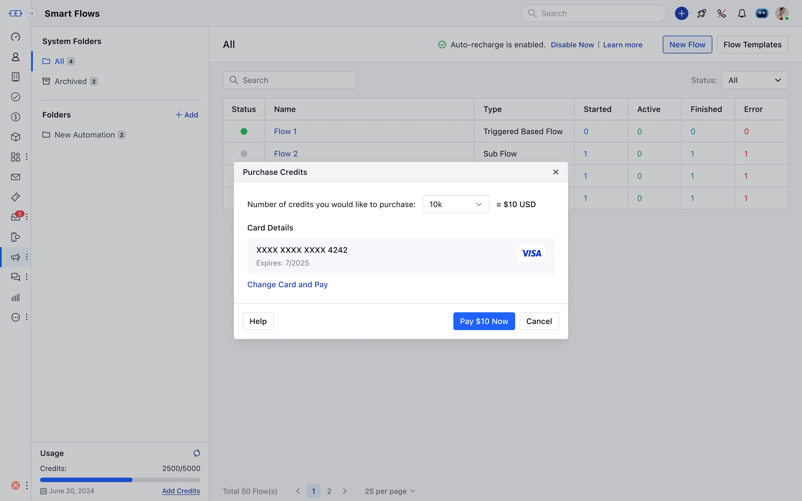
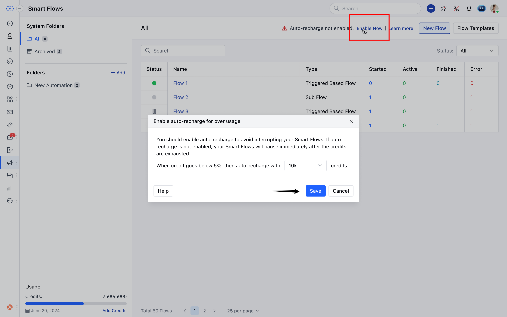
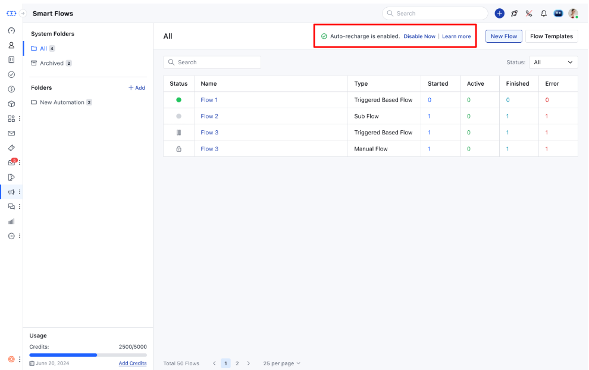
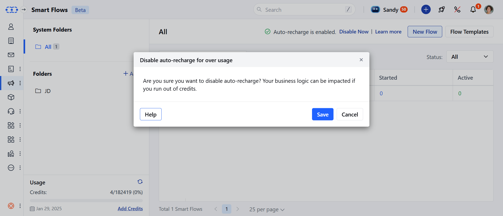

Smart Flow feature will be available across all Salesmate's plans, with varying limitations depending on the specific paid plan.

Each account will receive a certain number of credits to run Smart Flows based on their subscription plan, determined by the **number of user licenses** associated with that account.Flow usage beyond the free limit will be tracked monthly and billed in your next invoice.Trigger and condition steps will not consume any execution credits.The Email action will use 4 execution credits, while all other actions will use 1 execution credit each.
[Learn More about credits and how they are consumed.](#how-to-enable-auto-recharge-steps-to-enable-auto-rechargenavigate-to-the-smart-flow-or-campaign-listing-screenif-auto-recharge-is-not-enabled-youll-see-a-warning-message-just-above-the-listing-screen-auto-recharge-not-enabled-enable-nowclick-on-enable-now)

###  **Topics covered:**

- [Smart Flow Credits Inclusion based on Plans](#smart-flow-credits-inclusion-based-on-plans)

- [Trial Accounts](#trial-accounts)

- [Free Credit Renewal for Monthly and Annual Plans](#free-credit-renewal-for-monthly-and-annual-plans)

- [Manually Adding Credits for Smart Flows](#manually-adding-credits-for-smart-flows)

- [How to Enable Auto-Recharge](#how-to-enable-auto-recharge-steps-to-enable-auto-rechargenavigate-to-the-smart-flow-or-campaign-listing-screenif-auto-recharge-is-not-enabled-youll-see-a-warning-message-just-above-the-listing-screen-auto-recharge-not-enabled-enable-nowclick-on-enable-now)

- [How to Disable Auto-Recharge](#how-to-enable-auto-recharge-steps-to-enable-auto-rechargenavigate-to-the-smart-flow-or-campaign-listing-screenif-auto-recharge-is-not-enabled-youll-see-a-warning-message-just-above-the-listing-screen-auto-recharge-not-enabled-enable-nowclick-on-enable-now)

- [Pricing Structure to purchase additional credits](https://support.salesmate.io/hc/en-us/articles/36622327424793-Smart-Flows-Plans-Pricing#01JF7R12RR706YA35DN5C9CETD)

- [Effect of Smart Flow on Email campaign](#effect-of-smart-flow-on-email-campaign)

- [How contact quota is utilized for Automation Journeys and Smart flow](#how-contact-quota-is-utilized-for-automation-journeys-and-smart-flow)

###  Smart Flow Credits inclusion based on plans

| Plans | Total Credit Costs |
| --- | --- |
| Basic | 5000 / User / Month |
| Pro | 10000 / User / Month |
| Business | 15000 / User / Month |
| Enterprise | 20000 / User / Month |

###  Trial Accounts

A trial plan can have up to 15 active flows at once.You'll receive a total of 2,000 credits during the trial.If your trial ends while you have active flows, all of them will be paused, but your data will remain safe.

###  Free Credit Renewal for Monthly and Annual Plans

- **Monthly Plans:** Your credits will automatically renew on your next billing date, ensuring you always have the credits needed for the month.

- **Annual Plans:** Your credits will renew monthly, based on your plan’s billing date. For instance, if your plan renews on May 8th, your credits will be renewed on the 8th of each month.

###  Manually Adding Credits for Smart Flows

You can manually add credits through the Smart Flow and Campaign landing screens to ensure your Smart Flows run smoothly without interruption.

- **Steps to Manually Add Credits:** Navigate to the **Smart Flow** or **Campaign Listing** Screen.Click on **Add Credits** on the bottom left side under usage

Add credits in **increments of 10k**(10k, 20k, 30k, or 1M credits) and add the card details.Click on **Pay** to proceed with the purchase **.

After the purchase, a success message will appear and your balance will be updated.**"You've successfully bought credits. Thank you for your purchase!"**Note:** If you have exhausted the credits available for **Smart Flows**, all your Flows will be paused until you manually add credits. You have the option to ** Auto Recharge** your credits for seamless execution of the flows.

###  How to Enable Auto-Recharge **Steps to Enable Auto-Recharge:**Navigate to the **Smart Flow** or **Campaign Listing** Screen.If auto-recharge is not enabled, you’ll see a warning message just above the listing screen:⚠️ "Auto recharge not enabled. Enable NowClick on **Enable Now.

- **Choose the desired credits for auto-recharge and click Save.

###  How to Disable Auto-Recharge **Steps to Disable Auto-Recharge:**Navigate to the **Smart Flow** page.Hit on **Disable Now** from the top row.

If eligible, a popup will appear: "Are you sure you want to disable auto-recharge? Your business logic can be impacted if you run out of credits."Hit **Save** to disable auto-recharge.

**Note:**You can disable the auto-recharge feature if your current usage is lower than the available creditsIf your usage exceeds the available credits, a warning will appear: "You can’t disable auto-recharge as your current usage exceeds the available credits. You are bound to pay that amount."

###  Additional Credits Pricing

| 10,000 to 100,000 credits | $12 per 10,000 credits |
| --- | --- |
| 100,001 to 1,000,000 credits | $10 per 10,000 credits |
| 1,000,001 to 10,000,000 credits | $8 per 10,000 credits | **Example**: |

If you intend to purchase 100,000 credits, the price applicable would be $120 (12*10)If you intend purchase 110,000 credits, the price applicable would be $130 (12*10 as per the first slab) + ($10*1 as per the second slab)

###  Effect of Smart Flow on Email campaign

As we learned above, E-mail action consumes 4 credits any E-mails sent via E-mail campaigns will consume 4 credits. For instance, If 100 Emails were sent through Email campaign, it will consume 400 credits. [Learn More about credits and how they are consumed.](#how-to-enable-auto-recharge-steps-to-enable-auto-rechargenavigate-to-the-smart-flow-or-campaign-listing-screenif-auto-recharge-is-not-enabled-youll-see-a-warning-message-just-above-the-listing-screen-auto-recharge-not-enabled-enable-nowclick-on-enable-now) How Contact Quota is Utilized for Automation Journeys and Smart Flows

###  How contact quota is utilized for Automation Journeys and Smart flow

Automation Journeys consume your contact quota based on the number of unique contacts triggered within a billing cycle. If you have a paid subscription for Automation Journeys, Smart Flows will share the same contact quota.

- **For example**:

If you purchased a quota of 1,000 contacts.100 unique contacts are triggered via Smart Flows.100 unique contacts are triggered via Automation Journeys.

Your total usage would be 200 contacts, leaving 800 contacts remaining from your Automation Journeys quota.
[Learn more about how Automation Journeys Pricing are calculated](#how-to-enable-auto-recharge-steps-to-enable-auto-rechargenavigate-to-the-smart-flow-or-campaign-listing-screenif-auto-recharge-is-not-enabled-youll-see-a-warning-message-just-above-the-listing-screen-auto-recharge-not-enabled-enable-nowclick-on-enable-now)

All of your use cases built under **Automation Journeys** can be built on **Smart Flows** too. Please contact support team for assistance.
