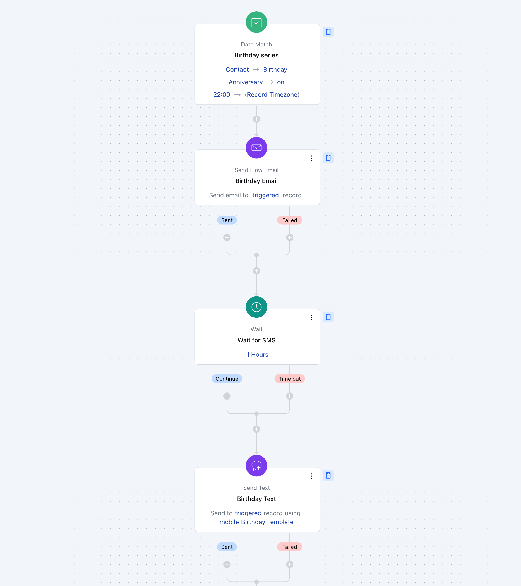

Credits is a term which is used to measure the consumption of your Smart flow. A block will consume a credit when they execute an action.

###  **Topics covered:**

- [How credits will be consumed.](#how-credits-will-be-consumed)
- [Practical Example](#practical-example)

###  How credits will be consumed.

Each successful step processed within a Flow counts as an **Execution**. Credits are deducted only when an action is successfully completed. For example, if you configure a "**Send Email**" action, credits are consumed only when the email is successfully sent. No credits are used if the action fails.

Below are examples of actions/executions under **Smart Flow.

- **- **Triggers:** No credits are consumed when a flow is triggered.

- **Conditional Steps:** The conditional blocks will not consume any credits.

- **Switch Actions:** Sub flow, Exit Flow, Exit from selected flow will not consume any credit.

- **Send Campaign / Send Email Action:** Each email sent to the customer will consume 4 credits.

- **Every other action block:** Every other block in the flow will consume 1 credit for execution.

###  Practical Example

Let's take an example of the Birthday Series Smart Flow Template, where the Contact will be triggered when the Birthdate is matched. The Flow will execute and send an E-mail to the contact and considering the delay of one hour, a text message will be sent.

Let's take the above flow as a reference and explain how this flow will consume your credits.

- **Trigger matched:** 0 Credits

- **Email Sent:** 4 Credits

- **Wait Action:** 1 Credit

- **Text Sent:** 1 Credit

- **Exit:** 0 Credit

- **Total:** 6 Credits.

Each time a contact matches the trigger and both of your actions are executed, a flow will consume five credits when build using similar action blocks.
