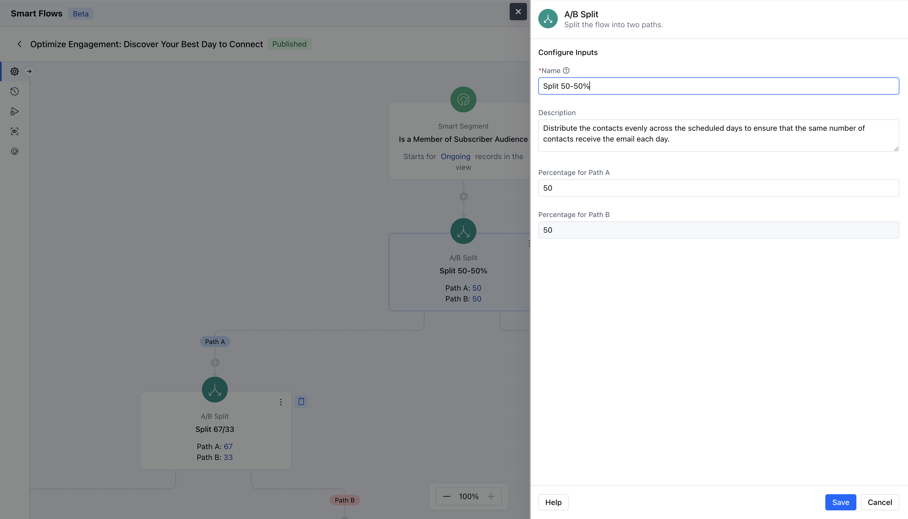

- The **A/B Split Action** in Smart Flow allows you to distribute your audience or data to distinct Users or Teams.

### **Topics covered:**

[How to Configure A/B Split Action](#how-to-configure-ab-split-action)

- [Practical Example](#practical-example)

### How to Configure A/B Split Action

When setting up a Smart Flow, select the **A/B Split** Action.

To configure the **A/B Split action,**you’ll need to enter the following details:**Name**: Assign a clear and descriptive name for the A/B Split Action to easily identify its purpose.

- **Description**: Provide a brief explanation of the action’s intent.

- **Percentage for Path A**: Define the percentage of participants or records that should follow Path A.

- **Percentage for Path B**: Set the percentage of participants or records that should follow Path B, ensuring the total equals 100%.Once the configuration is completed, hit on **Save**.

### Practical Example

Whenever new contacts subscribe to the service, we will split the journey and send them different emails. At the end of we can check the live view and verify the performance of each step.

### Practical example 2

If you want to distribute newly created leads between your users, you can use the A/B split to achieve it. Below example distributes leads between 4 users equally.

