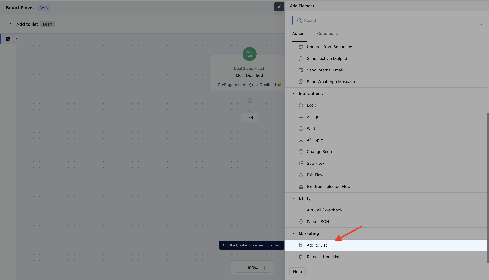
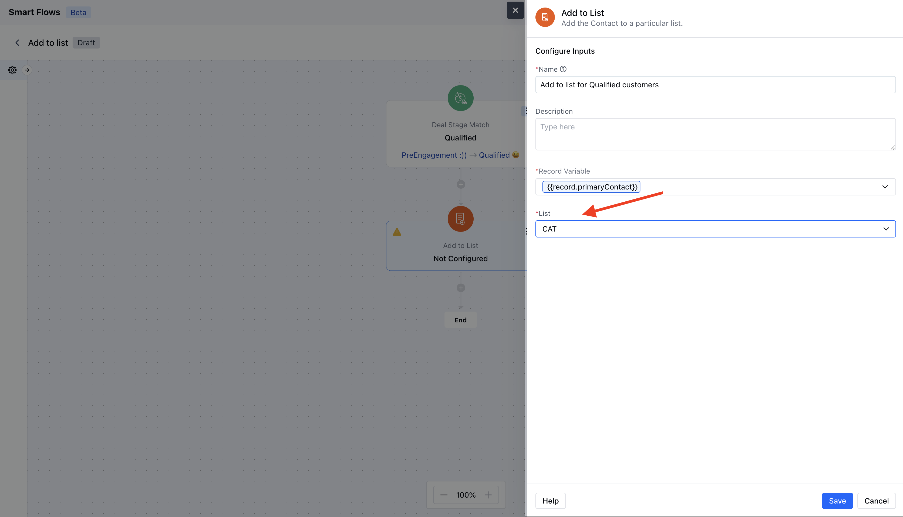
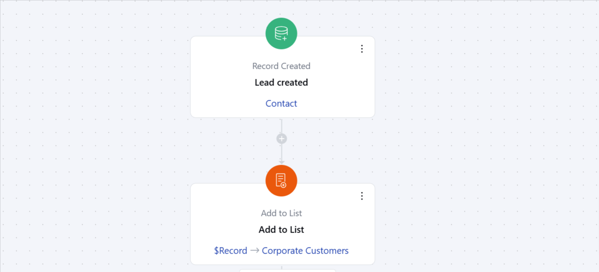

The Add to List Action allows you to automatically add contacts to a specified list as part of a Smart Flow. This action helps organize contacts into targeted groups for better segmentation and management.**Topics Covered:**[How to Configure Add to List Action](https://support.salesmate.io/hc/en-us/articles/38138553100185-Add-to-List#h_01J977QPRFG409GZZR26Q34AV6)[Practical Example](https://support.salesmate.io/hc/en-us/articles/38138553100185-Add-to-List#h_01J97862HDF1GZ0RBFDST32MS4)

### How to Configure Add to List Action

When setting up a Smart Flow, select the Add to List action.

When setting up the Add to List Action, you will need to configure the following details:**Name**: Provide a clear and descriptive name to identify the action's purpose.**Description**: Give a brief explanation of the action's function, describing what it will achieve.**Select Record Variable**: Determine which records will be added to the list. You have two options,**Use the record that triggered the flow**and**Use a record provided here**.

**List**: Choose a single list to which the contact(s) will be added

### Practical example:

Imagine you have a marketing team that manages different subscription plans: Basic, Standard, and Premium. When a customer signs up through your website or a mobile app, the system automatically identifies the chosen plan and assigns the customer to the particular list.This approach allows your marketing team to tailor communications and promotional efforts specific to each subscription type, ensuring relevant messaging and enhancing customer engagement.

**Note:**If the trigger point is not a contact, then only the**Use a record provided here**a variable option will be available.
