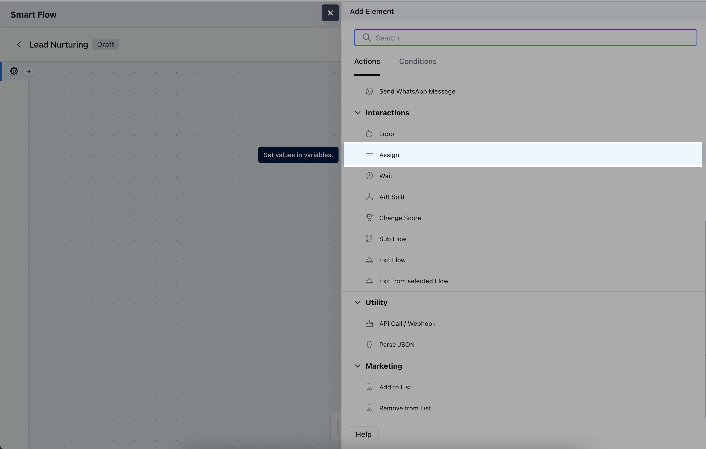
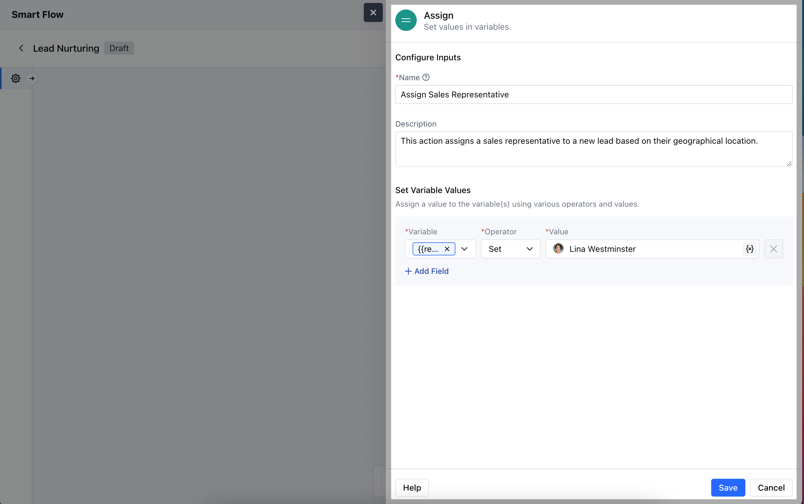
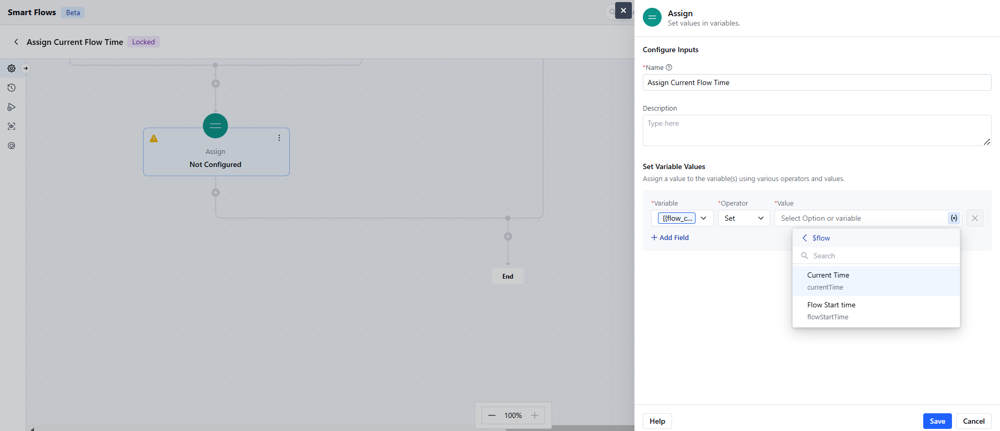

The **Assign Action** in a smart flow can assign values to variables. The variable can be a resource variable, record variable, outcome for some JSON parser, or instance of an iterable loop item.

###  **Topics covered:**

- [How to Configure Assign Action](#how-to-configure-assign-action)

- [Practical Example](#practical-example)

###  How to Configure Assign Action

When setting up a Smart Flow, select the **Assign** Action.

To configure the **Assign Action**, you'll need to specify the following details:**Name**: Enter a clear and descriptive title for the action that indicates its purpose.

- **Description**: Provide a brief explanation of what the action accomplishes, detailing how it fits into the overall workflow.

- **Set Variable Values**: Specify any variables that should be assigned values based on the action.Hit the Save button to save the configuration.

###  Practical Example

You can assign a run-time value to a variable for using it in the future. For example, I want to store the current time of the Smart Flow to be used in the later steps. I can do that by creating a variable of Date and Time variable and assigning the Flow's current time to it where I want to capture it.

