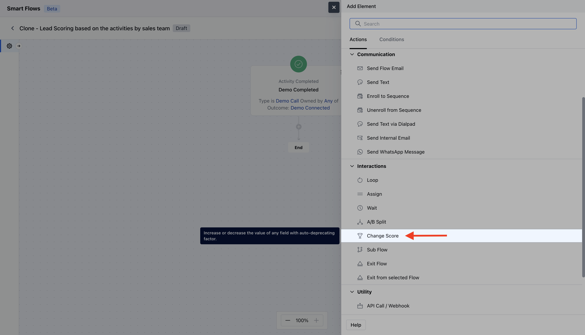
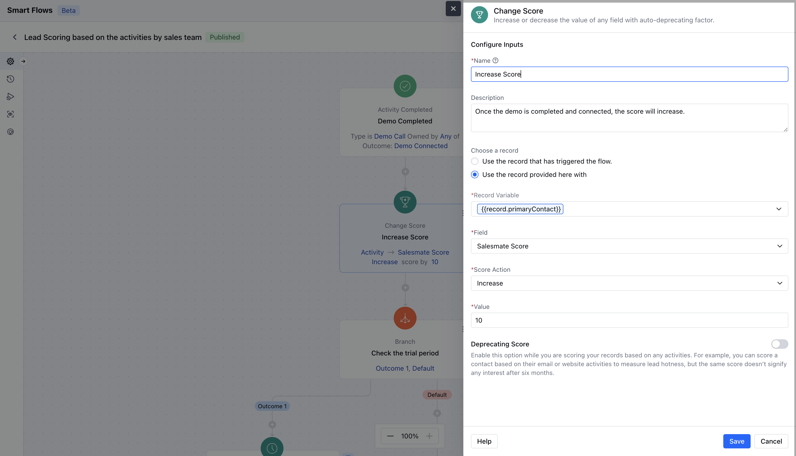
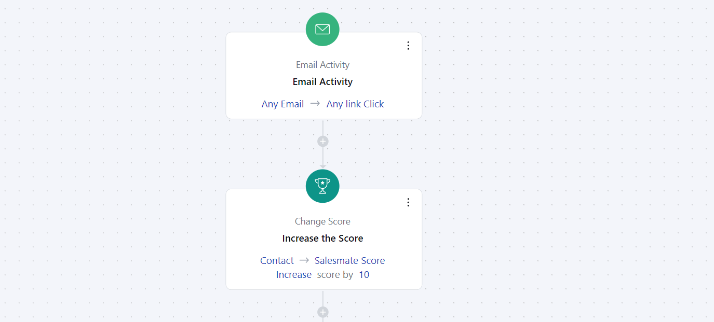
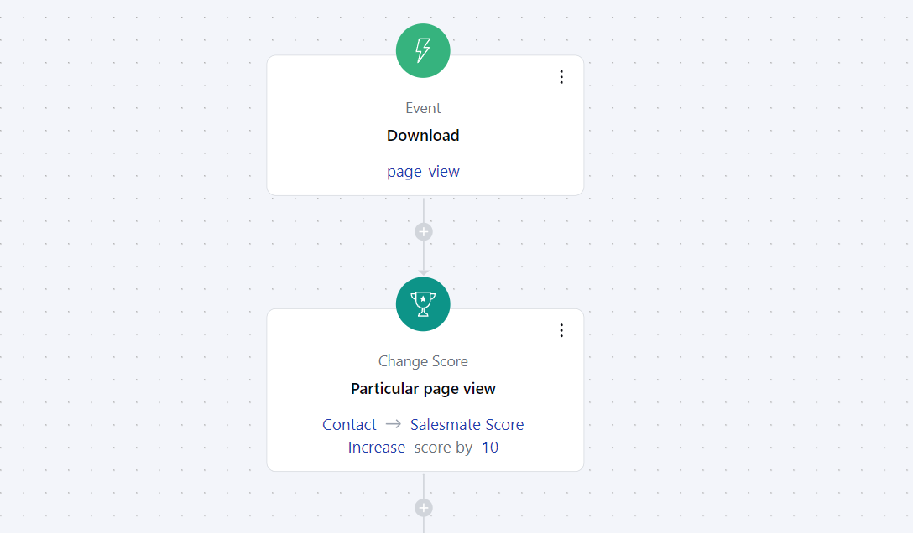
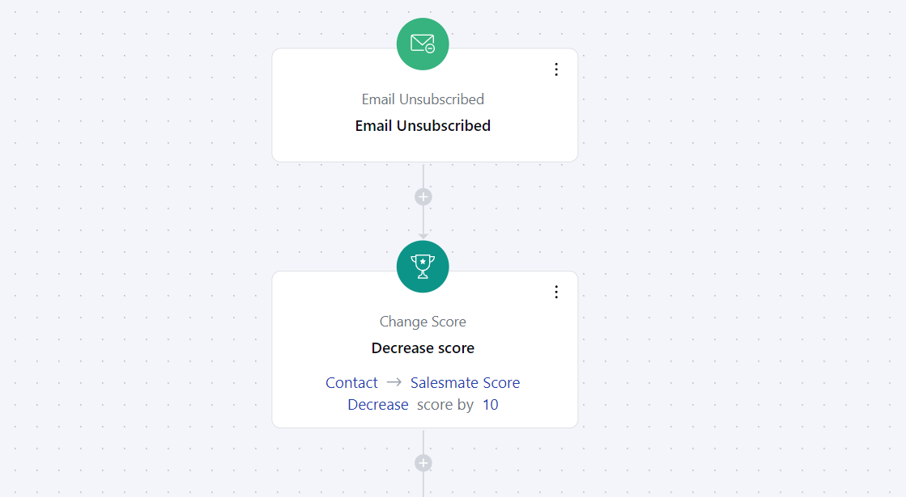

- The **Change Score Action** in Smart Flow allows you to increase or decrease the value of a specific field, including an automatic depreciation factor.

###  **Topics covered:**

- [How to Configure Change Score Action](#how-to-configure-change-score-action)

- [Practical Example](#increase-score-when-someone-clicks-a-specific-link-from-the-email)

###  How to Configure Change Score Action

While setting up a Smart Flow, select **Sub Flow** action.

When configuring the **Change Score Action** in Salesmate, you'll need to provide the following details:**Name**: Assign a clear and descriptive name for the action to identify its purpose easily.

- **Description**: Provide a brief explanation of what the action is intended to do, such as updating or adjusting the score field.

- **Choose a Record**:**Use the record that has triggered the flow**: Automatically select the record that initiated the flow.

- **Use the record provided here**: Manually specify the record to apply the action to.

- **Field**: Select the specific field where the score adjustment will be applied (e.g., lead score, deal score).

- **Score Action**: Specify whether to increase or decrease the score.

- **Value**: Enter the amount by which you want to adjust the score.

- **Deprecating Score**: Enable this option to gradually reduce the score over time. This is useful when scoring records based on activities that lose relevance after a certain period, ensuring the score reflects up-to-date engagement or interest levels.Once done,**Save** the configuration.

###  Use Cases

###  Increase score when someone clicks a specific link from the email

Scoring the leads who interact with our emails can give us a better idea about their interest in our products and services. E.g., If a lead has clicked on the pricing page link from the welcome email, they are probably more serious in evaluating our product. Here we increase their score by 5 points with a depreciating duration of 30 days. As if someone has visited a pricing page before 30 days might not as hot lead as someone has just visited the page.

###  Increase score when someone downloads an ebook

Start the automation journey when a contact downloads an ebook. So we can configure a push event to Salesmate whenever an ebook gets downloaded from the website. This way, we can score contacts based on their interaction with the site.

###  Decrease score when someone unsubscribes from your emails

Lead nurturing campaigns are an excellent way to educate your customer about your services and product via a sequence of emails. But if someone unsubscribes from your campaign, then they are probably less interested in your offerings. Over here, we decrease the lead score by 10 points when they unsubscribe from emails.

