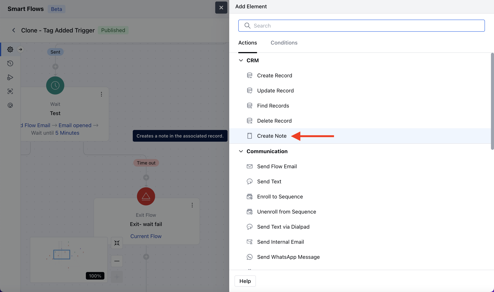
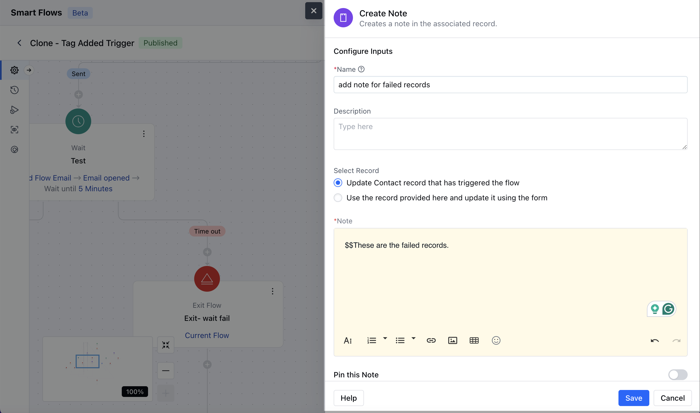
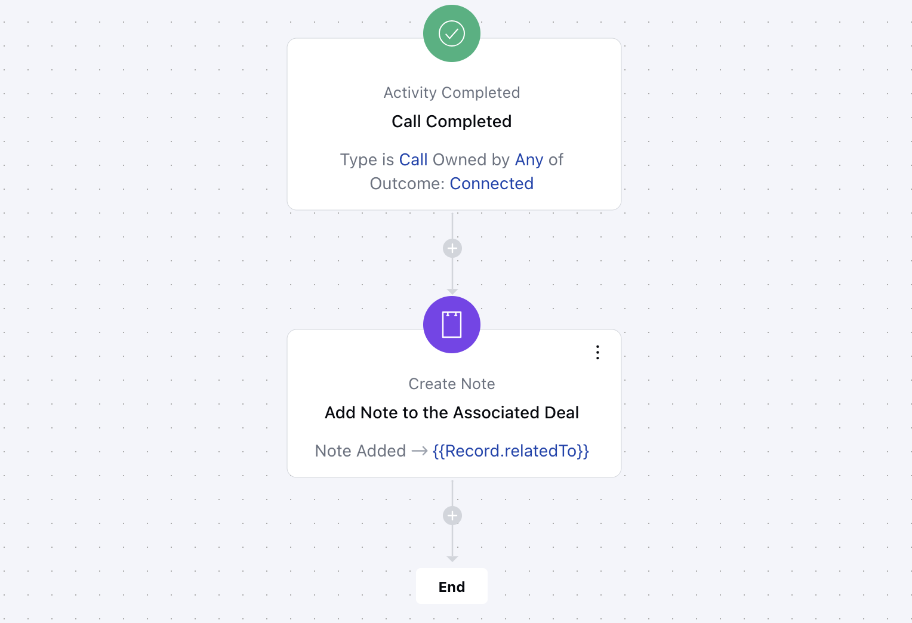

The**Create a Note**action enables you to add a note to an associated record within a workflow automation. This is useful for updating records with quick details or logging important information seamlessly.**Topics covered:**[How to configure the Create Note action](https://support.salesmate.io/hc/en-us/articles/41100286364441-Create-Note#h_01JFB84RHPMPZ2NG0171X91QT9)[Practical Example](https://support.salesmate.io/hc/en-us/articles/41100286364441-Create-Note#h_01JFB9D6T4Q2AVRKRDJM5QW3RS)

### How to configure the Create Note action

While setting up a Smart Flow, select the Create Note action.

Once the Create Note action is selected, configure it by providing the following details:**Name:**Assign a clear and descriptive name to the action to easily identify its purpose in the flow.**Description:**Add a description for better understanding.**Select Record:**Use the record that triggered the flow: This option will add a note to the record that has triggered the smart flow.Use the record provided here and update it using the form: Here you need to select the record variable for which you like to add a note.Note: Enter the message or content you want to add as a note. This field supports a**Rich Text Editor (RTE)**for formatting.Pin this Note: Enable this option if you want the note**pinned**. By default, it is disabled.Once the configuration is completed, hit**Save**.

### Practical Example:

A sales manager wants to ensure that follow-up notes are automatically added to a deal record after completing a sales call.

