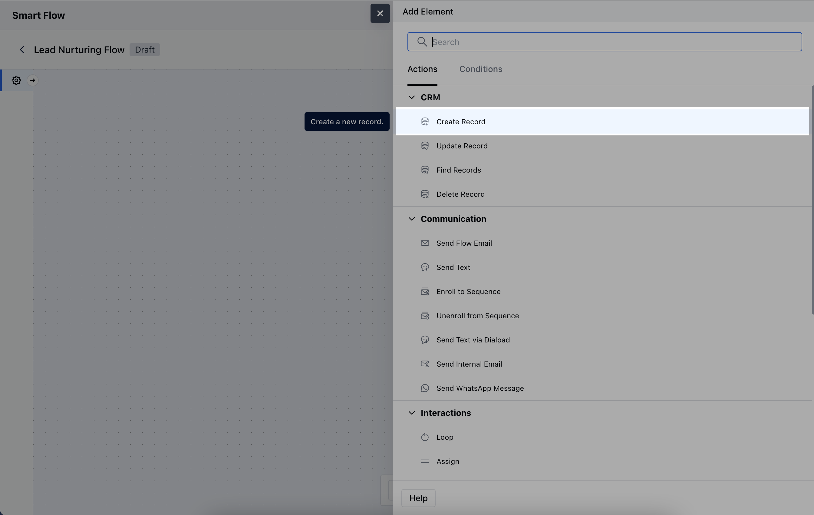
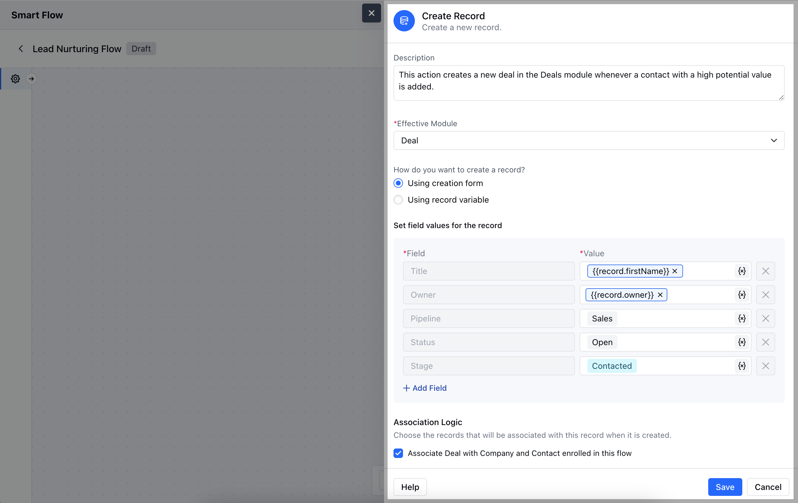
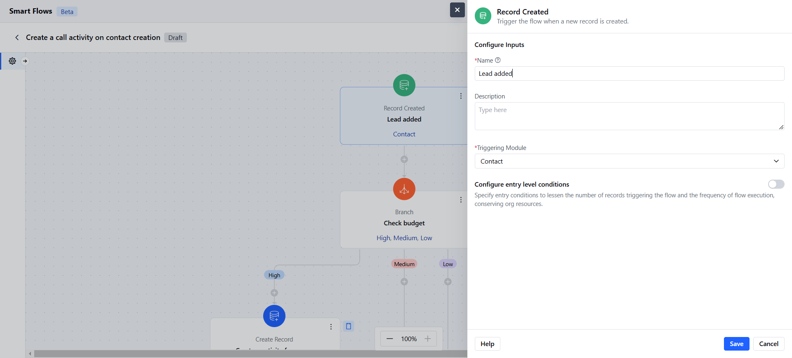
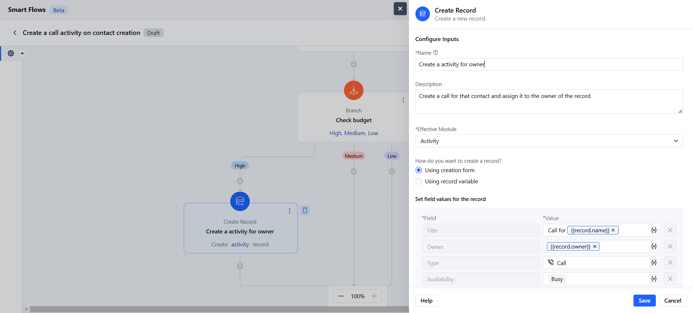

- The **Create Record Action** in Salesmate Smart Flows allows you to automatically generate new records based on the defined criteria within your flow **Topics covered:**

- [How to Configure Create Record Action](#how-to-configure-create-record-action)

- [Practical Example](#practical-example)

### How to Configure Create Record Action

While setting up a Smart Flow, select **Create Record** Action.

Once the **Create Record Action** is selected, configure it by providing the following details:

- **Name:** Assign a clear and descriptive name to the action to easily identify its purpose in the flow.

- **Description:** Provide a brief explanation of what this action does and the type of record being created.

- **Effective Module:** Select the module where the new record will be created, such as Contacts, Deals, or Tasks.

- **How do you want to create a record?**Choose one of the following methods:- **Using creation form:** Manually fill out the form to define specific details for the record.

- **Using record variable:** Automatically populate the new record with data from an existing variable within the flow.

- **Association Logic:** Determine whether the newly created records should be linked to other modules.Once the configuration is completed, hit **Save**.

### Practical Example

Whenever a new lead is added to the CRM, Smartflow automatically creates a follow-up activity and assigns it to a specific teammate.

