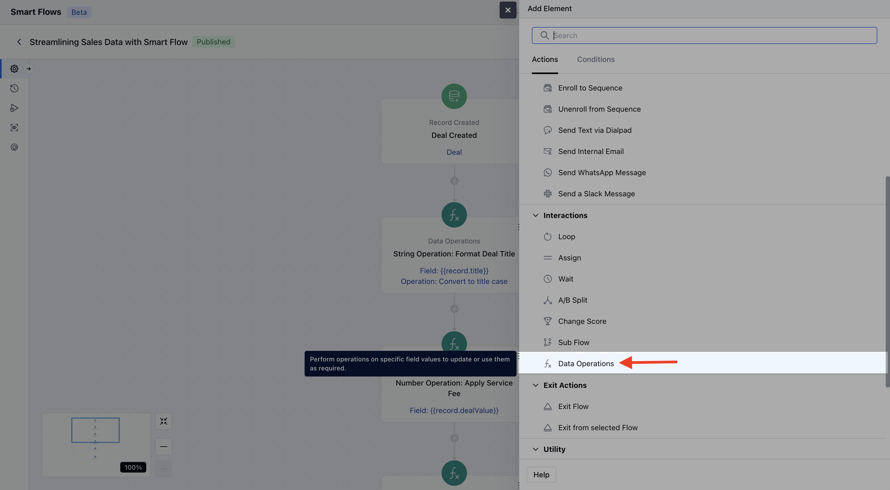
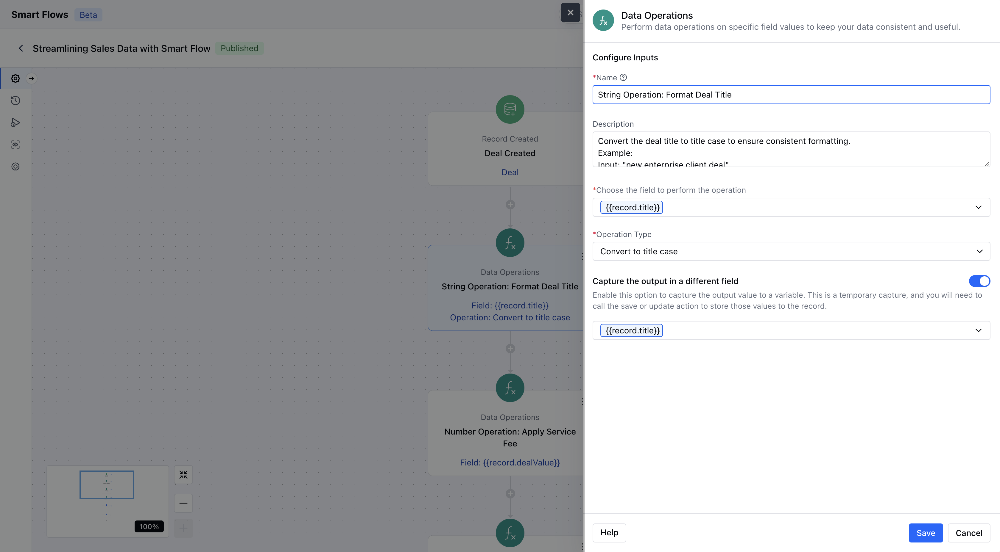
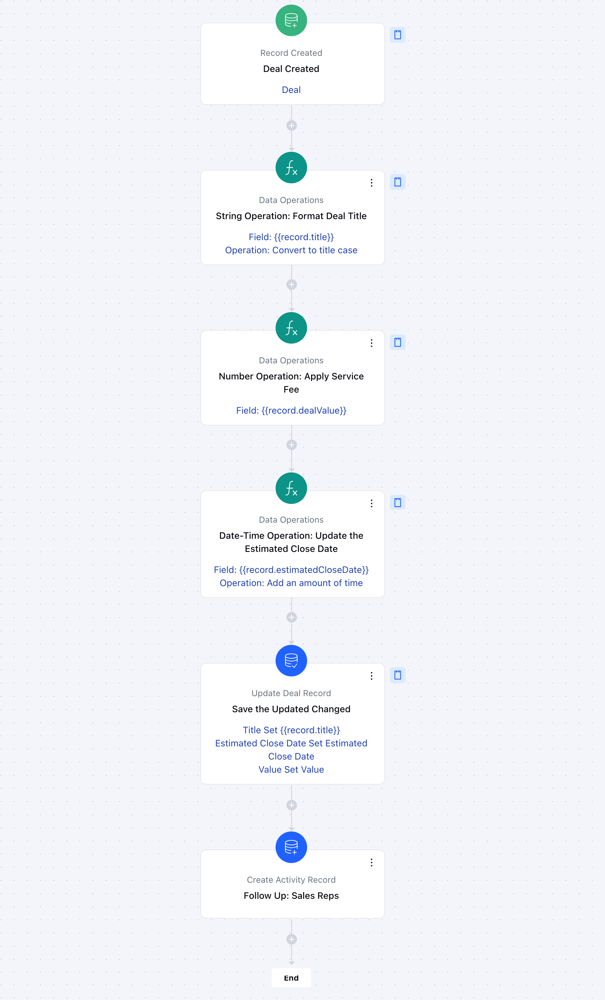

The Data Operations action in Smart Flow allows you to correct, organize, and maintain CRM data efficiently. This feature helps in refining and transforming field values by performing operations such as capitalizing contact or company names or computing values based on properties.

### Topics Covered:

[How to configure Data Operation Action](https://support.salesmate.io/hc/en-us/articles/41100082012825-Data-Operations#h_01JMC7V1A0XV5HA78XSWBBHXPR)[Practical Example](https://support.salesmate.io/hc/en-us/articles/41100082012825-Data-Operations#h_01JMCDTJ84HQNBKFH1AAWAD894)

### How to configure Date Operation Action

While setting up a Smart Flow, select the Data Operation as an action.

Once the Data Operation action is selected, configure it by providing the following details:**Name:**Assign a clear and descriptive name to the action to easily identify its purpose in the flow.**Description:**Add a description for better understanding.**Choosing the Field for Operations:**Select a variable from the triggering record or any variable from the flow.**Operation Type:**Select an operation type to continue. Depending on your choice, you may need to provide additional configuration details. The Operation Type is determined by the field you've selected and can be divided into the following types,
[**String/Text Operations**](https://support.salesmate.io/hc/en-us/articles/43652131010969-String-Text-Operations)[**Numeric Operations**](https://support.salesmate.io/hc/en-us/articles/43652154364441-Numeric-Operations)[**Date-Time Operations**](https://support.salesmate.io/hc/en-us/articles/43652193302297-Date-Time-Operations)**Capture the output in a different field:**Enable this option to capture the output value of a variable. This is a temporary capture, and you will need to use the [Update Record](https://support.salesmate.io/hc/en-us/articles/38138030465817) action to store those values in the record.

Once configured, hit**Save.**### Practical Example

This Smart Flow automates data operations by formatting deal titles, adding tax value, and changing the estimated close dates. It ensures data consistency, enhances efficiency, and streamlines sales processes by integrating key CRM actions such as notifications and record updates.

