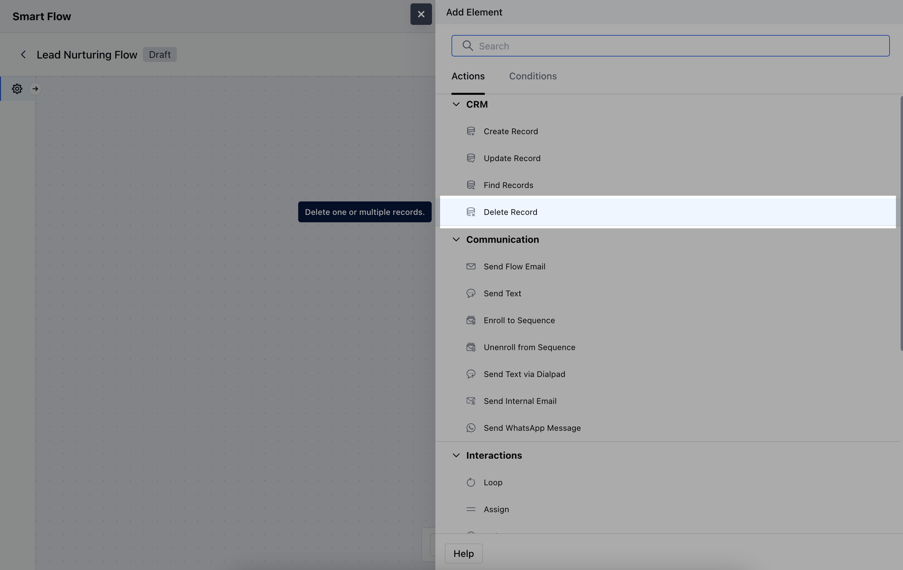
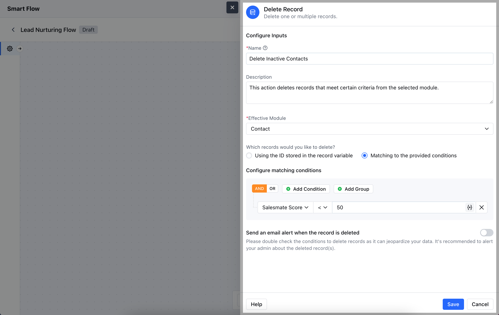
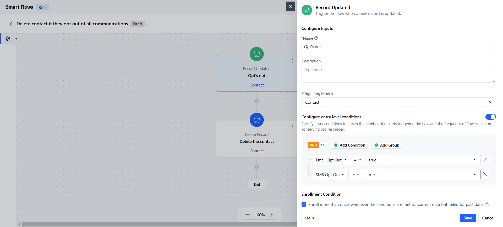
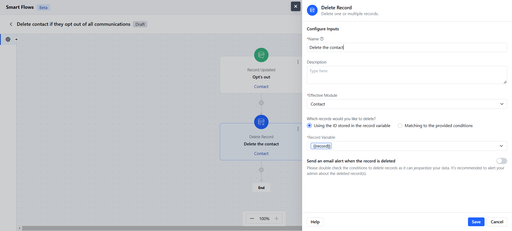

- The **Deleted Records Action** allows you to remove specific records from a module within your flow.

###  **Topics covered:**

[How to Configure Delete Record Action](#how-to-configure-delete-record-action)

- [Practical Example](#practical-example)

###  How to Configure Delete Record Action

While setting up a Smart Flow, select **Delete Record** action

To configure the **Deleted Records Action**, follow these steps:**Name**: Provide a clear and descriptive name for the action to identify its purpose.

- **Description**: Write a brief explanation of the action’s purpose, clarifying the criteria for deletion.

- **Effective Module**: Specify the module from which you want to delete records.

- **Which Records Would You Like to Delete?**: Choose one of the following options:**Using the ID Stored in the Record Variable**: Select this option if you have a specific record ID stored in a variable that you want to delete.

- **Matching to the Provided Conditions**: Select this option if you want to delete records that meet specific criteria you define.

- **Send an Email Alert When the Record is Deleted**: Enable this option if you wish to receive a notification email whenever a record is successfully deleted.Once the configuration is completed, hit **Save**.

###  Practical Example

Automatically delete contacts from your CRM if they unsubscribe from all communications or exercise their right to be forgotten.

