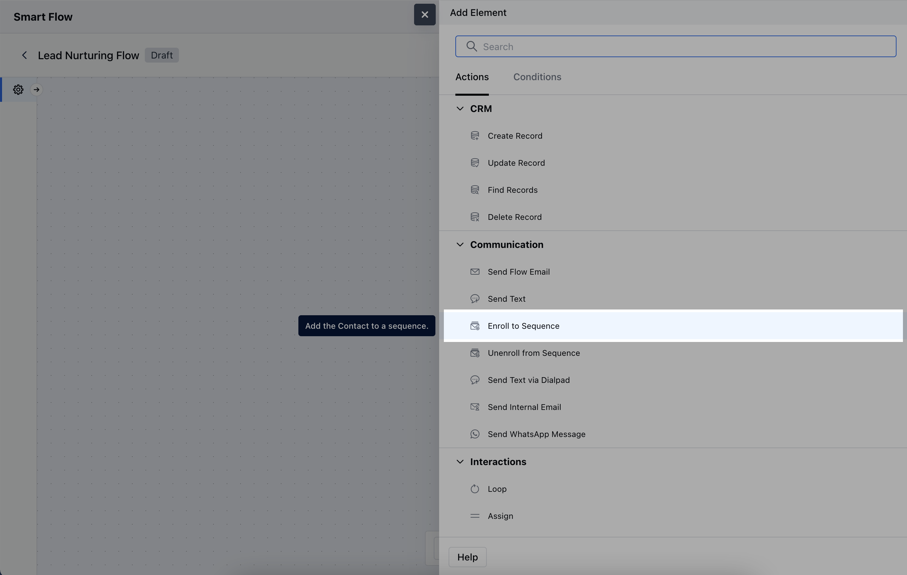
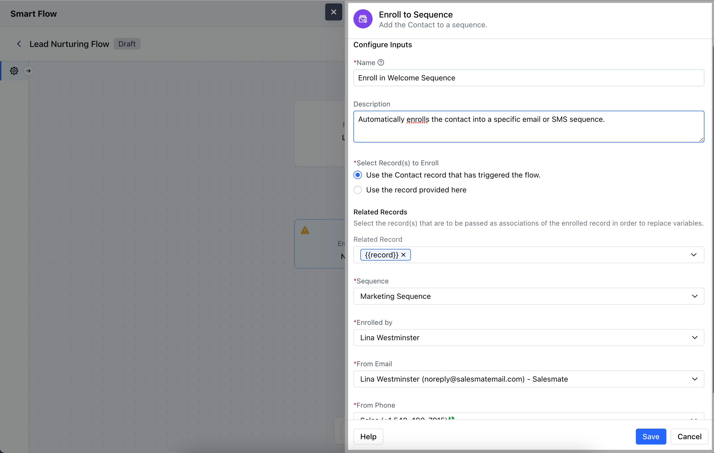
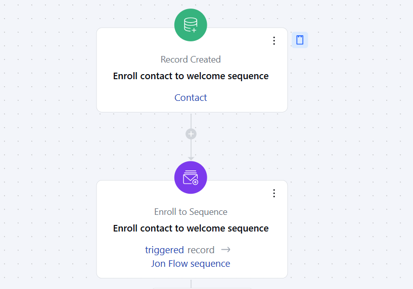

The **Enroll to Sequence Action** allows you to automatically enroll a contact or deal into a predefined sequence of emails, texts, or tasks as part of a Smart Flow.

### **Topics covered:**

- [How to Configure Enroll to Sequence Action](#how-to-configure-enroll-to-sequence-action)

- [Practical Example](#practical-example)

### How to Configure Enroll to Sequence Action

When setting up a Smart Flow, select the **Enroll to Sequence** action.

When setting up the **Enroll to Sequence Action**, you will need to configure the following details:**Name**: Provide a clear and descriptive name to identify the action's purpose.

- **Description**: Give a brief explanation of the action's function, describing what it will achieve.

- **Select Record(s) to Enroll**: Determine which records will be enrolled in the sequence. You can either select the contact associated with the flow trigger or manually choose specific records.

- **Related Record**: Specify any related record to associate with the sequence.

- **Sequence**: Choose the designated sequence that the record will follow.

- **Enrolled by**: Select the user whose Name and Email address will be used to send the Sequence.

- **From Email**: Select the email address that will be used for sending communications within the sequence.

- **From Phone**: Choose the phone number to be used for sending text, if the User has been assigned multiple numbers.Once the configuration is completed, hit **Save**.

### Practical Example

For instance, you want to enroll a contact to sequence automatically when you have closed a deal with them to capture their feedbackUsing the above case, you can use Smart flows to enroll the contact into a sequence which has steps to collect their feedback of the product or experience of their purchase process.This sequence would send them an automated feedback collection E-mail, Send Text, Create activity to call them to ensure maximum efforts are made to capture this feedback.You can use the action of **Record Updated** and configure the journey to enroll the records to this sequence i.e.

- **Feedback Collection Sequence**.

