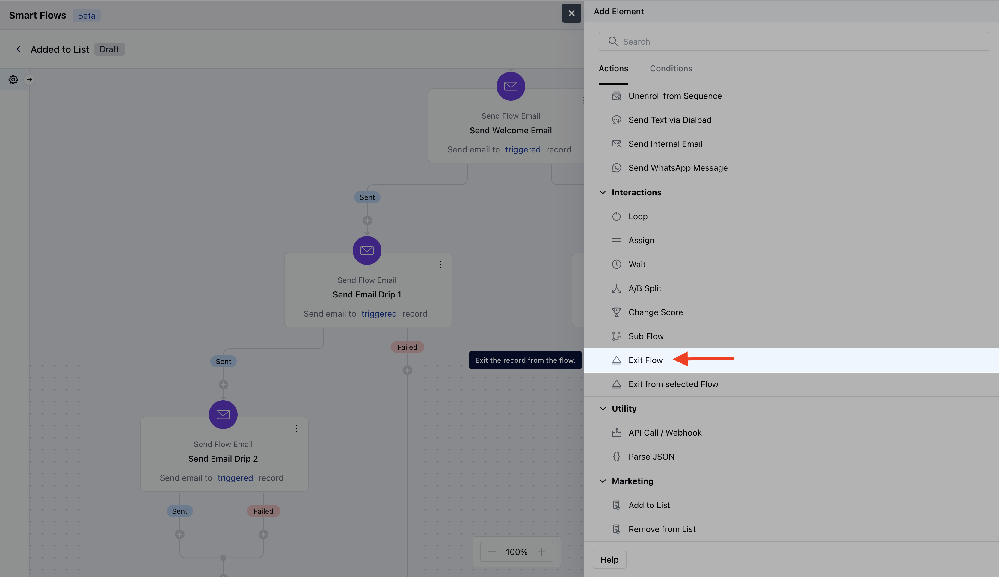
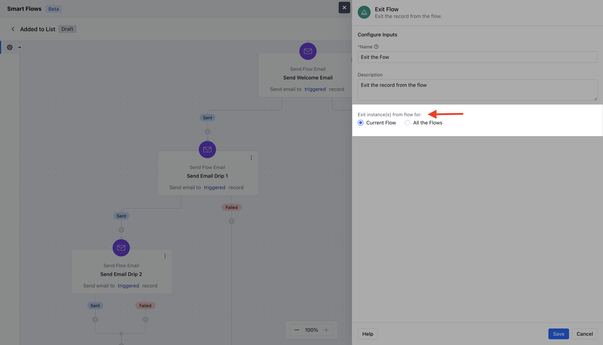
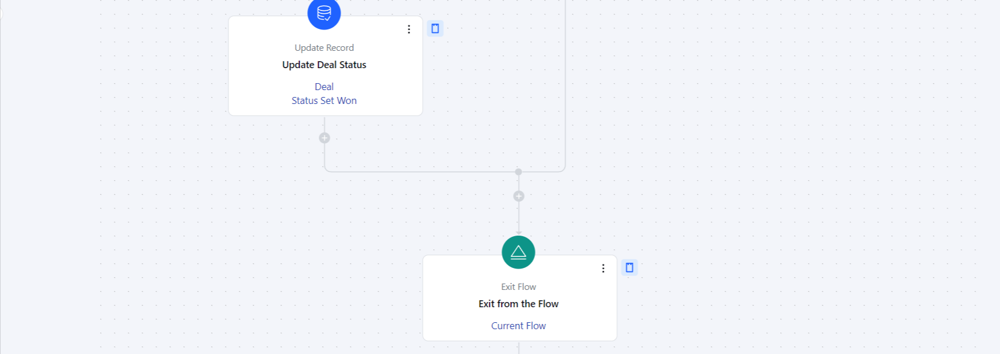

The Exit Flow Action allows you to remove a record from the current Smart Flow or all active flows. This action is useful when you need to stop automated processes for specific records.Topics Covered:

- [How to Configure Exit Flow Action](#how-to-configure-exit-flow-action)
- [Practical Example](#practical-examplehttpssupportsalesmateiohcen-usarticles38138458679577-exit-flowh_01j9a1apspvkw60hrc7s5a232p)

### How to Configure Exit Flow Action

When setting up a Smart Flow, select the **Exit Flow** action.

When setting up the Exit Flow Action, you will need to configure the following details:**Name**: Provide a clear and descriptive name to identify the action's purpose.

- **Description**: Give a brief explanation of the action's function, describing what it will achieve.

- **Exit Instance(s) Selection**: You can choose **Exit from Current Flow** to remove the record’s current instance from the flow (default option) or choose **Exit from all Flows** to exit the record from all flows, which will stop the automation for that record across all workflows.

Once the configuration is completed, hit **Save**.

###
[Practical Example](#practical-examplehttpssupportsalesmateiohcen-usarticles38138458679577-exit-flowh_01j9a1apspvkw60hrc7s5a232p)

The exit flow action allows you to remove a contact from the current flow or even from all flows altogether. For instance, if a client unsubscribes from an email, you can use this action to remove them from the flows since they are no longer interested. There are various use cases where this action can be applied, depending on the situation.As per the below screenshot we were tracking the deals and once the deal is won or lost we will remove that record from the flow as there is no further follow-ups needs to be done over here.

