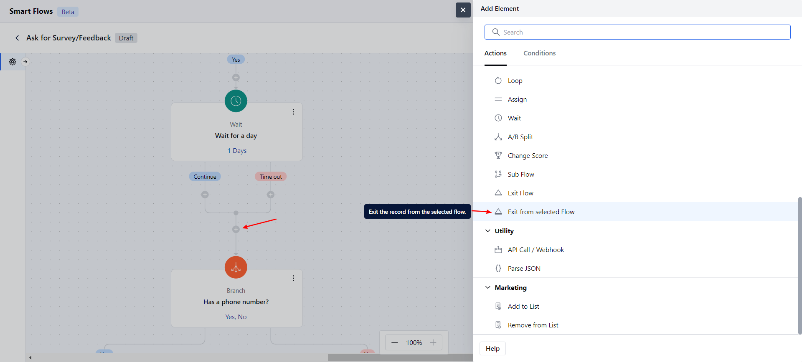
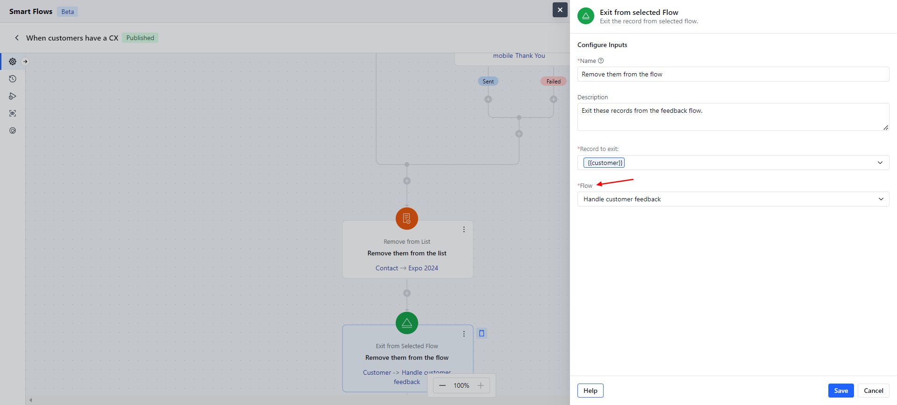

The Exit Selected Flow Action enables you to remove a specific record from any flow other than the current one. This action is particularly useful when working with sub-flows and you need to stop a record's execution in another flow based on certain criteria.Topics Covered:

- [How to Configure Exit Selected Flow Action](#how-to-configure-exit-from-selected-flow-action)
- [Practical Example](#practical-example)

# How to Configure Exit From Selected Flow Action

When setting up a Smart Flow, select the **Exit the Selected Flow** action.

When setting up the Exit Selected Flow Action, you will need to configure the following details:**Name**: Provide a clear and descriptive name to identify the action's purpose.

- **Description**: Give a brief explanation of the action's function, describing what it will achieve.

- **Record to Exit**: Select the record variable you want to remove from another flow. Here you can select a variable at any level but it must be a single record only.

- **Flow**: Choose a flow from which to the records should be exited.

Click **Save** and continue.

# Practical Example
