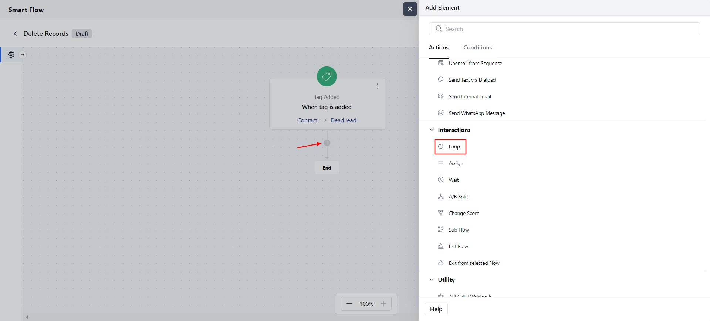
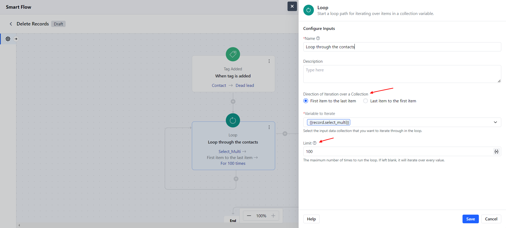
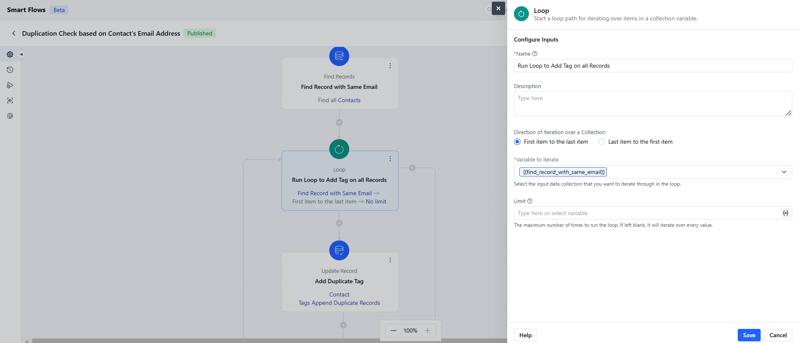
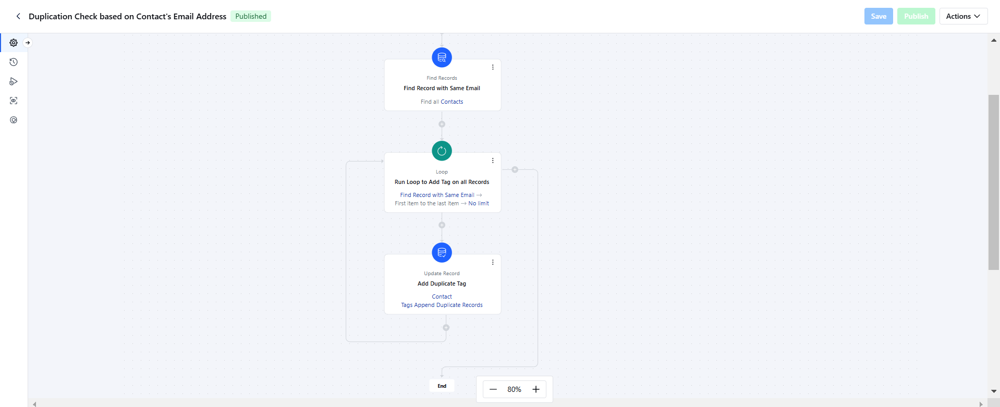

The Loop interaction in Smart Flows is used to go through a list of items one by one, allowing you to perform actions on each item in the smart flow, one at a time.

### **Topics covered:**

- [How to Configure the Loop Action](#how-to-configure-the-loop-action)

- [Practical Example](#practical-example)

### How to Configure the Loop Action

On the flow canvas, click the plus icon and select the **Loop** option from the Interactions section.

To configure the Loop, you'll need to provide the following details:**Name**: Give your loop a clear name so it’s easy to identify.

- **Description**: Add a short explanation of what the loop will do.

- **Variable to Loop Through**: Choose the list or group of items you want to go through.

- **Loop Direction**: Decide the order of the loop, either going from the **first item to the last**(this is the default option) or from the **last item to the first**.

- **Limit**: Set how many times the loop should run. If the value is zero or less, the repetition won’t run. Decimal numbers will be rounded down (for example, 3.4 becomes 3). By default, the loop runs through all items, but you can limit it. For example, setting the limit to 2 will only loop through the first two items.

### Practical Example

Add Tags to duplicate records in the system for sanitation of the data. Once the Tag is added, you can go through the list and merge the records.

