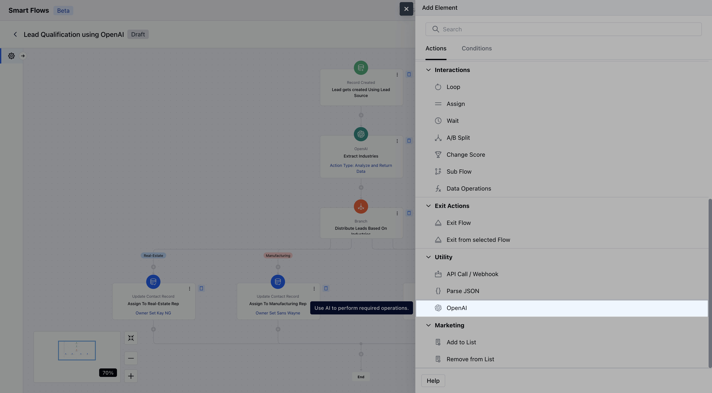
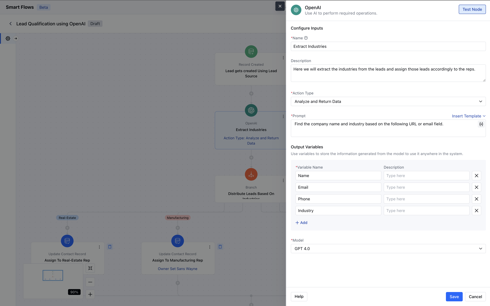
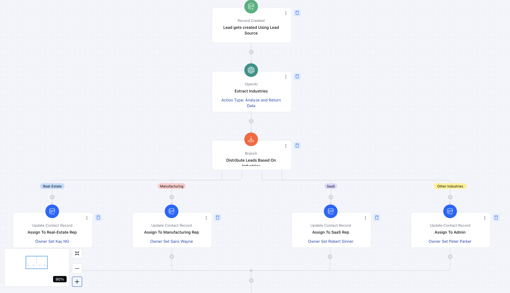

Salesmate Smart Flow now includes an OpenAI action, allowing users to automate AI-driven tasks within workflows.

**Note:** Note: This action can be used once the Open AI has been configured for your account.
- [Learn more](https://support.salesmate.io/hc/en-us/articles/43633919617945-Open-AI-Integration-with-Salesmate)

###  **Topics covered:**

- [How to Configure OpenAI action.](#how-to-configure-openai-action)
- [Practical Example](#practical-example)

###  How to Configure OpenAI Action

While setting up a Smart Flow, select the Open AI as action.

Once the OpenAI action is selected, configure it by providing the following details:

- **Name:** Assign a clear and descriptive name to the action to easily identify its purpose in the flow.

- **Description:** Add a description for better understanding.

- **Action Type:** Here you need to select the action that needs to be taken further on data.

- **Analyze and Return Data:** Uses a custom AI prompt to analyze text and extract meaningful insights.

- **Analyze Text Sentiment:** Identifies whether text sentiment is Positive, Negative, or Neutral.

- **Moderate Data:** Detects and flags inappropriate content, including Hate, Violence, and Self-Harm.

- **Classify Text:** Categorizes text into predefined classifications for better organization.

- **Create Translation:** Automatically translates text into the selected target language.

- **Summarize Text:** Generates a concise summary of the provided text for quick understanding.Each action type has its own input and output structure. You can map Smart Flow variables in prompts where applicable.

- **Model:** Here you need to select the module for the OpenAI.

- **GPT-4.0 **GPT-4.0-mini **Test Run:**It allows you to preview results with sample inputs.Once the configuration is completed, hit** Save **.

###  Practical Example:

Here, we will use **OpenAI** to extract key data from incoming leads sourced from various channels. Based on the extracted **industry information**, leads will be assigned to the appropriate sales representatives. This automation ensures **efficient lead distribution**, minimizes manual effort, and improves response time.

- **Step 1: Extract Contact Details** When a new lead is received, OpenAI will extract essential details, such as:**Name**– Helps personalize outreach.

- **Email**– Used for communication and follow-ups.

- **Company Name**– Provides business context for lead qualification.

- **LinkedIn URL**– Helps reps gather more insights before reaching out.

- **Step 2: Identify Industry Using OpenAI** OpenAI will analyze the extracted information (e.g., company name and LinkedIn URL) to determine the **industry type** of the lead.This ensures that each lead is categorized correctly without manual input.

- **Step 3: Assign Leads Based on Industry** Using **Branching Logic**, leads will be automatically assigned to the **right sales representative** based on the industry type.Example:
Leads from the **Tech Industry**→ Assigned to Rep A.Leads from the **Healthcare Industry**→ Assigned to Rep B.Leads from the **Finance Industry**→ Assigned to Rep C.

This automated workflow **saves time, improves accuracy, and ensures that each lead reaches the most suitable sales rep** for a higher chance of conversion.

