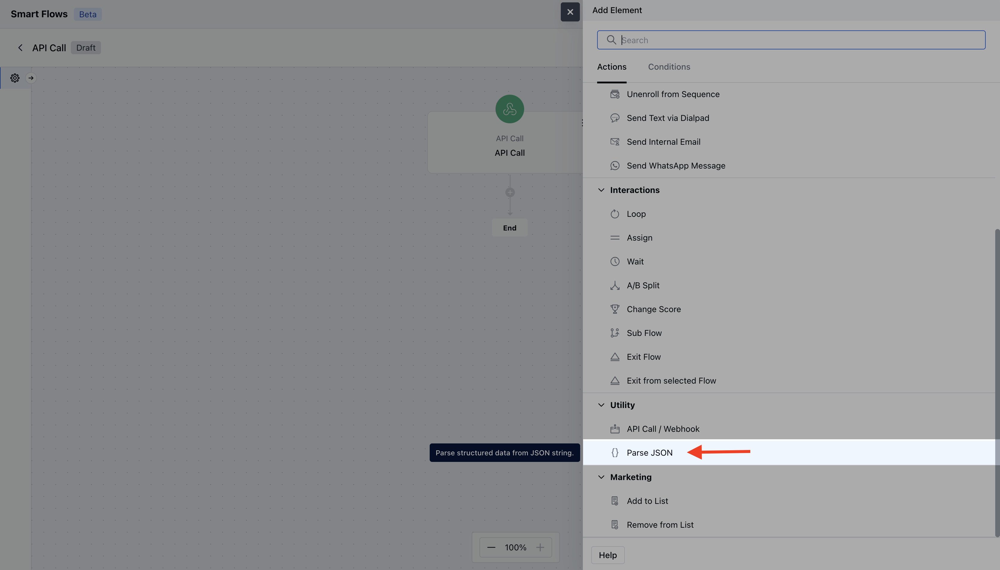
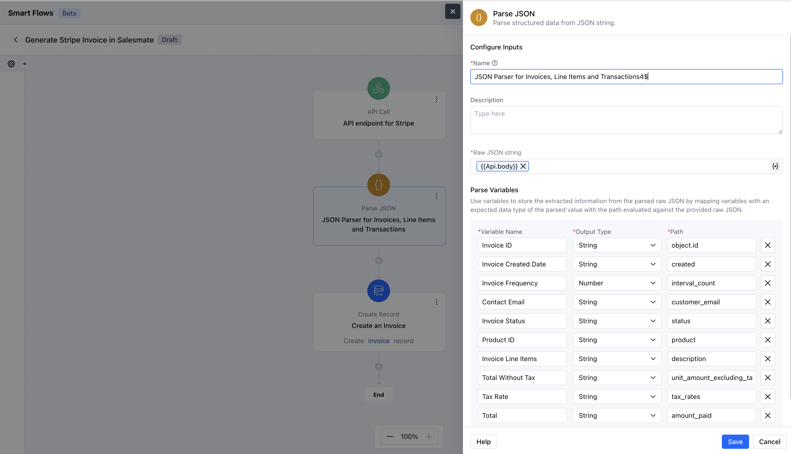
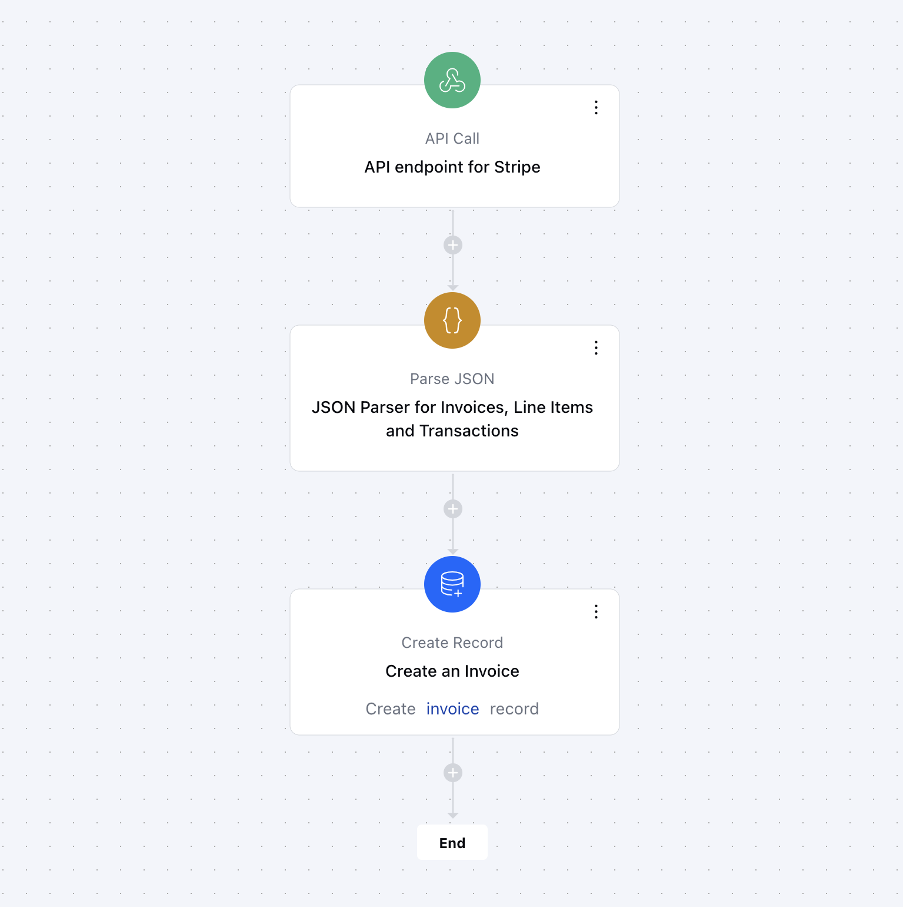

The**Parse JSON**action enables users to parse structured data from a JSON string, which can be obtained from API actions or any internally stored JSON data. This step is vital for turning raw JSON into usable data, allowing for efficient processing and further operations within your Smartflows.**Topics covered:**[How to configure**Parse JSON**Trigger.](https://support.salesmate.io/hc/en-us/articles/38138581983257-Parse-JSON#h_01J81M49CNA5H2J8N0KVJJ82CB)[Practical Example](https://support.salesmate.io/hc/en-us/articles/38138581983257-Parse-JSON#h_01JB9N2N59J4G9P853E56M3J1D)

### How to Configure Parse JSON Action

After selecting the**Parse JSON action**, you’ll need to configure the block by providing the following details:

While creating the Trigger-Based Flows select the**Parse JSON**action

**Name:** Give your parsing action a clear name to identify it easily.

**Description:** Provide a short explanation of what this trigger will do, outlining how it fits into the overall automation process.

**Raw JSON String:** This is where you provide the JSON data to be parsed. You can use the output from an API call (e.g., `{{Api.body}}`) or any other variable containing JSON data. Once you’ve provided the raw JSON string, you can define multiple variables by parsing the JSON.

**Variable Name:** Define a unique name for the variable to access the extracted output.

**Output Type:** Select the expected data type for the parsed value. Available types include:
- String
- Number
- JSON Array
- String Array
- Number Array

**Path:** Specify the property path to extract the desired value from the JSON. This path is evaluated against the provided raw JSON.

Once done, click on **Save**.

### Practical Example:

We have configured the Smart Flow that retrieves invoice details from Stripe. Here we have used an API call as a trigger to provide an API endpoint for Stripe webhooks. After that, we used Parse JSON to extract the exact details from Stripe about the invoice and use Create Record as an action to create an invoice in Salesmate.

