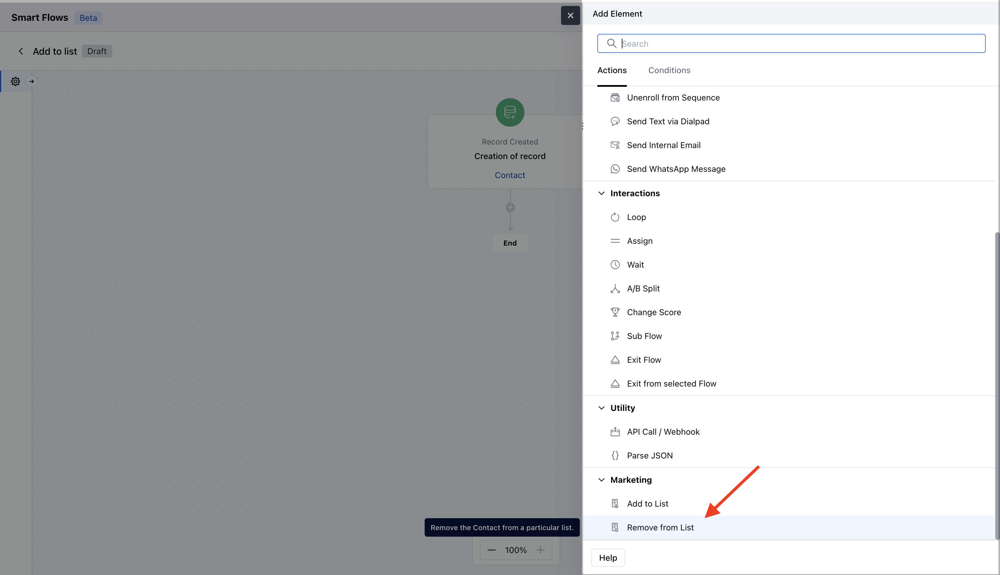
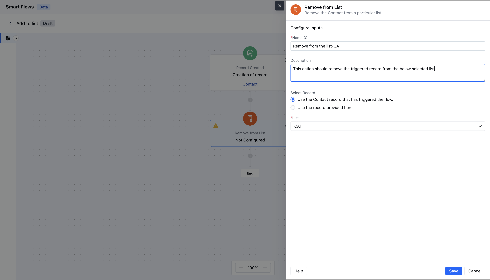
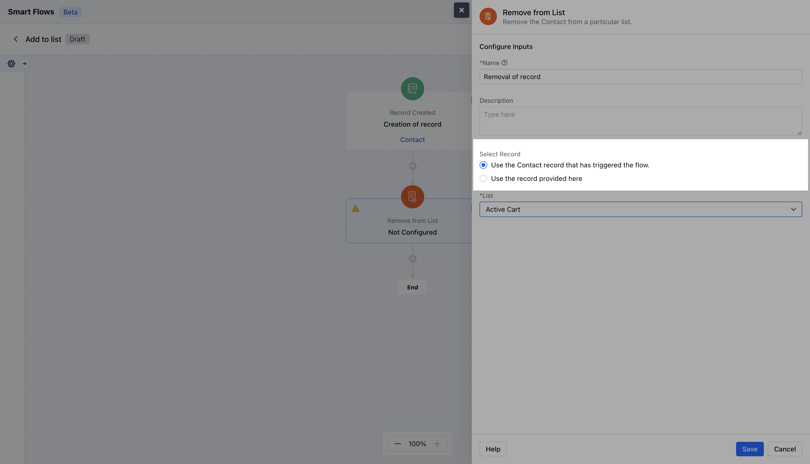
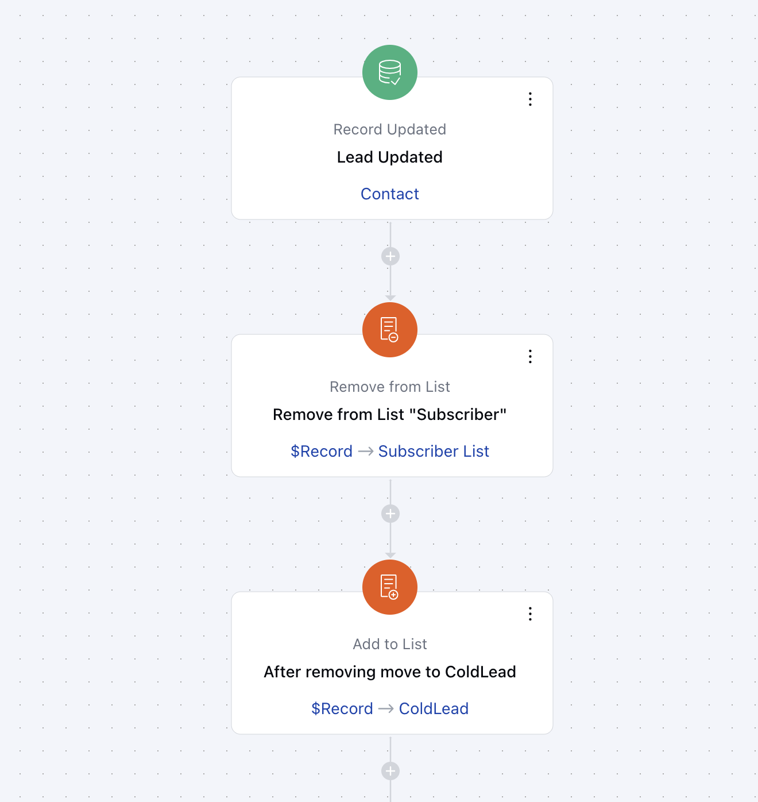

This step removes the contact from a particular list.**Topics Covered:**[How to use the remove from list action](https://support.salesmate.io/hc/en-us/articles/38138589895833-Remove-from-List#h_01JCE11M6ZHV77FR88GFPC6E3H)[Practical Example](https://support.salesmate.io/hc/en-us/articles/38138589895833-Remove-from-List#h_01JCE120A1A47ZHZ5QWPC3A7MC)

####**How to Use the Remove from List Action:**With this action step, you can automatically remove your contacts from specific lists when certain conditions are met.Select the "Remove from List" action when setting up a Smart Flow.When setting up the Remove from the List Action, you need to configure the following details:**Name**: Choose a clear and descriptive name to explain the action's purpose.**Description**: Provide a brief overview of what the action does and what it aims to achieve

**Select Record Variable**: Decide which records will be removed from the list. You have two options:
\- Use the record that triggered the flow
\- Use a record provided here.

####**Practical Example :**Suppose a customer decides to downgrade their subscription to your service. You want to ensure they no longer receive promotional emails about upgrades or new features.To manage this, you can set up an Automation Journey that removes the customer from the active subscriber list and transfers them to a "Downgraded Customers" list. The customer success team can then utilize this list to gather feedback on their experience or implement an automation journey that sends tailored notifications or re-engagement offers after a few months to encourage them to consider upgrading again.

**Note**: If the trigger point is not a contact, then only the**Use a record provided here**a variable option will be available.
