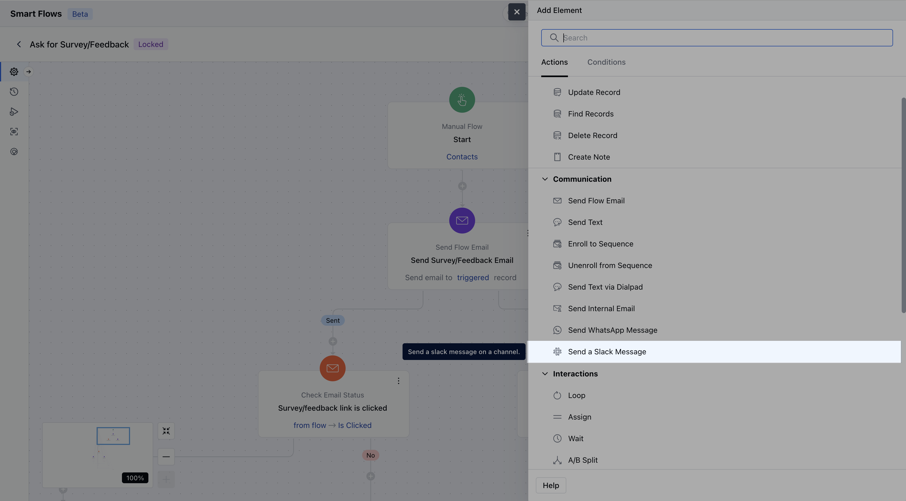
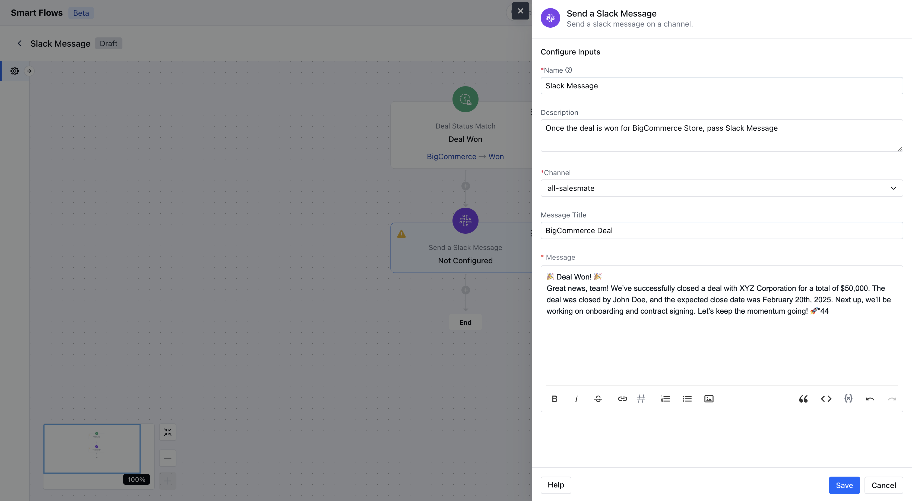
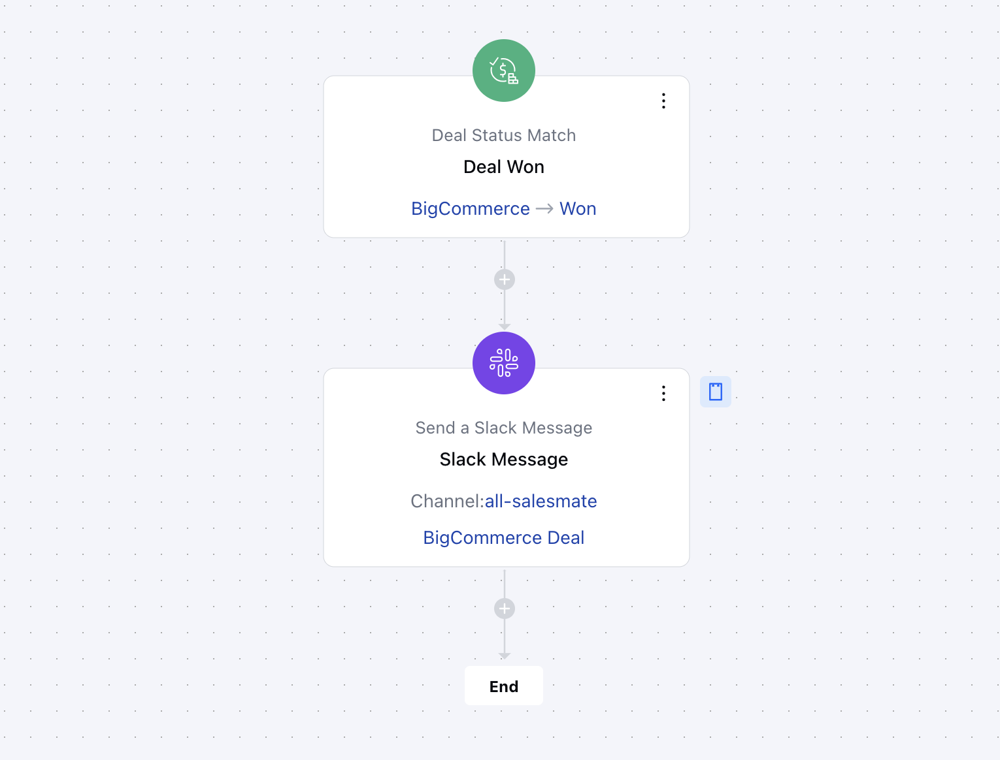

- The **"Send a Slack Message"** action allows users to automatically send Slack notifications based on predefined conditions. This helps teams stay updated, collaborate efficiently, and respond promptly to important activities.

- **Note:** To use this feature, make sure the Slack integration is enabled in Salesmate. Only users with the **Administrator** profile have the ability to install the integration.
- [Salesmate - Slack Integration Guide](https://support.salesmate.io/hc/en-us/articles/115003219625-Integration-for-Slack)

### **Topics covered:**

- [How to Configure Send A Slack Message](https://support.salesmate.io/hc/en-us/articles/41146524091417-Send-a-Slack-message#01JME9ZWN50Y3CB318WYWKT343)
- [Practical Use Case](#practical-use-case)

### How to Configure Send Internal Email Action

When setting up a Smart Flow, select the **Send A Slack Message** action.



To configure the **Send A Slack Message** action, you'll need to provide the following information:**Name **Description **Channel **: Select the channel to which you want to send a message.

- ** Message Title **: This is an optional field. If you want to add a title to your message, type that here. A maximum of 150 characters is allowed.

- ** Message **: Enter the message you wish to send. You can insert flow variables, which will be replaced upon sending, and utilize snippets. The message has a maximum character limit of 2000.Hit** Save** to complete the process.



### Practical Use Case

When a deal is marked as "Won" in Salesmate, a Slack message is automatically sent to the `#sales-wins` channel.

- **Example Message:**

```
New Deal Closed!
Client: {{contact.name}}
Amount: ${{deal.value}}
Owner: {{owner.name}}
Great job, team!
```

This keeps the team informed and aligned without manual updates.


