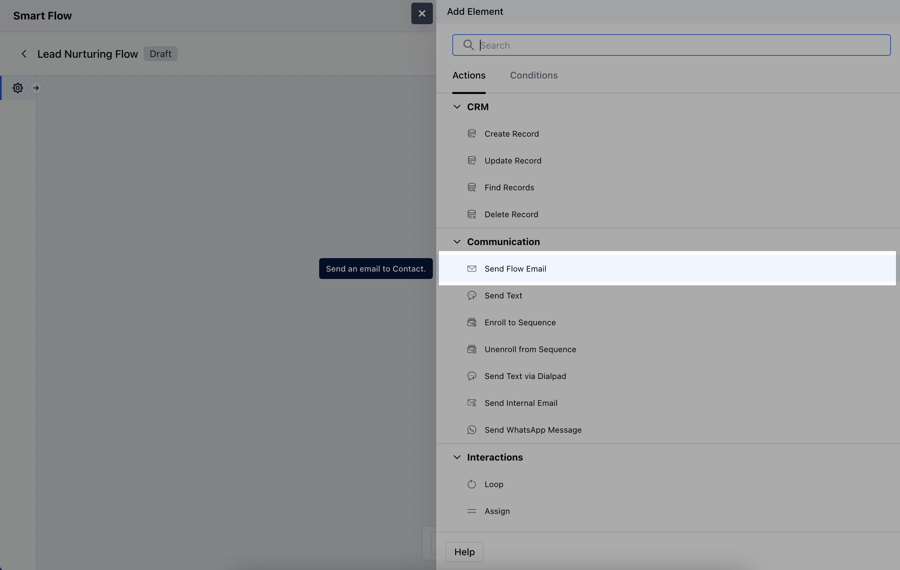

The**Send Flow Email Action**allows you to automatically send emails as part of a Smart Flow in Salesmate.**Topics Covered:**[How to Configure Send Flow Email Action](https://support.salesmate.io/hc/en-us/articles/38138164432409-Send-Flow-Email#h_01J8PHR69NFA2KJKH10DPG95D8)[Practical Example](https://support.salesmate.io/hc/en-us/articles/38138164432409-Send-Flow-Email#h_01J8PKBST3D7Y6574AEZ193WKJ)

### How to Configure Send Flow Email Action

When setting up a Smart Flow, select the**Send Flow Email**Action

To configure the**Send Flow Email Action**, you'll need to provide the following details:**Name**: Assign a clear and descriptive name for the action to easily identify its purpose.**Description**: Offer a brief explanation of the action’s function.**Send to**: Specify the recipient of the email. You can either choose to:**Use the Contact record that has triggered the flow**: This option sends the email to the contact that initiated the flow.**Use the record provided here**: This allows you to specify another contact or set of contacts for the email delivery.**Related Records**: Indicate any related records you want to associate with this email action.**Email Field**: Select the specific field containing the email address of the recipient, ensuring the email is sent to the correct address.**Flow Email**: Choose the Journey Email you wish to use for this action.**Dynamic Email Sender:**You can set a custom 'From' email for flow emails by choosing a specific user. You can select options like,**Trigger Module's record owner:**This will send an email from the record owner that has been triggered the smart flow. It can be Contact, Company, Activity, or Deal, etc.**Provided user:**Here you can select any user that is associated with the enrolled record using the field attributes.

Once the configuration is completed, hit**Save**.**Note:**Please note that if the selected user isn’t found or their email domain isn’t verified, this will automatically switch back to the default email that has been selected while creating journey email to keep things running smoothly!

### Practical Example

Consider this use case where you want to greet your clients on their special days, i.e. Birthdays, Anniversary.You can configure a flow that triggers "**Date Match"**to ensure that the E-mail is sent on their special occasion and connect it with the**"Send Flow E-mail"**action.Within the "**Send Flow Email**" action, you have the option to configure the template you want to send.This will send them the configured flow E-mail upon reaching this step.This will allow you to have an active engagement with your clients and keep them in touch.

