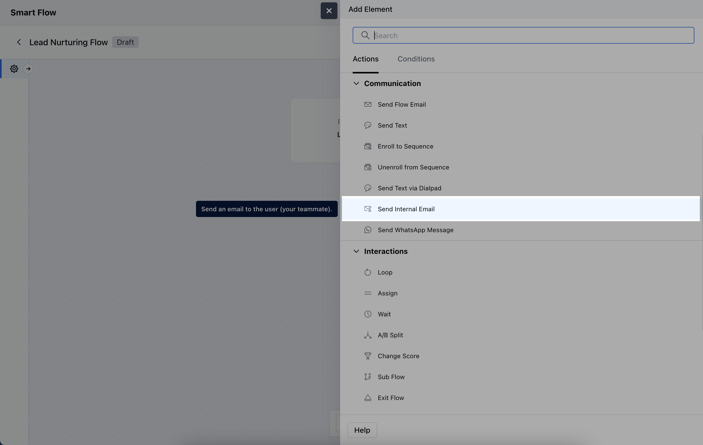
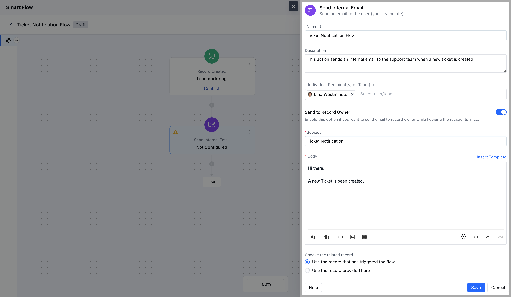

The**Send Internal Email Action**allows you to automate internal notifications by sending an email to Users or Team within your organization.**Topics Covered:**[How to Configure Send Internal Email Action](https://support.salesmate.io/hc/en-us/articles/38138259670809-Send-Internal-Email#h_01J8RTRZW3XKQZ09GYZPDZV30Q)[Practical Example](https://support.salesmate.io/hc/en-us/articles/38138259670809-Send-Internal-Email#h_01J8S08VAP0MW2A42XVYTYHZ8D)

### How to Configure Send Internal Email Action

When setting up a Smart Flow, select the**Send Internal Email**action.

To configure the**Send Internal Email Action**, you'll need to provide the following information:**Name**: Enter a clear and descriptive title for the action, identifying its purpose.**Description**: Provide a brief overview of what the email is intended to achieve within the flow.**Individual Recipient(s) or Team(s)**: Specify the User or Team who will receive the internal email.**Send to Record Owner**: Choose to send the email to the owner of the associated record.**Subject**: Provide a clear and relevant subject line that captures the purpose of the email.**Body**: Either manually enter the email content or select from predefined templates.**Choose the Related Record**: This option allows you to associate the email with a specific record in your system.**Use the record that has triggered the flow**: Automatically link the email to the record that initiated the flow.**Use the record provided here**: Manually select a different record to associate with the email, rather than the one that triggered the flow.Once the configuration is completed, hit on**Save**.

### Practical Example

Considering this use case where you want to notify your teammate when a deal is created and you have a specific E-mail template configured to notify them internally.Using this action can help you achieve this use case where this action can be configured when a record/deal is created to send an Internal E-mail to notify them.This can be used to notify a specific User/Record Owner/Team

