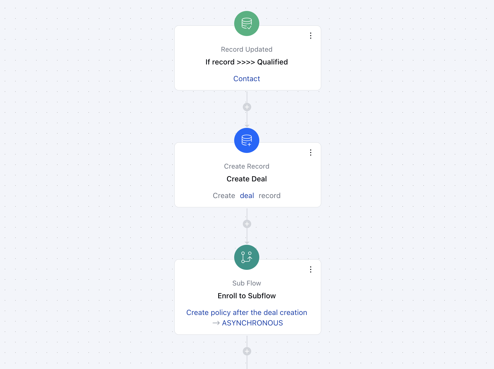

The**Sub Flow Action**in Smart Flow allows you to trigger another flow from within the current flow, enabling more complex automations.**Topics Covered:**[How to Configure Sub Flow Action](https://support.salesmate.io/hc/en-us/articles/38138439700761-Sub-Flow#h_01J91CABC2GZC5EDTSRV3VYWDK)[Practical Example](https://support.salesmate.io/hc/en-us/articles/38138439700761-Sub-Flow#h_01JB8SQAMH5BJRN6DETMA751YT)

### How to Configure Sub Flow Action

When setting up a Smart Flow, select the**Sub Flow**action.

Once selected, you would need to configure the Action by entering the following details,**Name**: Assign a descriptive name to the sub flow action for easy identification.**Description**: Give a brief explanation of what this action is designed to do.**Sub Flow**: Choose the specific sub flow that should be triggered as part of this action.**Input Variables**: Define any variables that should be passed from the main flow to the sub flow.Once the configuration is completed, hit**Save**.

### Practical Example

Putting it plainly, the purpose of Sub Flow action is that it allows you to develop sophisticated automations by linking up different flows and transferring important variables between them so that each flow has the context necessary for it to be executed accurately.For example, if a deal is created in the main flow, I can use a sub flow to trigger additional actions within the same process. I can pass along the information captured in the main flow during the deal creation, and then use that data in the sub flow to create an activity, send out an email, or perform other actions as needed.

