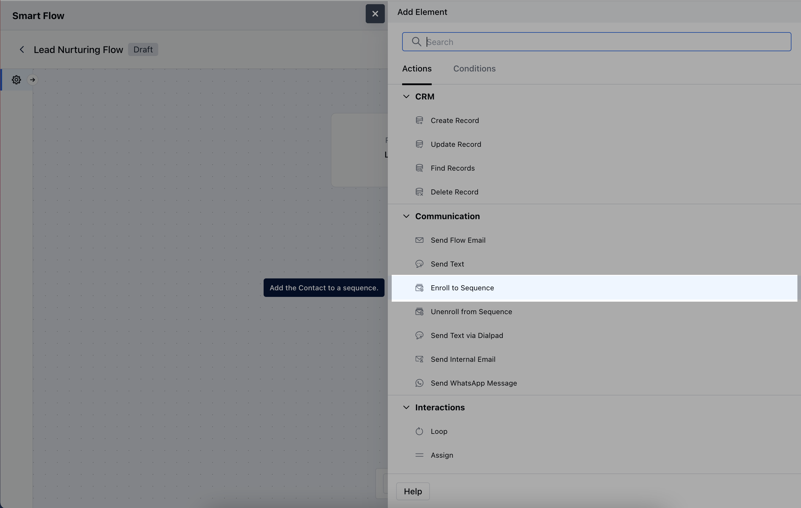
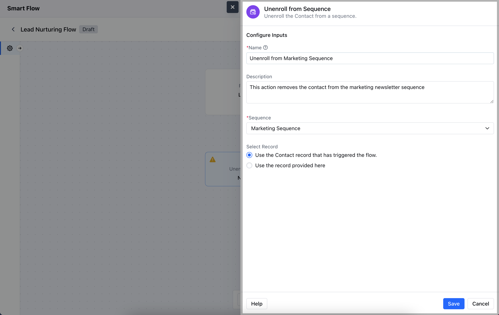
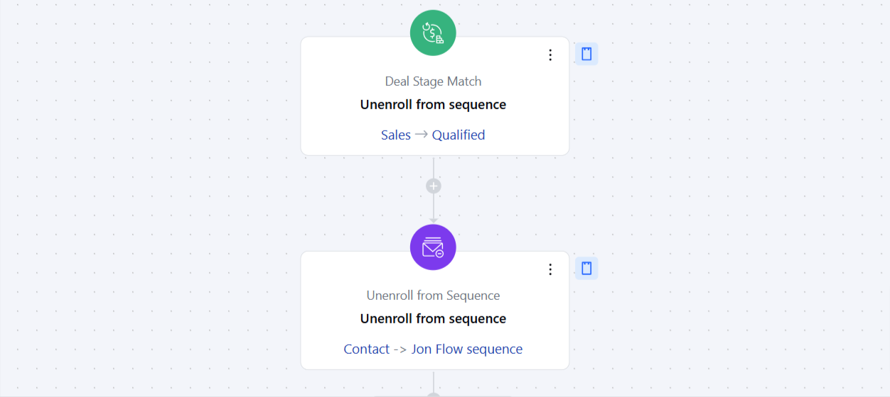

The**Unenroll from Sequence Action**allows you to automatically remove a contact or record from an ongoing email or SMS sequence.Topics Covered:

[How to Configure Unenroll from Sequence Action](https://support.salesmate.io/hc/en-us/articles/38138278711065-Unenroll-from-Sequence#h_01J8Q35W2R143GTJ3750PTNWFQ)[Practical Example](https://support.salesmate.io/hc/en-us/articles/38138278711065-Unenroll-from-Sequence#h_01J8Q4RSM1NX89S1MSVFPSKKK9)

### How to Configure Unenroll from Sequence Action

When setting up a Smart Flow, select the**Unenroll from Sequence**action.

After selecting the**Unenroll from Sequence Action**, you will need to configure it by providing the following details:**Name**: Give the action a clear and descriptive name to easily identify its purpose.**Description**: Write a brief explanation outlining what this action will do.**Sequence**: Specify the sequence from which you want to unenroll the contact or record.**Select Record**: Choose the record to be unenrolled:**Use the Contact record that has triggered the flow**: Automatically unenroll the contact tied to the flow's trigger.**Use the record provided here**: Manually select the records to be unenrolled.

### Practical Example

Considering a use case where you have a**Prospecting Sequence**for Qualifying a lead for Sales.The Smart Flow will allow you to unenroll contact from this sequence when a**Deal's Pipeline**is changed from**Prospect to Sales**automatically. This will allow you to ensure no further Prospecting E-mails are sent to a record as soon as they are Qualified for Sales.You can configure a flow and use this action "**Unenroll from sequence**" which executes on "**Deal Stage Match**" Added". Select the Stage  on "Deal Stage Match" trigger to ensure the record is removed from the sequence when it is moved to that specific Stage/Pipeline and configure it to "Unenroll from Sequence" action.

