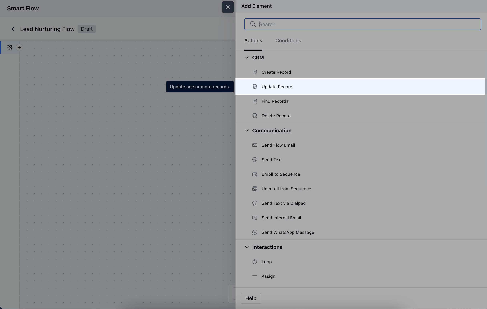
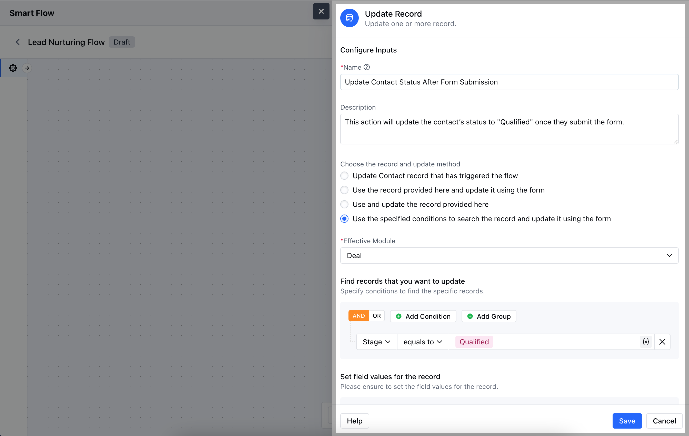
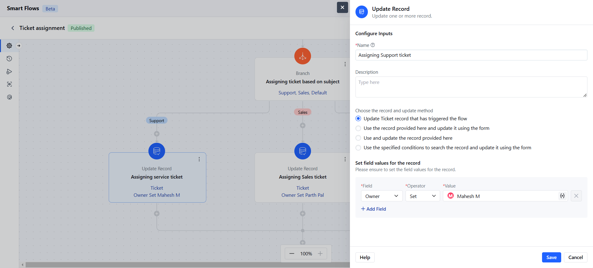
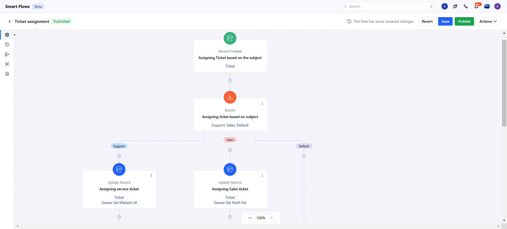

- **Update Record Action** in a Smart Flow allows you to modify existing records based on specific conditions.

###  **Topics covered:**

[How to Configure Update Record Action](#how-to-configure-update-record-action)

- [Practical Example](#practical-example)

###  How to Configure Update Record Action

While setting up a Smart Flow, select **Update Record** Action.

Once selected, you’ll need to configure the following details for the **Update Record Action**:**Name**: Provide a descriptive name for this action to easily identify its purpose.

- **Description**: Offer a brief explanation of what this action will accomplish and why it’s needed in the flow.

- **Choose the record and update method**: Select the specific record to update and decide whether to update it using a form or predefined variables.

- **Set field values for the record**: Define which fields in the record should be updated and provide the new values.Once the configuration is completed, hit **Save**.

###  Practical Example

- The **Update Record** action can be used to assign tickets or tasks based on their content, such as a Sales ticket or Support ticket. It updates the ticket to the relevant team owner or team member accordingly.

