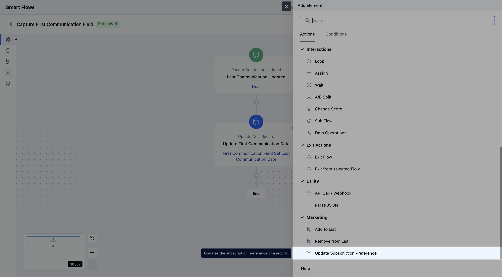
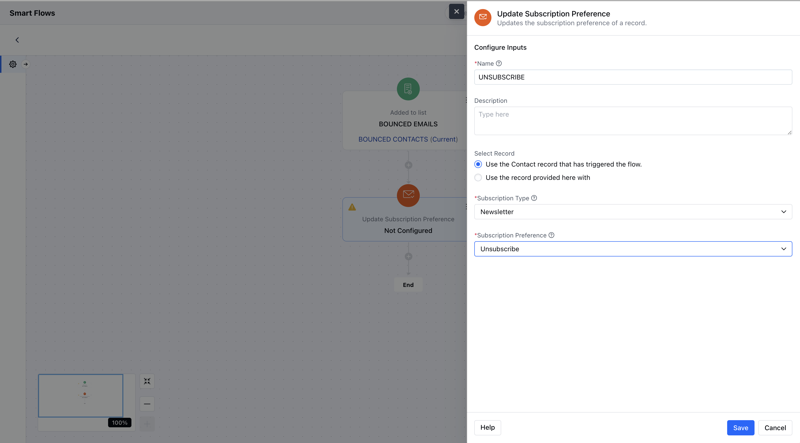
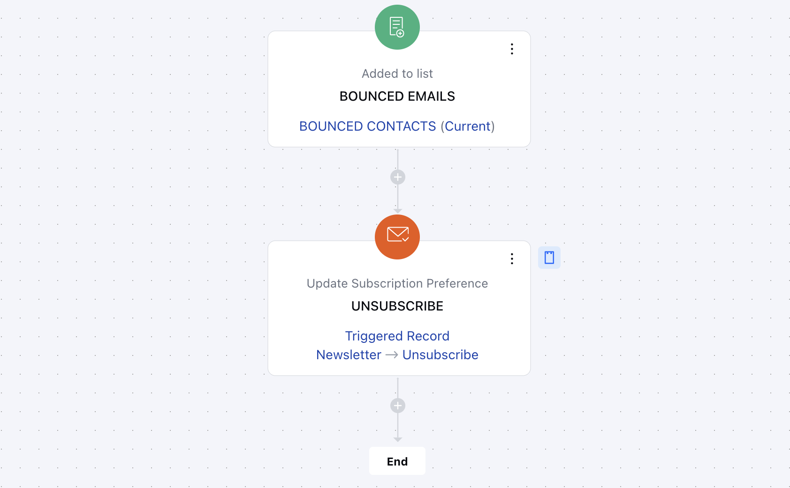

- The **Update Subscription Preference** action in Smart Flow is used to update a contact’s subscription preferences for a specific subscription type.

###  **Topics covered:**

- [How to Configure](#how-to-configure)

- [Practical Example:](#practical-example)

###  How to Configure

While setting up a Smart Flow, select **Update Record** Action.

Once selected, you’ll need to configure the following details for the **Update Record Action**:**Name**: Provide a descriptive name for this action to easily identify its purpose.

- **Description**: Offer a brief explanation of what this action will accomplish and why it’s needed in the flow.

- **Choose the record and update method**: Select the specific record to update and decide whether to update it using a form or predefined variables **Subscription Type:**Select the subscription type that you want to update **Subscription Preference**: Select their opt-in preference for the subscription

Once the configuration is completed, hit **Save**

###  Practical Example:

Let’s say you want to automatically unsubscribe a contact from marketing emails if their email address results in a hard bounce. This ensures your mailing list stays clean and your sender reputation remains strong.

