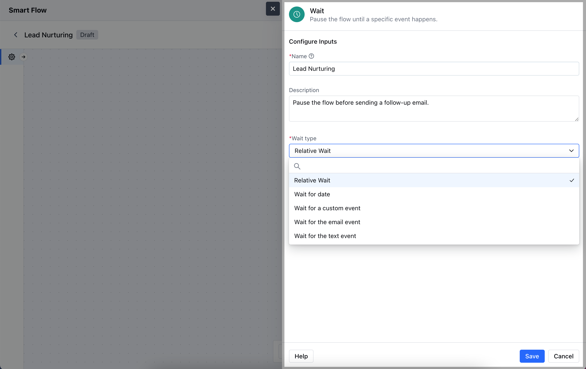
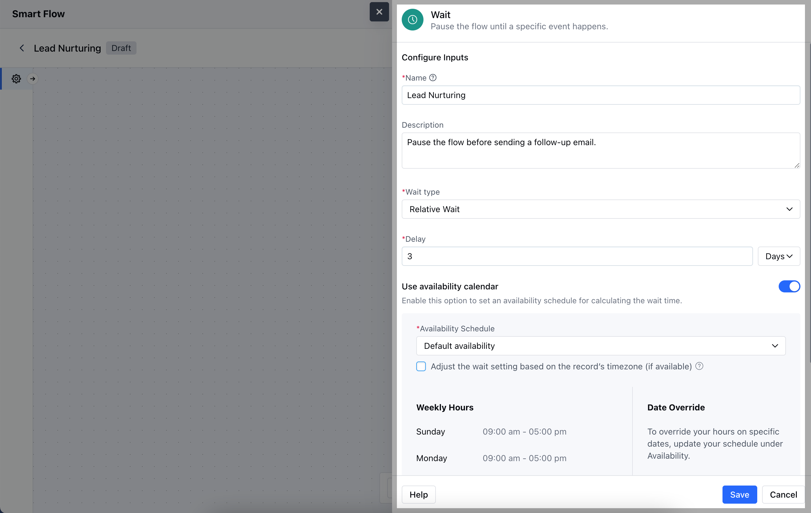
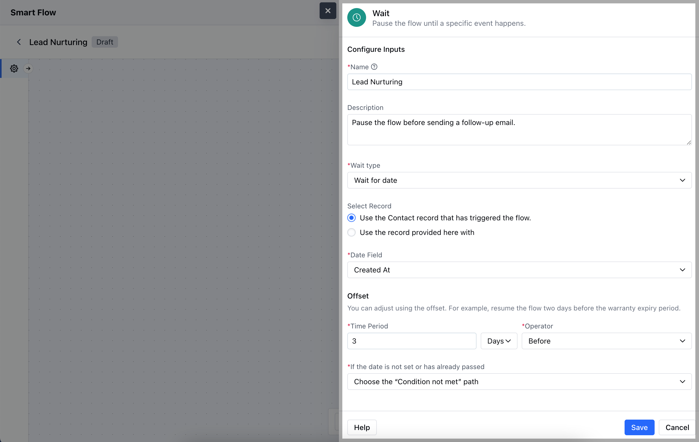
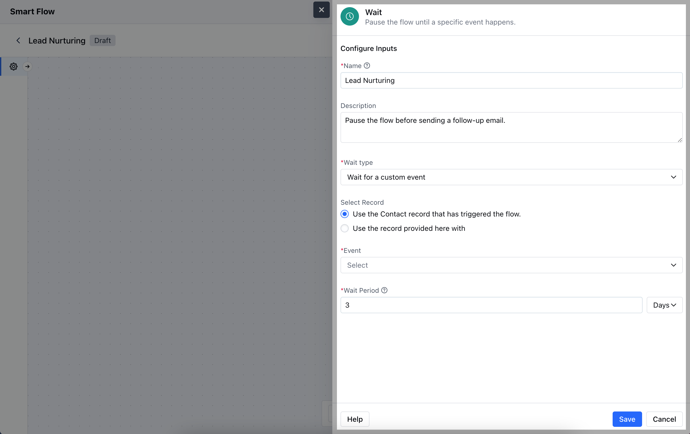
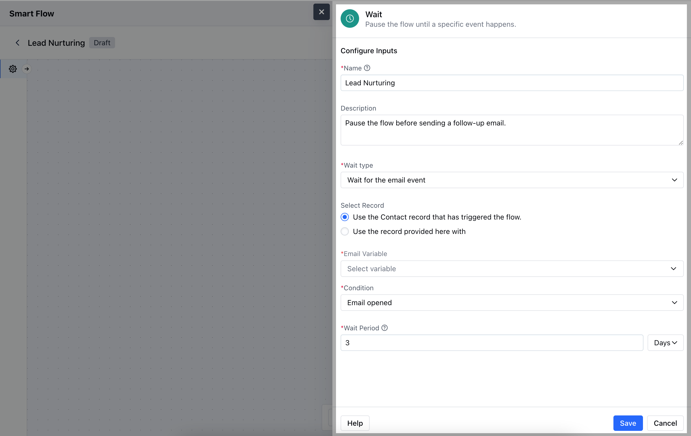
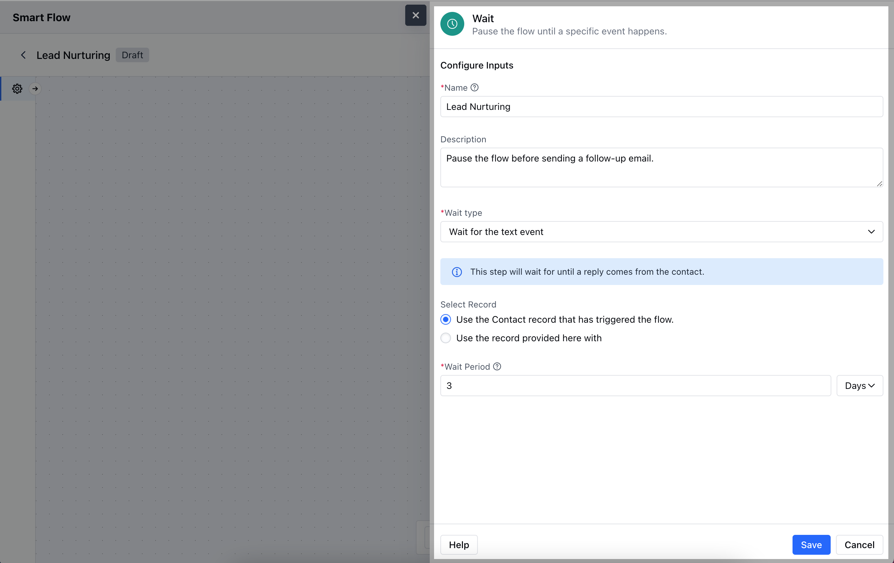
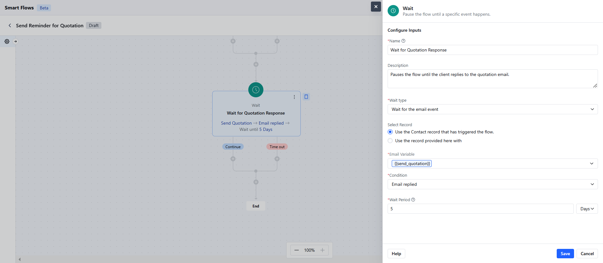

The **Wait** Action in Smart Flow within Salesmate allows you to pause the flow for a specified duration or until a certain condition is met before proceeding to the next action.

###  **Topics covered:**

- [How to Configure Wait Action](#how-to-configure-wait-action)

- [Practical Example](#practical-example)

###  How to Configure Wait Action

When setting up a Smart Flow, select the **Wait** action.

To configure the **Wait Action**, you’ll need to specify the following details:**Name**: Give the action a clear and descriptive name to indicate what the wait is for.

- **Description**: Provide a brief explanation of the wait action's purpose.

- **Wait Type**: Choose the appropriate wait type:
- [Relative Wait](https://support.salesmate.io/hc/en-us/articles/38138356545433-Wait#h_01J8SF7XBVTSP5WZ06CD09FA5W)
- [Wait for Date](https://support.salesmate.io/hc/en-us/articles/38138356545433-Wait#h_01J8SFQTTRDNE8YN3QQM900C54)
- [Wait for a Custom Event](https://support.salesmate.io/hc/en-us/articles/38138356545433-Wait#h_01J8SHZEDC8VDX7CP7E8A5XJGN)
- [Wait for the Email Event](https://support.salesmate.io/hc/en-us/articles/38138356545433-Wait#h_01J8SHM62B9DKYXAEGVNMG44N0)
- [Wait for the Text Event](https://support.salesmate.io/hc/en-us/articles/38138356545433-Wait#h_01J8SJ0P317H6J8G5MC16Y3T4Y)
**

- *### ** Relative Wait **-**Delay:** Specify the amount of time the flow should wait before proceeding

- **Use Availability Calendar:** Enable this option to set an availability schedule for calculating the wait time.

### **Wait for Date **Select Record**: Choose the specific record that will be used to calculate the wait time based on its date field.

- **Date Field**: Select the date field from the record that will trigger the wait.

- ** Offset **: Set the time interval and operator for the flow relative to the selected date. You can choose to either proceed with the flow if the date is missing or has already passed, or choose condition not met path.

### ** Wait for a Custom Event **Select Record**: Choose between using the contact record that initiated the flow or selecting a different record.

- **Event**: Specify the custom event to wait for.

- ** Wait Period **: Define the duration the system should wait for the event to occur before continuing the flow.

### ** Wait for the Email Event **Select Record**: Choose whether to use the contact record that initiated the flow or select a different record.

- **Email Variable**: Define the variable representing the email to be monitored in the flow.

- **Condition**: Specify the condition to track.

- ** Wait Period **: Set the maximum duration to wait for the condition to be met before continuing the flow.

### ** Wait for the Text Event **Select Record**: Choose whether to use the contact record that initiated the flow or another record provided.

- ** Wait Period **: Set the duration for which the system should wait for the specified text event to occur before proceeding with the flow.

Once the configuration is done, hit **Save**.

###  Practical Example

The Wait action can be set up to wait for a reply on a specific email. It can be a product purchase confirmation or a reply to a quotation.

- **If the Client Replies Within the Wait Period:** Trigger an action to handle the incoming reply like:
 Notify the sales representative immediately.Update the client’s status to “In Negotiation” in the CRM.Schedule a follow-up call or meeting to discuss the quotation.

- **If the Client Does Not Reply Within the Wait Period:** Send a reminder email to the client:
 The email could include a friendly reminder about the quotation and encourage them to ask any questions.Log the follow-up attempt in the client’s record for future reference.
