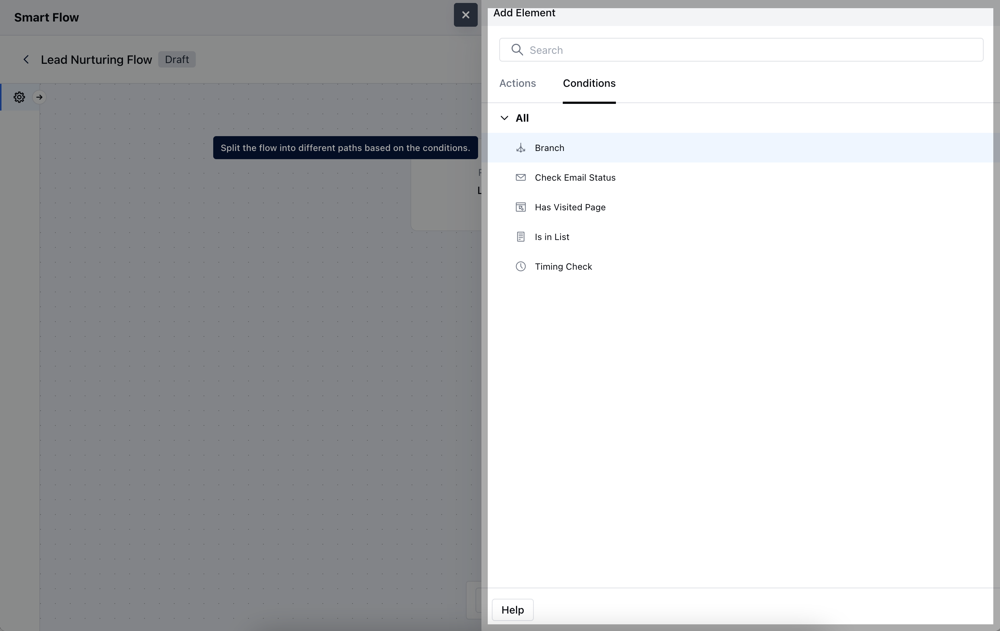
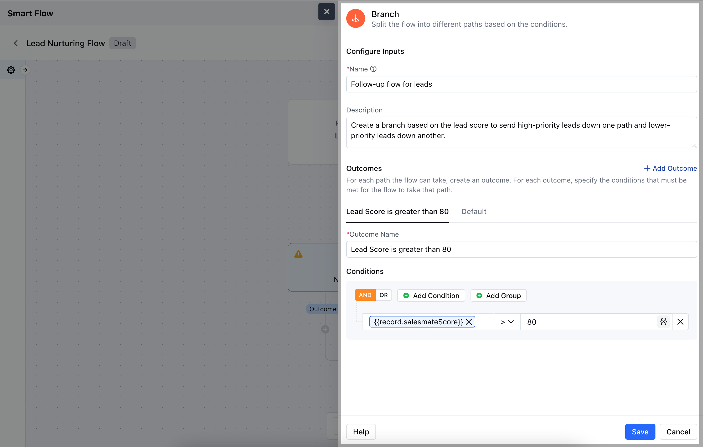
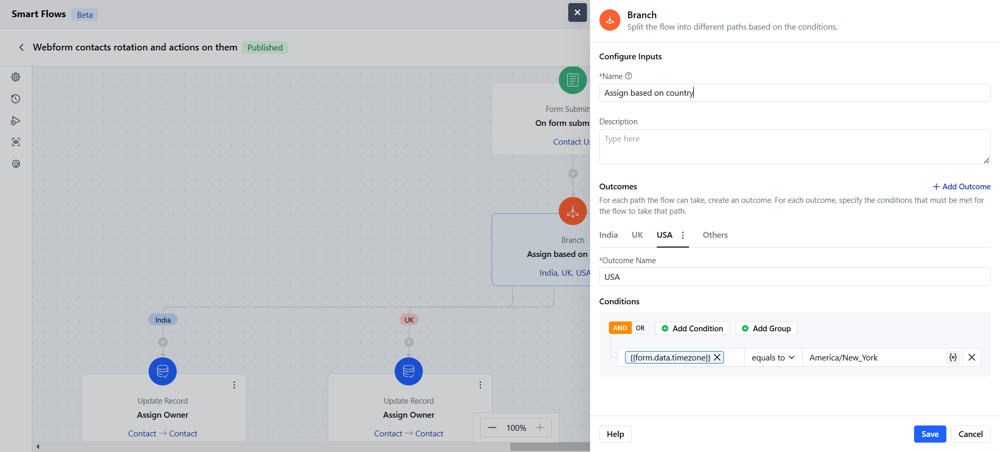
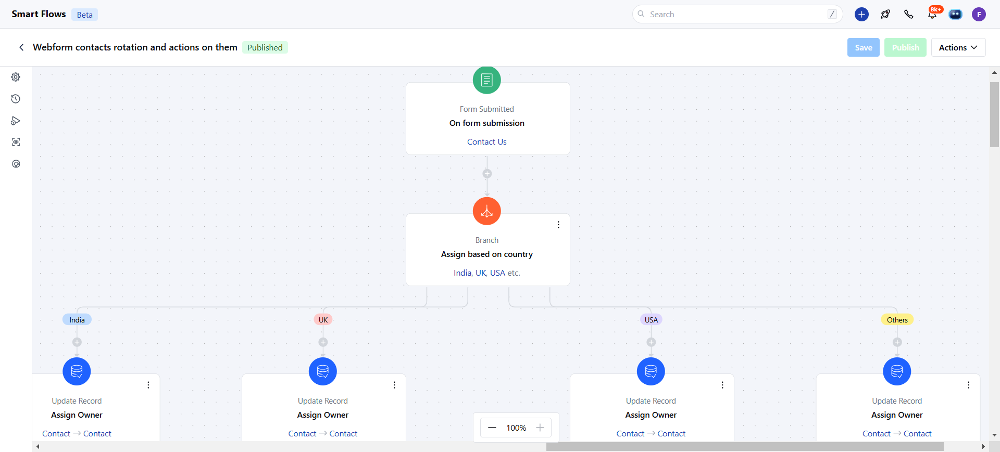

A **Branch Condition** in a Smart Flow allows you to create different paths based on specific criteria, ensuring that different actions are triggered for different segments of records.

### **Topics covered:**

- [How to Configure Branch Condition](#how-to-configure-branch-condition)

- [Practical Example](#practical-example)

### How to Configure Branch Condition

When setting up a Smart Flow, choose the **Branch** within the Condition section.

After selecting, you'll need to configure the branch condition by providing the following details:

- **Name:** Assign a clear and descriptive name to easily identify the branch condition.

- **Description:** Provide a brief explanation of what the branch condition does and its purpose within the flow.

- **Outcomes:** Define the possible paths or results that the branch will take based on the conditions.

- **Conditions:** Set the criteria that determine how records will flow through the different branches.Once done,**Save** the configuration.

### Practical Example

With the "Branch" condition, you can route web form submissions based on contact location. For instance, when a form is submitted and contacts are from different countries, the branch condition directs them to the appropriate team based on their country. This ensures each contact is assigned to the most relevant regional team, enhancing response accuracy and efficiency.

