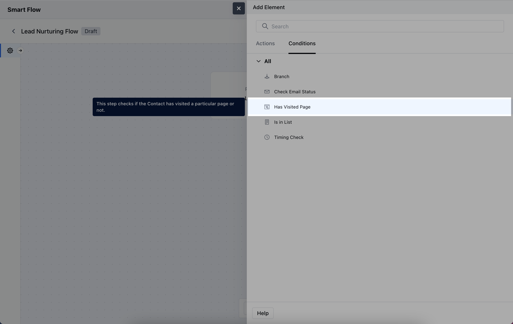
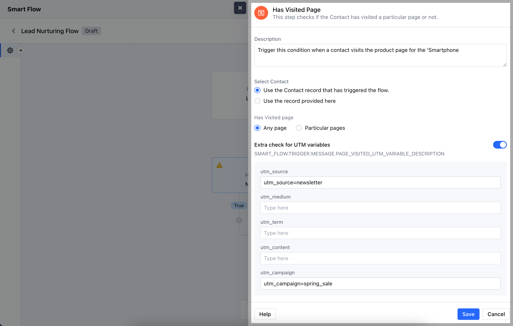
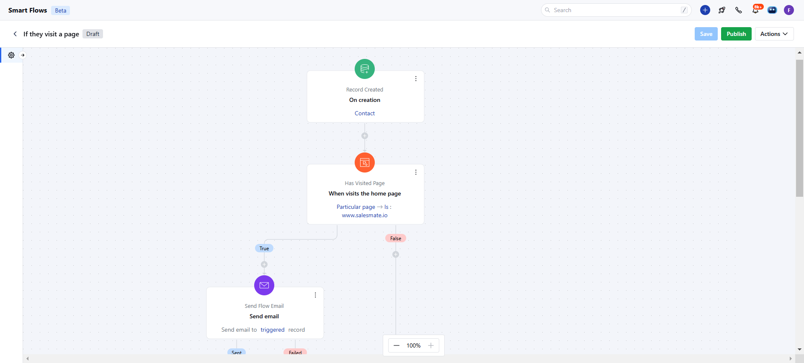
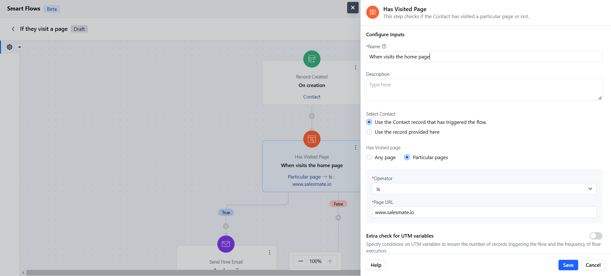
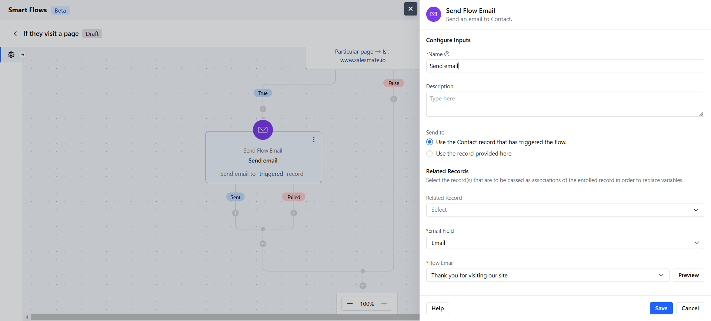

The **Has Visited Page Condition** in a Smart Flow allows you to create actions or logic based on whether a contact has visited a specific page on your website.

###  **Topics covered:**

- [How to Configure Has Visited Page Condition](#how-to-configure-has-visited-page-condition)

- [Practical Example](#practical-example)

###  How to Configure Has Visited Page Condition

When setting up a Smart Flow, choose the **Has Visited Page** Condition.

After selecting, you'll need to configure the **Has Visited Page** condition by providing the following details:

- **Name:** Assign a clear name to easily identify the condition.

- **Description:** Provide a brief explanation of what this condition does and its purpose in the flow.

- **Select Contact:**- **Use the Contact record that has triggered the flow:** Choose this if the contact initiating the flow will also be used to track the page visit.

- **Use the record provided here:** Choose this option if you want to manually specify a different contact or record.

- **Select Page:**- **Any Page:** Trigger the condition if the contact has visited any page on your website.

- **Particular Page:** Set the condition to trigger only when a specific page is visited.

- **Extra check for UTM variables:** Add any UTM parameters to narrow down the condition to specific campaigns or traffic sources. Once the configuration is completed, hit **Save**.

###  Practical Example

Using the "Has Visited a Page" condition, you can automate email engagement for site visitors. When a contact visits your website, this condition triggers an automated email, allowing you to promptly reach out with tailored information, offers, or a welcome message. This approach helps you engage visitors right as they show interest.

