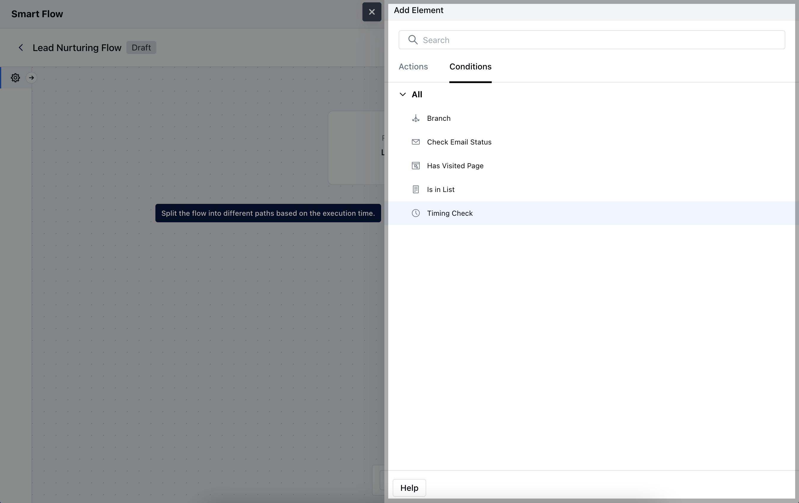
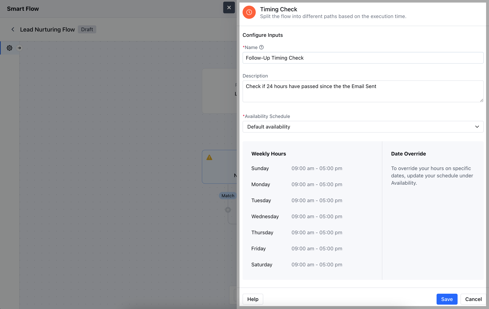
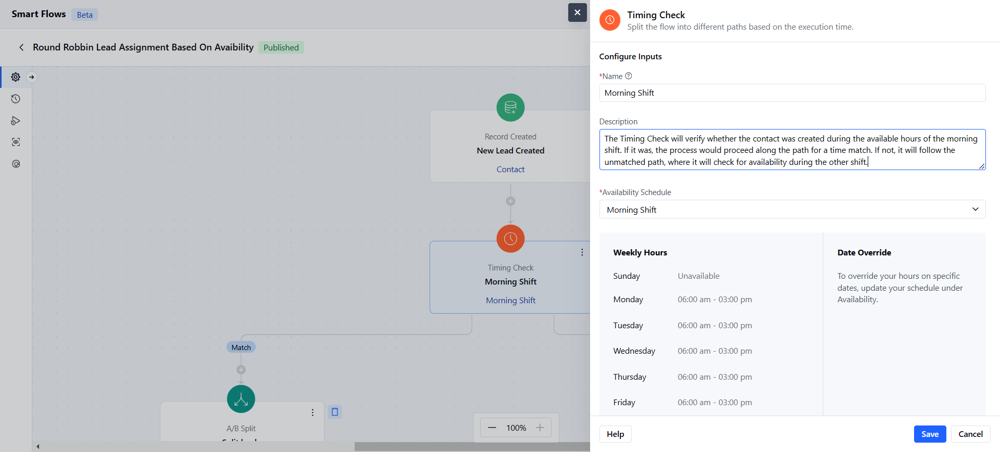
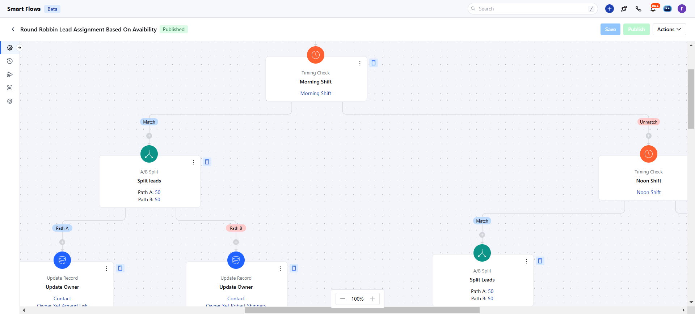

The**Timing Check Condition**in a Smart Flow allows you to evaluate the timing of an event or action to determine whether to proceed with a specific step in the flow.**Topics Covered:**[How to Configure Timing Check Condition](https://support.salesmate.io/hc/en-us/articles/37780773580569-Timing-Check#h_01J8M5CN3K0N7MQC40Y7WGSDXB)[Practical Example](https://support.salesmate.io/hc/en-us/articles/37780773580569-Timing-Check#h_01J8M63QS7CW4E5K43X5J2W6P4)

### How to Configure Timing Check Condition

When setting up a Smart Flow, choose the**Timing Check**condition.

After making your selection, you will need to configure the**Timing Check condition**by entering the following details:**Name:**Assign a clear and descriptive title for the condition that indicates its purpose within the flow.**Description:**Provide a brief explanation of what this condition does and why it’s important in the context of the flow.**Availability Schedule:**Define the specific time frames during which the condition will be evaluated.Once the configuration is completed, hit**Save**.

### Practical Example

The**Timing Check**condition can be used to verify if a contact was created during the morning shift (9 AM - 5 PM). If it was, it will assign the contact to the team working during that shift. If not, it checks for availability during the evening shift and routes the contact accordingly.

