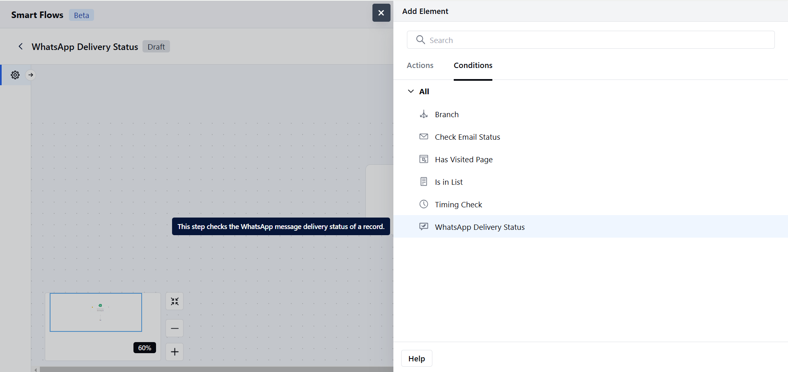
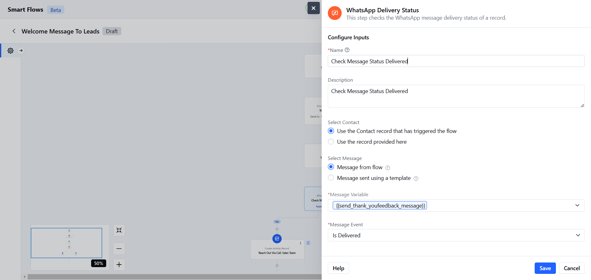
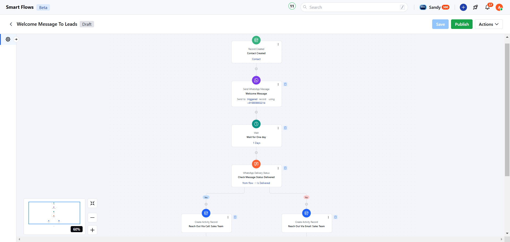

The **WhatsApp Delivery Status** evaluates the delivery status of a WhatsApp message sent to a contact. It checks the message interaction and seamlessly forwards the contact to the next action based on the result.

- **Note:** WhatsApp Channel (
- [WhatsApp by Twilio](https://support.salesmate.io/hc/en-us/articles/25786757545497-WhatsApp-by-Twilio-Installation)
or
[WhatsApp by Vonage](https://support.salesmate.io/hc/en-us/articles/25795103115161-WhatsApp-By-Vonage-Installation)
) needs to be installed to use WhatsApp Condition in Smart Flow.

### Topics to be covered:

- [How to Configure WhatsApp Delivery Status Condition](#how-to-configure-check-whatsapp-delivery-status-condition)
- [Practical Example](#practical-example)

### How to Configure Check WhatsApp Delivery Status Condition

When setting up a Smart Flow, choose the WhatsApp Delivery Status Condition.

After selecting, you'll need to configure the WhatsApp Delivery Status condition by providing the following details:**Name**: Assign a clear and descriptive name for the condition.

- **Description**: Provide a brief explanation of the condition’s purpose.

- **Select Contact:**Choose the contact for whom the WhatsApp Message status will be checked.

- **Use the contact that triggered the flow**: Available only when the trigger type is set to contact.

- **Use a contact provided here**: Search and select a contact type variable manually.

- **Select Message:** Choose one of the following options,

- **Message from Flow:** Select a message directly used within the current flow.

- **Message Sent Using a Template:** Choose a message that was sent using a pre-designed WhatsApp template.

- **Provider**: Select the WhatsApp provider (e.g., Vonage or Twilio).

- **From Number**: Select from configured numbers.

- **Message Template**: Choose an approved template for the selected provider and number.

- **Note**: If there is only one provider, the provider field will not appear.

- **Select Message Variable:** Choose the Send WhatsApp Message output variable.

- **Message Event:** Specify the message interaction to track:
- **Is Delivered:** Checks if the message was successfully delivered.

- **Is Read:** Checks if the message was read.

- **Is Replied:** Checks if a reply was received.Once the configuration is completed, hit **Save**.

### Practical Example:

Upon receiving new leads, automatically send them a WhatsApp welcome message about an ongoing sale. After a set delay, check if the message was delivered. If not, create a task for the sales team to follow up.

