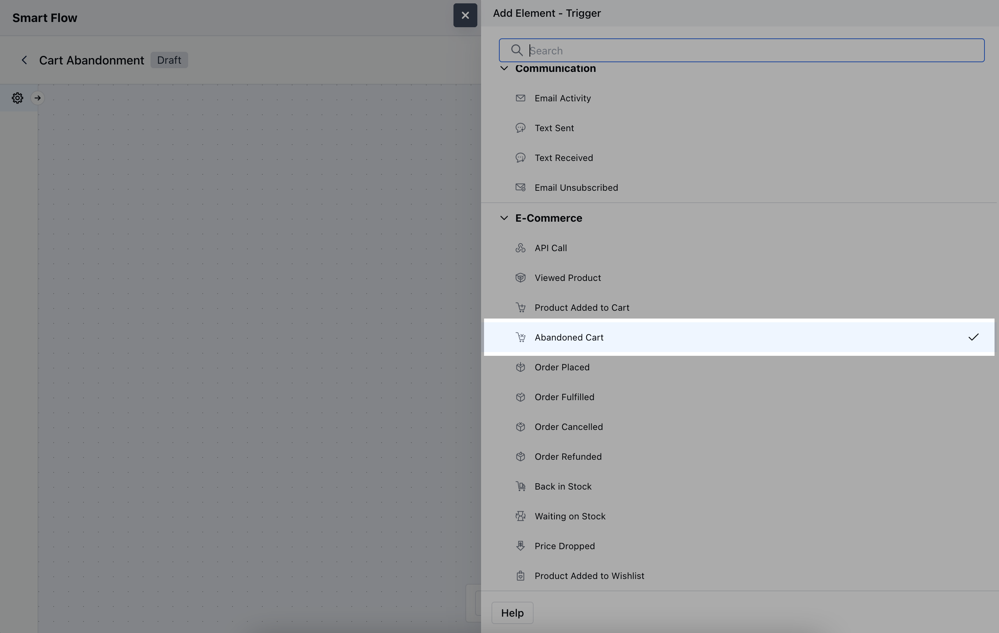
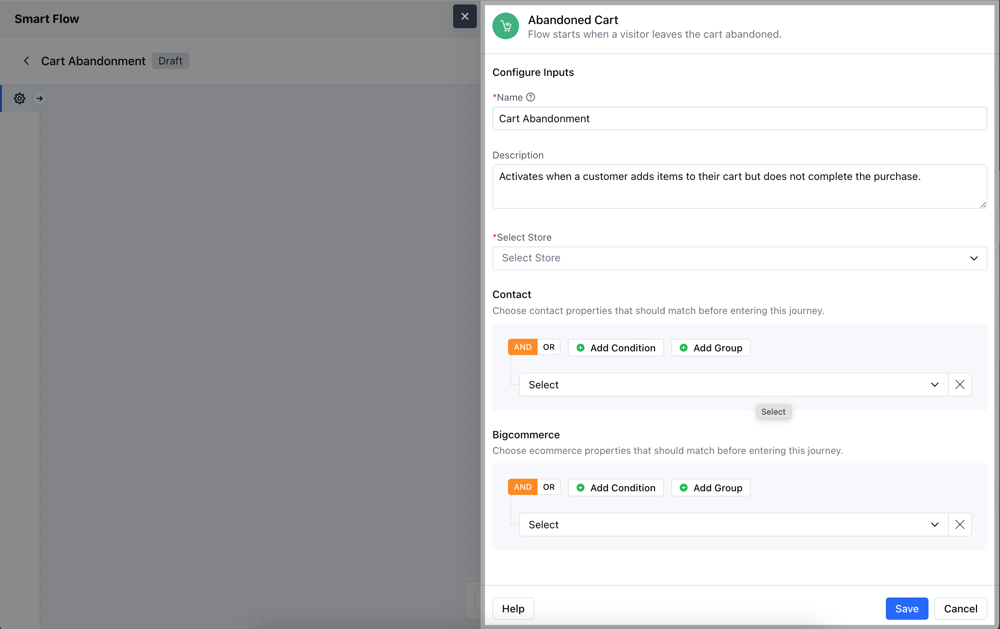
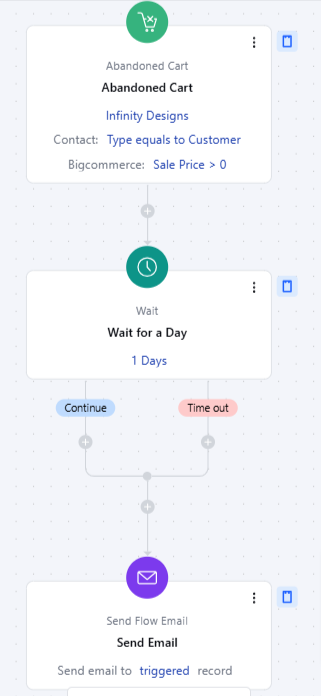

- The **Abandoned Cart** trigger starts a flow when a customer adds items to their shopping cart but leaves the site without completing the purchase.

- **Note:** This Trigger is a part of [BigCommerce](https://support.salesmate.io/hc/en-us/articles/6774740880153-Introduction-and-Installation-of-BigCommerce) Integration

- **Topics covered:** -
- [How to Configure Abandoned Cart Trigger](#how-to-configure-abandoned-cart-trigger)

- [Practical Example](#practical-example)

### How to Configure Abandoned Cart Trigger

While creating the Trigger Based Flows select **Abandoned Cart** trigger

When setting up the **Abandoned Cart** trigger, you'll need to configure the following details:

- **Name:** Provide a clear, descriptive name for the trigger.

- **Description:** Write a brief explanation of what the trigger does.

- **Select Store:** Choose the **BigCommerce** store where the abandoned cart event is being tracked.

- **Contact:** Define which contact properties should match before triggering this flow.

- **BigCommerce:** Define which BigCommerce properties should match before triggering the flow.Hit the **Save** button to save the configuration and start making the flow.

### Practical Example

Let's create a Smart Flow to send out an email to a customer/visitor when they forget a particular product from their cart.

