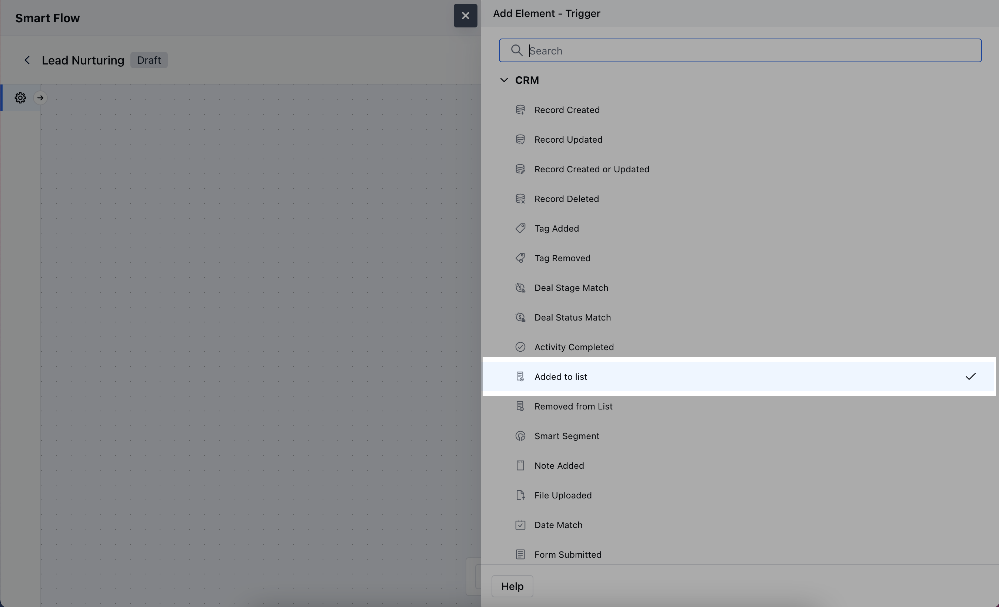
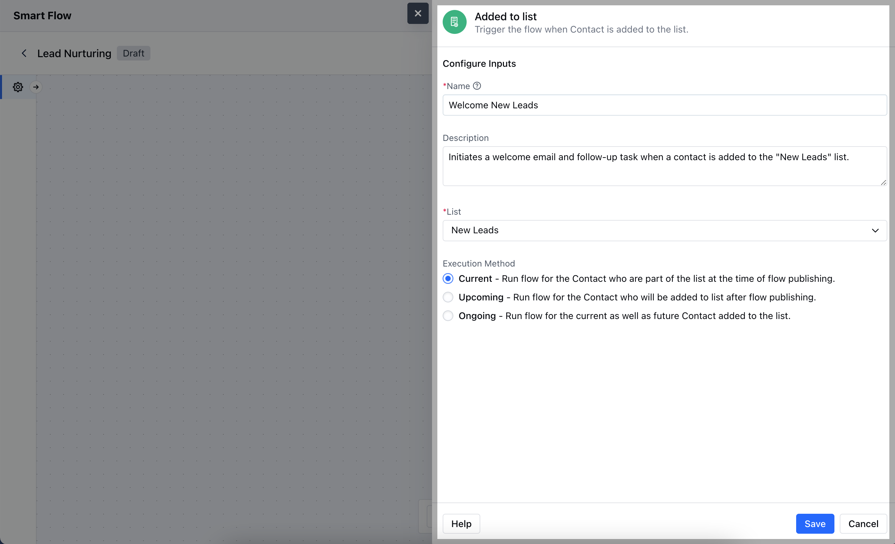
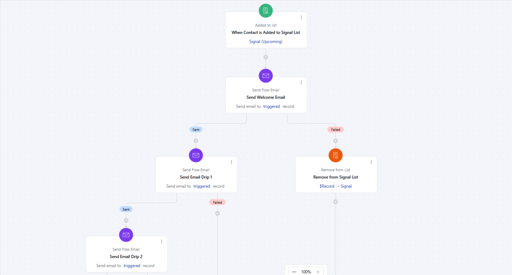

The Added to List trigger initiates the flow when a specific record is added to a designated list, automatically starting the associated actions based on this list.

###  **Topics covered:**

- [How to Configure Added To List Trigger](#how-to-configure-added-to-list-trigger)

- [Practical Example](#practical-example)

###  How to Configure Added To List Trigger

While creating the Trigger Based Flows select **Added to List** Trigger.

Once selected, you would then need to configure the block.

As you click on the block, a pop will open to add following details.

- **Name:** Provide a clear and descriptive name for the trigger.

- **Description:** Enter an explanation of what the trigger does and how it fits into the flow.

- **List:** Choose the specific list that will activate the trigger when a record is added to it.

- **Execution Method**,- **Current:** Run flow for the Contact who are part of the list at the time of flow publishing.

- **Upcoming:** Run flow for the Contact who will be added to list after flow publishing.

- **Ongoing:** Run flow for the current as well as future Contact added to the list.Once done,**Save** the information.

###  Practical Example

You want to send series of emails to the leads who show interest in a particular product or service. These leads can come from multiple sources, E.g., Inquiry form from the website, Facebook Lead, or interest shown over the chat. And these sources might change with time. So you don't want to keep updating your automation journey. In such cases, you can use the "Added to list" trigger. So, whenever there is a new lead, you can automatically or manually add that contact to the selected list, and it will flow through the automation journey.

